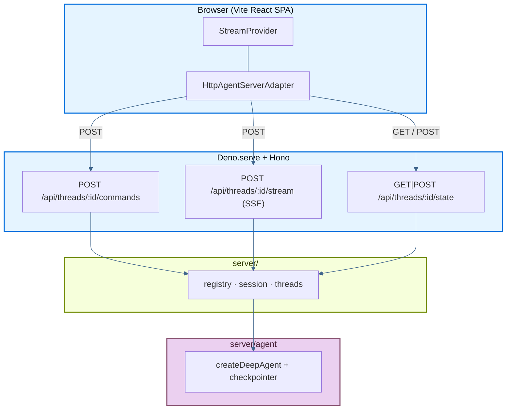

The following page details an example app that deploys a LangChain **deep agent** on [Deno Deploy](https://deno.com/deploy): streaming chat UI, subagents, and thread history, all backed by the [Agent Streaming Protocol](https://github.com/langchain-ai/agent-protocol/tree/main/streaming) implemented as HTTP + SSE route handlers on a Hono server. The React frontend is a Vite SPA (ported from the Next.js example); Deno serves the built static assets and the API from a single `main.ts` entrypoint.

It is a port of the Next.js example into Deno + Hono, showing how to run the same agent stack on Deno Deploy instead of Vercel.

Source: [`js-deno`](https://github.com/langchain-ai/deployment-cookbook/tree/main/js-deno) in the deployment cookbook.

## Deploy to Deno Deploy

<Steps>

<Step title="Create a Deno Deploy project">

Fork or clone [`langchain-ai/deployment-cookbook`](https://github.com/langchain-ai/deployment-cookbook). In the [Deno Deploy dashboard](https://dash.deno.com/), create a new project linked to this repo.

</Step>

<Step title="Configure build settings">

- Set **Root Directory** to `js-deno`.
- Set the **build command** to `deno task build:client` (builds the Vite SPA into `dist/`).
- Set the **entrypoint** to `main.ts`.
- Add `OPENAI_API_KEY` in project environment variables.

</Step>

<Step title="Deploy">

Deploy from the dashboard. Deno's build environment runs the build command, so `dist/` is generated in the cloud and never needs to be committed.

</Step>

</Steps>

Alternatively, use the built-in `deno deploy` CLI (Deno 2.x). The `deploy` block in [`deno.json`](https://github.com/langchain-ai/deployment-cookbook/blob/main/js-deno/deno.json) sets `org`/`app`. Change those to your own (or pass `--org`/`--app` flags, which override them).

```bash
cd js-deno

# First time only: create the app
deno deploy create --org <your-org> --app <your-app> --source local --region us --entrypoint main.ts

# Set your OpenAI key
deno deploy env add OPENAI_API_KEY <your-key> --org <your-org> --app <your-app>

# Build the client, deploy to production, and clean up dist/
deno task deploy
```

`deno task deploy` runs `deno task build:client && deno deploy --prod`, then `rm -rf dist`. Building locally is required because `deno deploy --source local` uploads your working tree (minus `.gitignore`) and does **not** run build commands. Those only run for GitHub-connected apps.

<Warning>
Two gotchas specific to the CLI `--source local` flow:

- **`dist/` must not be gitignored.** The uploader respects `.gitignore`, so the freshly built `dist/` must be visible during the upload window or every non-`/api` route returns **404**. The repo-root `.gitignore` ignores all `dist`, so `js-deno/.gitignore` re-includes it with `!dist/` and `!dist/**`. The `deno task deploy` flow deletes `dist/` after uploading, so it does not linger in `git status` despite not being ignored.
- **Do not use a `deploy.include` list.** There is a Deno Deploy bug where adding `include` makes the build resolve the entrypoint to `src/main.ts` and fail. Rely on the default `.gitignore`-based upload instead.
</Warning>

Optionally enable LangSmith tracing by adding the variables from [`.env.example`](https://github.com/langchain-ai/deployment-cookbook/blob/main/js-deno/.env.example).

## Required API endpoints

The app exposes the Agent Streaming Protocol under `/api/threads/...`. Route handlers live in `server/routes.ts` and mirror the Next.js handlers in `js-next/app/api/threads/`.

### Minimum (streaming chat)

| Method | Path | Purpose |
| --- | --- | --- |
| `POST` | `/api/threads/:threadId/commands` | Accept protocol commands (`run.start`, …) and start agent runs |
| `POST` | `/api/threads/:threadId/stream` | SSE stream of protocol events for a run |
| `GET` / `POST` | `/api/threads/:threadId/state` | Read and bootstrap checkpointed thread state |

### Optional (sidebar)

| Method | Path | Purpose |
| --- | --- | --- |
| `GET` | `/api/threads` | List threads known to the checkpointer |
| `DELETE` | `/api/threads/:threadId` | Delete a thread's session and checkpoints |
| `POST` | `/api/threads/:threadId/history` | Paginated checkpoint history (Agent Protocol) |

### Request flow



## How the Deno backend works

This example runs as a **single Deno process**:

- **`main.ts`**: `Deno.serve` + Hono app. Mounts `/api` routes and serves the Vite-built SPA from `dist/`.
- **`server/routes.ts`**: Hono route definitions for the Agent Streaming Protocol.
- **`server/session.ts`**: `LocalThreadSession`: buffers protocol events in a LangGraph `StreamChannel`, filters with `matchesSubscription`, and fans matching frames out over SSE `ReadableStream`.
- **`server/threads.ts`**: checkpointer-backed `getState` / `updateState` / `getHistory` helpers in the LangGraph SDK wire format.
- **`server/registry.ts`**: process-local singleton owning the agent and one session per thread id.
- **`server/agent/`**: same `createDeepAgent` orchestrator as the Next.js example (researcher + math-whiz subagents, mock tools).

Deno Deploy runs each isolate with its own in-memory `MemorySaver` checkpointer. For production persistence across isolates, swap in a [durable checkpointer](/oss/python/langgraph/checkpointers#checkpointer-libraries) (Postgres, Redis, …). The route handlers and `server/threads.ts` helpers stay the same.

## Production persistence

Out of the box, the agent uses an in-memory `MemorySaver` checkpointer (`server/agent/index.ts`) and a process-local session map (`server/registry.ts`). That works for local dev and single-isolate deployments, but on Deno Deploy (multiple isolates, cold starts) conversation state is **not durable** across instances.

Replace `MemorySaver` in `server/agent/index.ts` with a durable checkpointer such as `@langchain/langgraph-checkpoint-postgres` or `@langchain/langgraph-checkpoint-redis`. You will also want a shared session/replay store so SSE reconnection works across isolates.

## Local development

You need [Deno](https://deno.com/) 2.x and [pnpm](https://pnpm.io/) for the client.

```bash
cp .env.example .env   # set OPENAI_API_KEY
export $(grep -v '^#' .env | xargs)   # load env for Deno

# Terminal 1 — API + static (after first client build)
deno task build:client   # first time only
deno task dev

# Terminal 2 — Vite dev server with HMR (proxies /api to :8000)
cd client && pnpm install && pnpm dev
```

Open [http://localhost:5173](http://localhost:5173) for development with hot reload. The Vite dev server proxies `/api` to the Deno server on port 8000.

For a production-like local run (single server, no HMR):

```bash
deno task build:client
deno task start
```

Open [http://localhost:8000](http://localhost:8000).

## Project layout

- `main.ts`: Deno Deploy entrypoint (`Deno.serve` + Hono).
- `server/agent/`: deep agent (`createDeepAgent`) with subagents and mock tools.
- `server/`: protocol server logic: `session.ts`, `threads.ts`, `serialize.ts`, `registry.ts`, `routes.ts`.
- `client/`: Vite + React SPA (same UI as the Next.js example).
- `dist/`: Vite build output served by Deno (generated by `deno task build:client`).

## See also

- [Frameworks and platforms overview](/langsmith/deploy-frameworks-and-platforms)
- [Deploy with Next.js](/langsmith/deploy-nextjs)
- [Agent Streaming Protocol](https://github.com/langchain-ai/agent-protocol/tree/main/streaming)

---

<div className="source-links">
<Callout icon="terminal-2">
    [Connect these docs](/use-these-docs) to Claude, VSCode, and more via MCP for real-time answers.
</Callout>
<Callout icon="edit">
    [Edit this page on GitHub](https://github.com/langchain-ai/docs/edit/main/src/langsmith/deploy-deno.mdx) or [file an issue](https://github.com/langchain-ai/docs/issues/new/choose).
</Callout>
</div>
