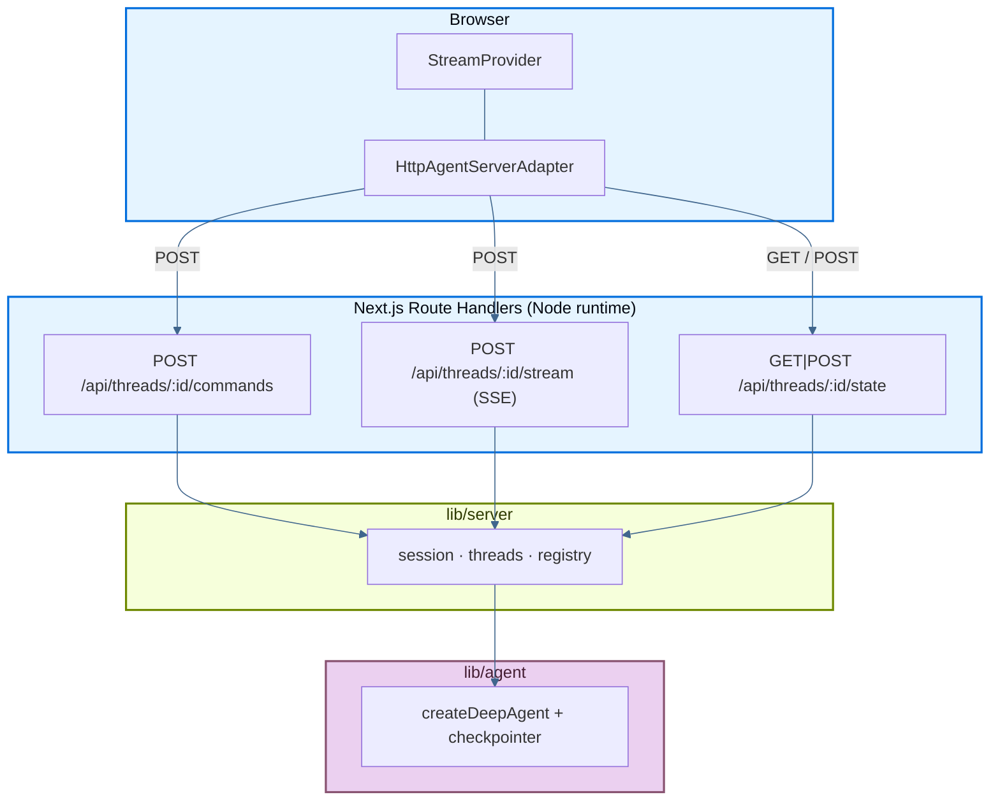

The following page details an example app that deploys a LangChain **deep agent** entirely inside a [Next.js App](https://nextjs.org/) Router project: streaming chat UI, subagents, and thread history, all backed by the [Agent Streaming Protocol](https://github.com/langchain-ai/agent-protocol/tree/main/streaming) implemented as Next.js Route Handlers (HTTP + SSE). No separate backend process.

Source: [`js-next`](https://github.com/langchain-ai/deployment-cookbook/tree/main/js-next) in the deployment cookbook.

## Deploy to Vercel

<Steps>

<Step title="Import the repository">

Click **Deploy with Vercel** below, or import [`langchain-ai/deployment-cookbook`](https://github.com/langchain-ai/deployment-cookbook) manually.

<a href="https://vercel.com/new/clone?repository-url=https%3A%2F%2Fgithub.com%2Flangchain-ai%2Fdeployment-cookbook&root-directory=js-next&env=OPENAI_API_KEY&envDescription=OpenAI%20API%20key%20for%20the%20agent%20and%20its%20subagents" target="_blank" rel="noopener noreferrer">
  
</a>

</Step>

<Step title="Configure the project">

Set **Root Directory** to `js-next` and add `OPENAI_API_KEY` in project settings.

</Step>

<Step title="Deploy">

Deploy the project. Route handlers already set `runtime = "nodejs"` and the SSE route sets `dynamic = "force-dynamic"`, which Vercel needs for streaming.

</Step>

</Steps>

Optionally enable LangSmith tracing by adding the variables from [`.env.example`](https://github.com/langchain-ai/deployment-cookbook/blob/main/js-next/.env.example).

## Required API endpoints

The app exposes the Agent Streaming Protocol under `/api/threads/...`. Route handlers live in `app/api/threads/`.

### Minimum (streaming chat)

These three endpoints are enough to run a single-threaded streaming chat with `@langchain/react`'s `HttpAgentServerAdapter`:

| Method | Path | Purpose |
| --- | --- | --- |
| `POST` | `/api/threads/:threadId/commands` | Accept protocol commands (`run.start`, …) and start agent runs |
| `POST` | `/api/threads/:threadId/stream` | SSE stream of protocol events for a run |
| `GET` / `POST` | `/api/threads/:threadId/state` | Read and bootstrap checkpointed thread state |

The client bootstraps a thread with `GET /state` (and `POST /state` on 404) so hydration does not 404 before the first message is sent.

### Optional (thread sidebar)

This example also implements endpoints for the thread-history sidebar. Omit them if your UI does not need multi-thread management:

| Method | Path | Purpose |
| --- | --- | --- |
| `GET` | `/api/threads` | List threads known to the checkpointer |
| `DELETE` | `/api/threads/:threadId` | Delete a thread's session and checkpoints |
| `POST` | `/api/threads/:threadId/history` | Paginated checkpoint history (Agent Protocol) |

### Request flow



1. Bootstrap thread state (`GET`/`POST /state`).
2. On submit, the SDK sends `run.start` to `/commands` and receives a `run_id`.
3. The SDK subscribes to `/stream` (SSE) for replay + live protocol events.
4. Subagent (`task`) runs emit namespaced events surfaced as `stream.subagents`.

## Production persistence

Out of the box, the agent uses an in-memory `MemorySaver` checkpointer (`lib/agent/index.ts`) and a process-local session map (`lib/server/registry.ts`). That works for local dev and single-instance servers, but on Vercel (serverless, multiple replicas) conversation state is **not durable** across cold starts or instances.

For production, swap in a [durable checkpointer](/oss/python/langgraph/checkpointers#checkpointer-libraries):

| Package | Backend |
| --- | --- |
| [`@langchain/langgraph-checkpoint-redis`](https://www.npmjs.com/package/@langchain/langgraph-checkpoint-redis) | Redis (`RedisSaver`) |
| [`@langchain/langgraph-checkpoint-postgres`](https://www.npmjs.com/package/@langchain/langgraph-checkpoint-postgres) | Postgres (`PostgresSaver`) |
| [`@langchain/langgraph-checkpoint-sqlite`](https://www.npmjs.com/package/@langchain/langgraph-checkpoint-sqlite) | SQLite (`SqliteSaver`) |

Replace `MemorySaver` in `lib/agent/index.ts` and pass the new checkpointer to `createDeepAgent`. The route handlers and `lib/server/threads.ts` helpers stay the same.

### Redis on Vercel

A common choice for Vercel is Redis via the [Marketplace](https://vercel.com/docs/redis) (for example [Upstash Redis](https://vercel.com/marketplace/upstash)). Install the integration on your Vercel project; credentials are injected as environment variables automatically.

Then wire `@langchain/langgraph-checkpoint-redis`:

```ts
import { RedisSaver } from "@langchain/langgraph-checkpoint-redis";

const checkpointer = await RedisSaver.fromUrl(process.env.REDIS_URL!);
```

Use the connection string your Redis provider exposes (Upstash provides both REST and Redis-protocol URLs; the checkpointer needs the Redis URL).

You will also want a shared session/replay store in `lib/server/registry.ts` so SSE reconnection works across serverless invocations. The checkpointer swap is the main step for durable thread history; the session store is a separate concern for live-run replay.

For more information, see [checkpointer libraries](/oss/python/langgraph/checkpointers#checkpointer-libraries) and [add memory / persistence](/oss/python/langgraph/add-memory).

## Local development

```bash
cp .env.example .env.local   # set OPENAI_API_KEY
pnpm install
pnpm dev
```

Open [http://localhost:3000](http://localhost:3000).

```bash
pnpm build   # production build
pnpm start   # serve the production build
pnpm lint    # eslint
```

## Project layout

- `lib/agent/`: deep agent (`createDeepAgent`) with `researcher` and `math-whiz` subagents and mock tools. Marked `server-only`.
- `lib/server/`: protocol server logic: `session.ts` (SSE runs), `threads.ts` (checkpointer-backed state), `serialize.ts`, `registry.ts`.
- `app/api/threads/`: Route Handlers for the protocol endpoints above.
- `lib/chat/threads-client.ts`: browser thread bootstrap and sidebar helpers.
- `components/`: chat UI (`ChatApp`, `Chat`, `MessageList`, `Subagents`, `ThreadHistory`, …).

## See also

- [Frameworks and platforms overview](/langsmith/deploy-frameworks-and-platforms)
- [Agent Streaming Protocol](https://github.com/langchain-ai/agent-protocol/tree/main/streaming)
- [`react-custom-backend`](https://github.com/langchain-ai/streaming-cookbook) — original Vite + Hono reference for a custom protocol server
- [Next.js Route Handlers](https://nextjs.org/docs/app/building-your-application/routing/route-handlers)

---

<div className="source-links">
<Callout icon="terminal-2">
    [Connect these docs](/use-these-docs) to Claude, VSCode, and more via MCP for real-time answers.
</Callout>
<Callout icon="edit">
    [Edit this page on GitHub](https://github.com/langchain-ai/docs/edit/main/src/langsmith/deploy-nextjs.mdx) or [file an issue](https://github.com/langchain-ai/docs/issues/new/choose).
</Callout>
</div>
