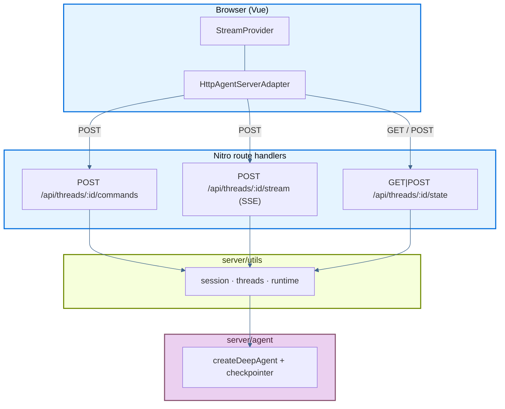

The following page details an example app that deploys a LangChain **deep agent** inside a [Nuxt 4](https://nuxt.com) project: streaming chat UI, subagent detail views, thread history, and reasoning-token streaming, all backed by the [Agent Streaming Protocol](https://github.com/langchain-ai/agent-protocol/tree/main/streaming) implemented as Nitro route handlers (HTTP + SSE). No separate backend process.

Source: [`js-nuxt`](https://github.com/langchain-ai/deployment-cookbook/tree/main/js-nuxt) in the deployment cookbook.

## Deploy

<Tabs>

<Tab title="Vercel">

<Steps>

<Step title="Import the repository">

Click **Deploy with Vercel** below, or import [`langchain-ai/deployment-cookbook`](https://github.com/langchain-ai/deployment-cookbook) manually.

<a href="https://vercel.com/new/clone?repository-url=https%3A%2F%2Fgithub.com%2Flangchain-ai%2Fdeployment-cookbook&root-directory=js-nuxt&env=OPENAI_API_KEY&envDescription=OpenAI%20API%20key%20for%20the%20agent%20and%20its%20subagents" target="_blank" rel="noopener noreferrer">
  
</a>

</Step>

<Step title="Configure the project">

Set **Root Directory** to `js-nuxt` and add `OPENAI_API_KEY` in project settings.

</Step>

<Step title="Deploy">

Deploy the project. Nuxt detects Vercel automatically and builds Nitro server routes for the Agent Streaming Protocol API.

</Step>

</Steps>

</Tab>

<Tab title="Netlify">

<Steps>

<Step title="Import the repository">

Click **Deploy to Netlify** below, or import [`langchain-ai/deployment-cookbook`](https://github.com/langchain-ai/deployment-cookbook) manually.

<a href="https://app.netlify.com/start/deploy?repository=https://github.com/langchain-ai/deployment-cookbook&base=js-nuxt" target="_blank" rel="noopener noreferrer">
  
</a>

</Step>

<Step title="Configure the project">

Set **Base directory** to `js-nuxt`. Netlify runs the Nuxt build from that subdirectory.

</Step>

<Step title="Set environment variables">

Add `OPENAI_API_KEY` in the Netlify deploy settings before the first build completes.

</Step>

</Steps>

</Tab>

<Tab title="Node">

<Steps>

<Step title="Build for production">

```bash
cd js-nuxt
cp .env.example .env   # set OPENAI_API_KEY for local dev
pnpm install
pnpm build
```

</Step>

<Step title="Set environment variables">

Export `OPENAI_API_KEY` on the host. Nitro reads it at runtime from the environment.

Optionally enable LangSmith tracing by adding the variables from [`.env.example`](https://github.com/langchain-ai/deployment-cookbook/blob/main/js-nuxt/.env.example).

</Step>

<Step title="Start the Nitro server">

```bash
node .output/server/index.mjs
```

Run behind any process manager or container orchestrator that keeps a Node.js process alive.

</Step>

</Steps>

</Tab>

</Tabs>

<Tip>
`@langchain/vue` discovers subagents from the stream and renders a clickable chip per subagent. Selecting one opens a scoped chat view bound to that subagent's namespaced `messages` and `tools` channels via `useMessages`. Reasoning summaries stream into a collapsible "Thinking" block that auto-expands while streaming.
</Tip>

## Required API endpoints

The app exposes the Agent Streaming Protocol under `/api/threads/...`. Nitro route handlers live in `server/api/threads/`.

### Minimum (streaming chat)

These three endpoints are enough to run a single-threaded streaming chat with `@langchain/vue`'s `HttpAgentServerAdapter`:

| Method | Path | Purpose |
| --- | --- | --- |
| `POST` | `/api/threads/:threadId/commands` | Accept protocol commands (`run.start`, …) and start agent runs |
| `POST` | `/api/threads/:threadId/stream` | SSE stream of protocol events for a run |
| `GET` / `POST` | `/api/threads/:threadId/state` | Read and bootstrap checkpointed thread state |

The client bootstraps a thread with `GET /state` (and `POST /state` on 404) so hydration does not 404 before the first message is sent.

### Optional (thread sidebar)

This example also implements endpoints for the thread-history sidebar. Omit them if your UI does not need multi-thread management:

| Method | Path | Purpose |
| --- | --- | --- |
| `GET` | `/api/threads` | List threads known to the checkpointer |
| `DELETE` | `/api/threads/:threadId` | Delete a thread's session and checkpoints |
| `POST` | `/api/threads/:threadId/history` | Paginated checkpoint history (Agent Protocol) |

### Request flow



1. Bootstrap thread state (`GET`/`POST /state`).
2. On submit, the SDK sends `run.start` to `/commands` and receives a `run_id`.
3. The SDK subscribes to `/stream` (SSE) for replay + live protocol events.
4. Subagent (`task`) runs emit namespaced events surfaced as `stream.subagents`.

## Nitro backend design

| Concern | Implementation |
| --- | --- |
| Frontend | Vue components in `app/` (wrapped in `<ClientOnly>` for SSE) |
| API layer | Nitro route handlers in `server/api/threads/` |
| Runtime | Node.js (Nitro preset depends on deploy target) |
| SSE replay | Process-local `LocalThreadSession` (`server/utils/session.ts`) |
| Agent runs | Same Nitro process; events buffered in a LangGraph `StreamChannel` |
| Thread storage | In-memory `MemorySaver` checkpointer (`server/agent/index.ts`) |
| Secrets | `.env` locally; host environment variables in production |

The agent's checkpointer is the single source of truth for threads. There is no client-side cache: the sidebar is always fetched from the server, and restarting the server clears every thread.

## Production persistence

Out of the box, the agent uses an in-memory `MemorySaver` checkpointer (`server/agent/index.ts`) and a process-local session map (`server/utils/runtime.ts`). That works for local dev and single-instance servers, but on serverless or multi-instance hosts conversation state is **not durable** across cold starts or replicas.

For production, swap in a [durable checkpointer](/oss/python/langgraph/checkpointers#checkpointer-libraries):

| Package | Backend |
| --- | --- |
| [`@langchain/langgraph-checkpoint-redis`](https://www.npmjs.com/package/@langchain/langgraph-checkpoint-redis) | Redis (`RedisSaver`) |
| [`@langchain/langgraph-checkpoint-postgres`](https://www.npmjs.com/package/@langchain/langgraph-checkpoint-postgres) | Postgres (`PostgresSaver`) |
| [`@langchain/langgraph-checkpoint-sqlite`](https://www.npmjs.com/package/@langchain/langgraph-checkpoint-sqlite) | SQLite (`SqliteSaver`) |

Replace `MemorySaver` in `server/agent/index.ts` and pass the new checkpointer to `createDeepAgent`. The Nitro route handlers and `server/utils/threads.ts` helpers stay the same.

You will also want a shared session/replay store in `server/utils/runtime.ts` so SSE reconnection works across serverless invocations.

For more information, see [checkpointer libraries](/oss/python/langgraph/checkpointers#checkpointer-libraries) and [add memory / persistence](/oss/python/langgraph/add-memory).

## Local development

```bash
cp .env.example .env   # set OPENAI_API_KEY
pnpm install
pnpm dev
```

Open [http://localhost:3000](http://localhost:3000). Send a prompt that delegates to subagents and watch their work stream into dedicated cards.

```bash
pnpm build      # production build
pnpm preview    # preview the production build
pnpm typecheck  # vue-tsc over the project
```

## Project layout

<AccordionGroup>

<Accordion title="Project structure">

- `server/agent/` — deep agent (`createDeepAgent`) with `researcher` and `math-whiz` subagents, mock tools, and `stripReasoningReplay` middleware.
- `server/utils/` — protocol server logic: `session.ts` (SSE runs), `threads.ts` (checkpointer-backed state), `serialize.ts`, `runtime.ts`.
- `server/api/threads/` — Nitro route handlers for the protocol endpoints above.
- `app/components/` — Vue chat UI (`ChatApp`, `Chat`, `ThreadHistory`, `SubagentList`, `MessageReasoning`, …) using `@langchain/vue`.
- `app/utils/threads.ts` — server-driven thread helpers and LangGraph SDK bootstrap.

</Accordion>

<Accordion title="Backend details">

- `server/agent/index.ts` — coordinator uses a reasoning model over the Responses API; tool-using subagents use chat-completions (to avoid reasoning item replay through the checkpointer).
- `server/agent/middleware.ts` — rebuilds prior assistant messages from `content` + `tool_calls` so stale reasoning ids are never replayed to the Responses API.
- `server/utils/session.ts` — `LocalThreadSession` buffers protocol events and fans matching frames out over SSE via `matchesSubscription`.
- `server/api/threads/index.get.ts` — `GET /api/threads`, the checkpointer-backed thread list.
- `server/api/threads/[threadId]/…` — handlers for `commands`, `stream`, `state` (GET/POST), `history`, and `DELETE`.

</Accordion>

<Accordion title="Frontend details">

- `app/components/ChatThread.vue` — builds the `HttpAgentServerAdapter` and calls `provideStream({ transport, threadId })`.
- `app/components/Chat.vue` — message view with composer and per-subagent detail view (with breadcrumb).
- `app/components/SubagentList.vue` / `SubagentDetail.vue` — inline subagent cards and scoped subagent chat (`useMessages` bound to namespace).
- `app/components/MessageReasoning.vue` — collapsible "Thinking" block for reasoning summaries.

</Accordion>

</AccordionGroup>

## See also

- [Frameworks and platforms overview](/langsmith/deploy-frameworks-and-platforms)
- [Agent Streaming Protocol](https://github.com/langchain-ai/agent-protocol/tree/main/streaming)
- [`react-custom-backend`](https://github.com/langchain-ai/streaming-cookbook) — original Vite + Hono reference for a custom protocol server
- [`@langchain/vue`](https://www.npmjs.com/package/@langchain/vue) — `useStream`, `provideStream`, and selector composables
- [Frontend overview](/oss/python/langchain/frontend/overview)

---

<div className="source-links">
<Callout icon="terminal-2">
    [Connect these docs](/use-these-docs) to Claude, VSCode, and more via MCP for real-time answers.
</Callout>
<Callout icon="edit">
    [Edit this page on GitHub](https://github.com/langchain-ai/docs/edit/main/src/langsmith/deploy-nuxt.mdx) or [file an issue](https://github.com/langchain-ai/docs/issues/new/choose).
</Callout>
</div>
