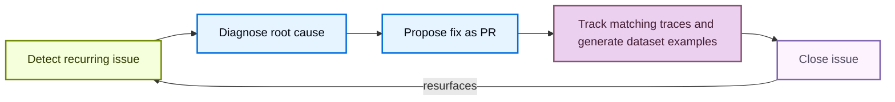

LangSmith Engine helps you ship more reliable agents without manually searching through traces. It is the LangSmith agent for agent engineering: working from your production traces, it surfaces recurring issues, diagnoses their root cause, and drives the fix across every stage of the development lifecycle. For a product overview, see [Engine](/langsmith/engine-overview).

## How Engine works

### The issue lifecycle

Each issue moves through a closed loop in which Engine:

1. Detects a recurring issue in your traces.
2. Diagnoses the root cause against your traces and connected source code.
3. Proposes a fix as a pull request.
4. Tracks the issue over time, automatically adding new traces that match the same pattern, and generates ground truth [dataset examples](/langsmith/manage-datasets) so you can verify a fix.
5. Reopens the issue automatically if it resurfaces after being closed.



### How Engine selects traces

Engine analyzes both trace content and run feedback when selecting and ranking traces for each scan. It treats feedback—including online evaluator scores, annotation queue scores, and user feedback submitted via the SDK—as a high-priority signal, not supplementary data.

To apply this signal, Engine:

- Reads the feedback keys present in your project and performs a dedicated pull of low-scoring traces for each key, so the sample includes traces with poor evaluator scores rather than leaving them to recency.
- Prioritizes traces with non-empty feedback scores ahead of other traces when screening the sample.
- Preserves feedback scores on every trace in the analysis context, even when trace payloads are compacted to fit within context limits.

Any source that writes feedback to a run contributes to this prioritization automatically. Engine requires no setup beyond evaluators or annotation queues.

## Set up Engine

Setting up Engine is a two-step process: an [Organization Admin](/langsmith/rbac#organization-admin) first enables Engine for the [workspace](/langsmith/administration-overview#workspaces), then any user can turn on Engine for each tracing project.

<Note>
On Self-hosted LangSmith, an operator must enable Engine in the LangSmith Helm chart before either step is available. Refer to [Engine on Self-hosted](/langsmith/engine-self-hosted).
</Note>

### Enable Engine for your organization

<Note>You must be an [**Organization Admin**](/langsmith/rbac#organization-admin) to enable Engine. To find your admins, open **Settings**, select **Members** under **Access and Security**, and look for members with the **Organization Admin** role.</Note>

<Steps>
  <Step title="Open Engine enablement">
    In the [LangSmith console](https://smith.langchain.com?utm_source=docs&utm_medium=cta&utm_campaign=langsmith-signup&utm_content=langsmith-engine), click **Settings** in the bottom-left corner, then select **Engine enablement** under **Engine**.
  </Step>
  <Step title="Toggle Enable Engine">
    Toggle **Enable Engine** on and acknowledge the AI features terms of use. The dialog displays the following in-product notice verbatim:

    > LangSmith AI features, powered by LangChain-managed inference, bring intelligence to your observability workflow. With LangSmith AI enabled, your team can surface issues faster, run smarter evaluations, and build more reliable LLM applications. By enabling this feature, your organization's trace data will be processed using LangChain-managed LLM keys. Subject to our Terms of Service.

  </Step>
</Steps>

Once Engine is enabled, any team member in your organization can set it up for their tracing projects.

<Tip>
  If you want to turn off Engine, toggle the same setting to off. This will stop all automatic runs of Engine and discontinue future billing in your account.
</Tip>

### Turn on Engine for a tracing project

<Steps>
  <Step title="Open Engine and select a project">
    In the [LangSmith console](https://smith.langchain.com?utm_source=docs&utm_medium=cta&utm_campaign=langsmith-signup&utm_content=langsmith-engine), select **Engine** in the UI sidebar. The project selector lists projects that are already configured. To set up a project that is not listed, click **+ Set up another project**, then choose it under **Choose a project to analyze**. The **Engine** tab in a tracing project is also available.
  </Step>
  <Step title="Connect a code repository (optional)">
    Although optional, connecting a code repository is recommended. Engine reads your source code to locate the code path behind a failing trace, ground its proposed fixes in the actual implementation, and open pull requests directly from issues. Under **Connect your agent's code repository**, select a repository in the **GitHub Repository** field. Only repositories the GitHub app can access are shown. Click **Manage app access →** to update permissions. For GitHub App setup and organization approval, see [Connect Engine to GitHub](/langsmith/engine-github). To give Engine additional project context, select a repository in the **Context Hub repository** field.
  </Step>
  <Step title="Select preference categories (optional)">
    Under **What matters most to you?**, select categories to prioritize for your review (for example, **Tool Call Failures** or **Latency**). Click **+ Add something specific** to describe a custom concern. See [Tell Engine what kinds of issues to focus on](#tell-engine-what-kinds-of-issues-to-focus-on).
  </Step>
  <Step title="Choose an analysis level">
    Under **Analysis level**, choose **Reduced**, **Standard** (the default), or **Expanded**. Higher levels analyze more traces and cost more. See [Set the analysis level](#set-the-analysis-level).
  </Step>
  <Step title="Focus on specific traces (optional)">
    Under **Focus on specific traces**, narrow Engine's attention to a subset of runs by run name or metadata. Leave it empty to analyze all traces. See [Tell Engine which traces to focus on](#tell-engine-which-traces-to-focus-on).
  </Step>
  <Step title="Start analyzing">
    Click **Start Analyzing**. The dialog may show an estimated monthly cost range based on your project's usage. Engine can take up to 20 minutes to analyze your project’s traces and begin making suggestions. While you wait, you can [set up notifications](/langsmith/engine-notifications) to be alerted in Slack or via webhook when issues of different priority levels are found.
  </Step>
  <Step title="Review the agent overview document">
    Before surfacing issues, Engine generates an agent overview document describing your project's purpose, architecture, and key metrics based on your traces. Review and edit the document, then click **Accept & Continue** to proceed. If the overview is inaccurate, edit it before continuing, since Engine uses it as context for all analysis, so accuracy here affects the quality of detected issues.
  </Step>
</Steps>

<Frame caption="Setup dialog">
  
  
</Frame>

You can change any of these choices later in [Configure Engine](#configure-engine). To connect GitHub, see [Connect Engine to GitHub](/langsmith/engine-github). To get alerted in Slack or through a webhook when Engine finds issues, see [Engine notifications](/langsmith/engine-notifications).

### Pause Engine or delete its issues

Engine scans your traces on a dynamic schedule tuned to balance cost and performance. To stop scanning a project without deleting its existing issues, click **Pause** in the [**Engine Settings**](#configure-engine) panel. Click **Resume** to start scanning again.

Click **Delete all issues** in the same panel to permanently remove the project's issues and Engine settings. This cannot be undone.

To turn off Engine for the whole organization, see [Enable Engine for your organization](#enable-engine-for-your-organization).

## Configure Engine

On the **Engine** page, click the **Configure Engine** <Icon icon="settings"/> (gear) icon at the top of the issue list to open the **Engine settings** panel. Use it to give Engine context on your agent, tell it what to focus on, and connect Linear. The panel also holds settings covered elsewhere:

- **Code repository** and **Context repository**: Connect or update the GitHub repository Engine reads when diagnosing issues, optionally with a **Subfolder** and a **Branch** (defaults to the repository default). A Context Hub repository lets Engine propose fixes to instructions, docs, and linked skills. See [Connect Engine to GitHub](/langsmith/engine-github).
- **Notifications**: See [Engine notifications](/langsmith/engine-notifications).
- **Analysis level**: See [Set the analysis level](#set-the-analysis-level).
- **Engine spend**: See [Set spend limits and monitor usage](#set-spend-limits-and-monitor-usage).
- **Pause** and **Delete all issues**: See [Pause Engine or delete its issues](#pause-engine-or-delete-its-issues).

### Give context on your agent

During setup, Engine generates an agent overview document describing your project's purpose, architecture, and key metrics. Engine uses it as context for all analysis, so its accuracy affects the quality of detected issues. Under **Agent overview**, edit the document to add any relevant context Engine can't infer from your traces and to make sure it is accurate. The document's **User Preferences** section also collects what Engine has [learned from your actions on issues](#investigate-and-fix-an-issue), so you can review and correct those calibrations here.

### Tell Engine what kinds of issues to focus on

Under **Preferences**, list the areas Engine should focus on, prioritize, or ignore. Select category chips such as **Cost & Tokens**, **Latency**, or **Tool Call Failures**, or click **+ Add something specific** to describe a custom concern. Engine treats preferences as authoritative and folds them into the agent overview document. Changes take effect on the next scan.

### Tell Engine which traces to focus on

Focus Engine on the traces that matter to keep analysis precise and reduce wasted LCU spend. Use trace scope (the **Focus on specific traces** control) when a project mixes several agents or workloads and you want Engine to analyze only some of them. For example, if a project runs both a production chatbot and a nightly batch job, scope to `Run Name is chatbot` so Engine ignores the batch runs. By default, Engine analyzes all of a project's traces.

Set the scope in either of two places, using the same control:

- **Engine setup**: In the **Find and fix your agent's issues** panel, under **Focus on specific traces**.
- **Engine Settings**: In the **Focus on specific traces** section of the [**Engine Settings**](#configure-engine) panel. Edits here save automatically.

Add scope conditions with the filter editor. You can add one condition of each kind, **up to two**:

- **Run Name**: Pick a run or agent name. The value field autocompletes from the run names in your project's recent traces.
- **Metadata**: Pick a metadata key, then a value. Both autocomplete from the metadata present on your project's recent runs.

To add a condition, choose its kind from the field selector, fill in the values, then click **Add**. Each condition appears as a chip, for example `Run Name is chatbot` or `env is prod`. Click the **×** on a chip to remove that condition.

<Note>
**Scope limitation:** The scope filter only accepts run name and metadata conditions. You cannot scope Engine's scan by feedback key, evaluator name, or score threshold. To focus Engine on traces with a specific evaluator's low scores, describe that in your [preferences](#tell-engine-what-kinds-of-issues-to-focus-on) or [agent overview](#give-context-on-your-agent). Engine already factors in all feedback signals automatically. See [How Engine selects traces](#how-engine-selects-traces).
</Note>

Scope determines which traces Engine analyzes to detect issues and build the agent overview document. Scope set during initial setup applies to Engine's first scan. Scope changed later in the [**Engine Settings**](#configure-engine) panel does not re-run Engine immediately; it applies on the next scan.

### Connect to Linear

Under **Linear**, click **Connect**, select a team, optionally select a project for new issues, then click **Save changes**. Engine retains durable links to the issues it creates, but does not synchronize later edits from Linear. Deleting all Engine issues does not delete existing Linear tickets. See [Create a Linear issue](#create-a-linear-issue).

## Manage Engine costs

### Understand LCU costs

<Note>
Engine uses **LangChain-managed inference** exclusively. Bring Your Own Key (BYOK) is not supported; you cannot supply your own provider API keys for Engine.
</Note>

Engine charges in **LangChain Compute Units (LCUs)**, a normalized unit of work combining compute, storage, memory, and LLM spend. LCU consumption scales with the number of traces analyzed, the number and complexity of the LLM calls Engine makes to diagnose and fix issues, and the size of any connected repository. LCUs cost **$1.50 USD each**. For an estimate of your expected LCU usage, see the [LangSmith Usage Calculator](https://www.langchain.com/pricing#pricing-calc).

Engine runs in two phases:

| Phase | Trigger | Typical LCU usage |
|---|---|---|
| **Initialization** | First time you enable Engine on a project | 30-40 LCUs |
| **Recurring scans** | Automatically, on a dynamic schedule | 10-15 LCUs |

On initialization, Engine audits past traces, clusters and prioritizes issues by severity, and proposes fixes to your prompts or code (if a repository is connected). Recurring scans run on a dynamic schedule tuned to balance cost and performance, whether or not new issues are found, and surface new issues not previously detected.

### Set the analysis level

The analysis level controls how many of your project's traces Engine analyzes, and so how many LCUs it uses. Choose it when you [turn on Engine for a project](#turn-on-engine-for-a-tracing-project), and change it later under **Analysis level** in the [**Engine Settings**](#configure-engine) panel:

- **Reduced**: Monitors fewer traces at a lower cost.
- **Standard** (default): Analyzes more of your eligible traces for fuller coverage.
- **Expanded**: Maximum coverage for high-volume projects. Available only for projects with enough tracing volume.

The setup dialog shows an estimated monthly cost range that updates with the level you choose.

### Set spend limits and monitor usage

Organization Admins can set spend limits at two levels:

- **Org-wide limit**: Open **Settings**, select **Engine enablement** under **Engine**, then enter a value under **Monthly LCU spend limit**.
- **Per-project limit**: Open the **Engine** tab in a tracing project, click the **Engine Settings** <Icon icon="settings"/> icon, and set a limit under **Monthly LCU spend limit**.

You can enter limits in LCU or USD (1 LCU = $1.50). When a limit is reached, LangSmith pauses new Engine runs until the limit is raised or the next monthly billing period begins.

The two levels default differently:

- **Org-wide limit**: Choose **Default**, **No limit**, or a custom cap. Until an admin chooses, the default applies (500 LCU per month, about $750), so Engine spend is capped even though no one has set a limit. The **Engine enablement** page names the enforced limit and its source.
- **Per-project limit**: Leave the field blank for no limit. Use **Remove limit** to clear a cap you set earlier.

To stop Engine entirely, use the **Enable Engine** toggle in **Settings > Engine enablement**.

To monitor usage, you can view your organization's monthly LCU spend on the **Engine enablement** page in **Settings**, or view per-project spend in the [**Engine Settings**](#configure-engine) panel for each tracing project.

## Investigate and fix an issue

Once setup is complete, the **Engine** page lists the issues Engine has detected. Click any issue to open its detail panel. At the top, a diagnosis describes the problem and its impact. Each issue has a toolbar for setting its priority, closing or reopening it, opening a pull request, creating a Linear issue, and watching it.

Engine learns from how you handle issues. On each scheduled scan, it reviews the actions you took since the last scan, such as closing an issue, marking it as incorrectly flagged, changing its priority, or opening a pull request, and folds them into the **User Preferences** section of the [agent overview](#give-context-on-your-agent). Reasons you give when changing priority or closing an issue are part of that feedback. For example, if you repeatedly mark issues in one category as incorrectly flagged, Engine rates that category as lower priority on later scans. Changes that come from automation, such as a pull request merging, and actions taken through [LangSmith Chat](/langsmith/chat#engine) do not count as feedback.

### Review evidence

The **Evidence** section contains traces that support a diagnosis, including a snippet from each trace. From this section, you can:

- **View a trace**: Click **View trace** to open an evidence trace. When Engine identifies the child run that caused the issue, it opens that exact run. The trace view includes a **View issue** link back to the Engine issue.
- **Create offline examples**: Click [**Add offline examples**](#add-offline-examples) to generate custom ground truth [dataset examples](/langsmith/manage-datasets) from the production trace inputs for offline evaluation.
- **View project evidence**: Click **View all in project** to view the evidence in the tracing project.

For more information, see [Manage a trace](/langsmith/manage-trace).

Engine keeps tracking an issue after it is filed. On later scans, any new trace that matches the issue's failure pattern is added to **Evidence** automatically, so the issue reflects how often the failure is still happening without you re-running anything.

The **Proposed Fix** section describes the issue and suggests how to address it, which may include specific code or prompt changes if a repository is connected.

### Change priority and status

Select **Low**, **Medium**, or **High** from the priority dropdown to update an issue's priority. You can optionally provide a reason, which Engine [learns from](#investigate-and-fix-an-issue) on later scans.

Closing records the outcome of your review. Click:

- **Close** to mark the issue as resolved.
- **Incorrectly Flagged** to dismiss the issue as not real or not worth fixing.

For either outcome, you can optionally provide a reason, which Engine [learns from](#investigate-and-fix-an-issue) on later scans.

You can reopen a closed issue at any time. Click **Reopen** to clear any fix in progress and stop watching the issue if it was being watched. Engine also reopens an issue automatically when it detects the same problem recurring in a later trace.

### Open a pull request

Click **Open PR** to open a GitHub pull request with the proposed code change in your connected repository. Connect a repository first if you haven't. Once a pull request exists, Engine replaces **Open PR** with **View PR #\<number\>**. Click **View PR #\<number\>** to open the pull request in GitHub. Engine reflects the PR's status (open, merged, or closed) throughout the issue. You can also copy the issue's fix context to your clipboard for use with an LLM or coding assistant. Engine can propose code changes to any connected repository, including agents built with [Deep Agents](/oss/python/deepagents/overview), [LangChain](/oss/python/langchain/overview), and [LangGraph](/oss/python/langgraph/overview).

### Create a Linear issue

To create an issue, first [connect Linear](#configure-engine), then click **Create in Linear** on an Engine issue. Engine shows **Linear creation pending** while it creates the issue. When creation completes, Engine displays the linked Linear issue identifier in the Engine issue and issue list.

The Linear issue includes the Engine issue title and description, severity, category, tags, a **View issue in LangSmith** link, and evidence trace IDs. Engine retains the link to the Linear issue. If you close the Linear ticket, Engine closes the corresponding issue. If you cancel the Linear ticket, Engine marks the corresponding issue as incorrectly flagged. Engine also tracks a pull request linked to the Linear ticket on the corresponding Engine issue.

### Add offline examples

This step captures the traces that surfaced the issue as ground-truth [dataset examples](/langsmith/manage-datasets), so you can evaluate the fix offline before it reaches production.

1. Click **Add offline examples** at the top right of the **Evidence** list to open the **Add as offline example** dialog.
2. Review each trace. The dialog shows the input, the wrong output the agent produced, and the proposed expected output as a custom ground truth example.
3. Click **Add to Dataset** to add them directly, or click **Edit in annotation queue** to review them first.
4. In the annotation queue, each example shows the run inputs alongside reference outputs proposed by Engine, structured as named [assertions](/langsmith/assertions) generated from trace analysis. Each assertion is a short claim describing what a correct answer should or shouldn't include. Edit the assertions as needed, add new ones with **+ Add assertion**, then click **Add to Dataset & Continue** to work through each example.

For more information, refer to [Manage datasets](/langsmith/manage-datasets), [Use annotation queues](/langsmith/annotation-queues), and [Use assertions](/langsmith/assertions).

### Watch an issue

Watching keeps an issue open for monitoring without resolving it or marking it as incorrectly flagged. Click **Watch** when you are not ready to fix an issue but still want to know if it keeps happening.

To be alerted when a watched issue recurs, click **Alert me via Slack**, which opens the **Notifications** section of the [Engine Settings](#configure-engine) panel. See [Engine notifications](/langsmith/engine-notifications).

When new traces link to a watched issue, Engine moves it to the top of your list and shows how many new traces arrived, so you can pick up the fix or keep watching.

<Note>
Watching is only available for open issues without a pull request in flight: discard the fix to watch an issue again. Resolving a watched issue, or marking it as incorrectly flagged, automatically stops watching it.
</Note>

## Filter and sort issues

### In the UI

The **Engine** page lists detected issues in the left panel. Each entry shows a title, a short description, the number of contributing traces, and how recently the issue was observed. Each issue is tagged with a failure category, such as **Silent tool error** or **Hallucination**.

At the top of the list, you can click:

- **Filter issues** icon to filter by **Priority**, **Status** and **Tags**.
- **Sort issues** icon to sort by **Severity**, **Last Updated**, and **Created**.
- **Configure Engine** <Icon icon="settings"/> (gear) icon to [configure Engine](#configure-engine).

Open [LangSmith Chat](/langsmith/chat#engine) to ask questions across your issues, for example, which issues need the most attention or how many new issues are open.

If no issues appear after setup completes, Engine found no recurring patterns in the analyzed traces. Try checking back after more traces have been collected.

### With the CLI

Use `langsmith project issues list` in the [LangSmith CLI](/langsmith/cli) to list a project's issues. Filter with `--status` (`open`, `fixing`, `watching`, `completed`, or `ignored`) and `--priority` (`urgent`, `high`, `medium`, or `low`), and page with `--limit` and `--offset`.

```bash
# List open, high-priority issues for a project
langsmith project issues list --project <project-name> --status open --priority high
```

## See also

- [Engine](/langsmith/engine-overview): Product overview and where Engine fits in the development lifecycle.
- [Connect Engine to GitHub](/langsmith/engine-github): Connect repositories in LangSmith Cloud, or create and configure your own GitHub App for a self-hosted deployment.
- [Engine notifications](/langsmith/engine-notifications): Slack and webhook destinations, event payload reference, and signing-secret verification.
- [Engine on self-hosted](/langsmith/engine-self-hosted): Self-hosted architecture and data handling.
- [Manage datasets](/langsmith/manage-datasets), [Use annotation queues](/langsmith/annotation-queues), and [Use assertions](/langsmith/assertions): Work with the offline examples Engine generates.
- [LangSmith CLI](/langsmith/cli): List and manage issues programmatically.

---

<div className="source-links">
<Callout icon="terminal-2">
    [Connect these docs](/use-these-docs) to your agent of choice via MCP for real-time answers.
</Callout>
<Callout icon="edit">
    [Edit this page on GitHub](https://github.com/langchain-ai/docs/edit/main/src/langsmith/engine.mdx) or [file an issue](https://github.com/langchain-ai/docs/issues/new/choose).
</Callout>
</div>
