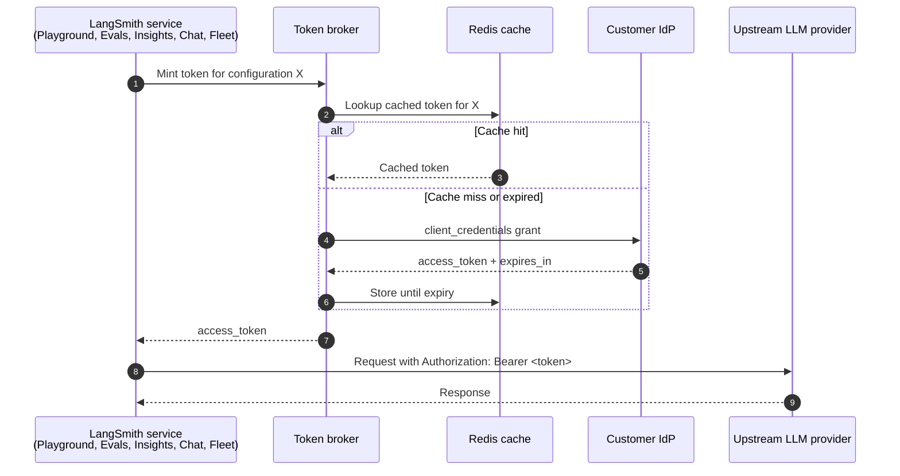

Model configurations define the model and parameters that LangSmith features use when calling an AI provider. A single shared library of configurations spans your entire [workspace](/langsmith/administration-overview#workspaces), so any configuration you create is available across the following features without duplication:

- [**Playground**](/langsmith/prompt-engineering-concepts)
- [**Evaluators**](/langsmith/evaluation)
- [**Fleet**](/langsmith/fleet/index)
- [**Chat**](/langsmith/chat)
- [**Insights**](/langsmith/insights)

[Workspace admins](/langsmith/rbac#workspace-admin) can create, edit, and delete configurations and control which providers and models are available per feature. Non-admin members can view configurations but cannot modify them.

Configurations can also carry [OAuth client credentials](#oauth-client-credentials), so LangSmith mints short-lived bearer tokens against your IdP at request time instead of using a static API key.

## Feature Access

The **Feature Access** table controls provider and model availability independently for each LangSmith feature.

| **Feature** | **Model selection experience** |
|---------|---------------------------|
| Playground | Full model controls—view and adjust all parameters. No built-in models; relies on workspace configurations. |
| Evaluators | Full model controls—view and adjust all parameters. No built-in models; relies on workspace configurations. |
| Fleet | Choose from a curated list by default. You can also add custom workspace configurations. |
| Chat | Choose from a curated list by default. You can also add custom workspace configurations. |
| Insights (Thinking) | Model used for deep analysis. Choose from a curated list with provider recommendations by default. You can also add custom workspace configurations. |
| Insights (Summarization) | Model used for lightweight summarization. Choose from a curated list with provider recommendations by default. You can also add custom workspace configurations. |

All features support custom workspace configurations, so you can use any provider or model—even for features that show a curated list by default.

<Note>
**Insights** uses two separate rows—one for analysis and one for summarization. The UI displays a warning if you select incompatible providers or non-recommended models for either row.
</Note>

### Configure feature access

To configure feature access in the [UI](https://smith.langchain.com?utm_source=docs&utm_medium=cta&utm_campaign=langsmith-signup&utm_content=langsmith-model-configurations):

1. Navigate to **Settings** > **Model configurations**.
1. In the **Feature Access** table, find the feature you want to configure.
1. Click **Enabled Providers** and toggle providers on or off for that feature.
1. Click **Available Models** and select which models users can choose from.
1. Use the **Default Model** dropdown to set the model preselected when users open the feature.

## Configurations

The **Configurations** table is a shared library of named model configurations for your workspace. Configurations you create in LangSmith (including from the [Playground](/langsmith/managing-model-configurations)) appear here and you can reuse them across all features.

### Create a configuration

1. Navigate to **Settings** > **Model configurations**.
1. Under **Configurations**, click **+ Create**.
1. Select a **Provider** and **Model**.
1. Enter the **API Key Name**—the name of the secret in your workspace that stores the provider API key.
1. Adjust parameters as needed. Parameters are grouped into sections for:
    - **Standard sampling settings**: temperature, top P, top K, presence penalty, frequency penalty, max output tokens
    - **Reasoning**: reasoning effort, service tier
    - **Provider config**: provider API, base URL
    - **Options**: stop sequences, seed, JSON mode, extra headers, requests per second, extra parameters

    Available parameters vary by provider—refer to your provider's documentation for details.
1. Click **Save**.

### Edit a configuration

1. In the **Configurations** table, click the overflow menu <Icon icon="dots-vertical" iconType="regular" /> next to the configuration.
1. Select **Edit**.
1. Update the configuration and click **Save**.

### Delete a configuration

1. In the **Configurations** table, click the overflow menu <Icon icon="dots-vertical" iconType="regular" /> next to the configuration.
1. Select <Icon icon="trash" iconType="regular" /> **Delete** and confirm.

## OAuth client credentials

<Note>
OAuth client credentials are available on LangSmith [Cloud](/langsmith/cloud) and [Self-hosted](/langsmith/self-hosted) deployments running version `0.16.0-rc.6` or later.
</Note>

When a model configuration sits behind an OAuth2 gateway, you can store the OAuth `client_credentials` directly on the configuration instead of distributing a static API key. LangSmith exchanges those credentials for a short-lived bearer token at request time, attaches it as `Authorization: Bearer <token>` on the outbound LLM call, and refreshes the token before it expires. This is a per-configuration self-service alternative to routing the workspace through the [LLM auth proxy](/langsmith/llm-auth-proxy-self-hosted); the two are mutually exclusive per configuration.

OAuth client credentials are available on every [plan](/langsmith/pricing-plans) that supports custom model configurations. The **Use Custom OAuth** toggle applies to bearer-token providers (OpenAI, Anthropic, OpenAI-compatible endpoints, and similar) and is not supported for Bedrock, Google Vertex AI, or Google GenAI, which authenticate with native cloud identity. The toggle is also hidden for the **LangServe (Deprecated)** preset.

### Configure OAuth on a model configuration

Configuring OAuth requires the [Workspace Admin](/langsmith/rbac#workspace-admin) role, or a [custom role](/langsmith/rbac#custom-roles) with the `workspaces:manage-model-configs` permission. Members without it see the OAuth fields disabled, with a masked secret hint. In the [LangSmith UI](https://smith.langchain.com?utm_source=docs&utm_medium=cta&utm_campaign=langsmith-signup&utm_content=langsmith-model-configurations):

1. Navigate to **Settings** > **Model configurations** and either click **+ Create** or open an existing row through the overflow menu <Icon icon="dots-vertical" iconType="regular" /> > **Edit**.
1. Select a compatible provider and configure model parameters as usual.
1. Toggle **Use Custom OAuth** on.
1. Fill the OAuth fields:
    - **Token URL**: the IdP token endpoint, for example `https://login.example.com/oauth/token`.
    - **Client ID**: the OAuth client identifier.
    - **Client Secret**: the OAuth client secret. Encrypted at rest.
    - **Token Endpoint Auth Method**: `client_secret_basic` or `client_secret_post`.
    - **Extra parameters**: key/value rows sent in the token request body. Use these rows for `scope`, `audience`, `resource`, or any other parameter the IdP expects. Add one row per value when sending multiple scopes; duplicate keys are sent as multi-value pairs.
    - **Extra headers**: additional headers sent with the token request. Reserved headers such as `Authorization` are rejected at save time.
1. Click **Save**.

### Edit semantics

OAuth fields follow edit behaviors that protect the stored secret:

- **Secret round-trip**: the server returns the secret as `********`. The input renders empty with a *"Secret is set. Type to replace."* hint. Submitting without retyping leaves the stored secret unchanged.
- **Toggle off preserves credentials**: switching **Use Custom OAuth** off deactivates the OAuth flow but keeps the stored fields. Toggling back on resumes using the same credentials.
- **Clear a field**: edit the configuration and blank the field to clear it explicitly.
- **Clone via Save as preset**: when you save a one-off configuration as a new preset, non-secret OAuth fields copy into the new row. The secret cannot transfer because it is never exposed for read, so OAuth is force-disabled on the clone until you re-enter the secret.

### How a request flows

When a request runs against an OAuth-enabled configuration, LangSmith mints a bearer through an internal broker, caches the result, and stamps the bearer on every outbound LLM call until the cached token expires.

Routing between OAuth and the [LLM auth proxy](/langsmith/llm-auth-proxy-self-hosted) is per-configuration, not per-organization. Each request resolves to OAuth or the LLM auth proxy based on the configuration's OAuth state. A single multi-model job (for example, [Insights](/langsmith/insights) with separate Thinking and Summarization models) can mix the two flows because each model is resolved independently.

### Fallback behavior

If the broker cannot mint a token (IdP unreachable, credentials invalid, configuration deleted between request preparation and execution), the request falls back to the static workspace API key for the provider. If no workspace key is set, expect a provider 401 on the outbound call.

Token rotation propagates only after the cached bearer expires. Plan rotations around the access token TTL configured at the IdP.

### Surface coverage

OAuth-enabled configurations are honored wherever model configurations are consumed:

- [**Playground**](/langsmith/prompt-engineering-concepts): chat runs and experiment runs.
- [**Evaluators**](/langsmith/evaluation): LLM-as-judge configuration, Reuse, Preview Test, and Evaluator Details Test all skip the workspace-secrets prompt when every prompt resolves to an OAuth-enabled configuration.
- [**Insights**](/langsmith/insights): Thinking and Summarization configurations are resolved independently.
- [**Chat**](/langsmith/chat)
- [**Fleet**](/langsmith/fleet/index)

When OAuth is enabled on a configuration, LangSmith does not prompt for a workspace secret for that configuration, because the broker supplies the credential at request time.

### Security and audit

- **Encryption at rest**: client secrets are Fernet-encrypted with the same derivation used for [workspace secrets](/langsmith/administration-overview#workspaces).
- **Bearer caching**: access tokens are cached until expiry and are never written to logs.

### FAQ

<Accordion title="Can a single set of OAuth credentials be shared across workspaces?">
No. OAuth credentials are stored on the model configuration, which is workspace-scoped. Each workspace enters its own credentials, even when the credentials point at the same IdP client.
</Accordion>

<Accordion title="Why is my OAuth-enabled configuration suddenly using a static workspace key?">
If the broker cannot mint a bearer (IdP unreachable, credentials invalid, configuration deleted between request preparation and execution), the request falls back to the static workspace API key for the provider. Re-open the model configuration and verify the Token URL is reachable, the Client ID and secret are current, and the Token Endpoint Auth Method matches what your IdP expects.
</Accordion>

<Accordion title="How do I rotate the client secret?">
Edit the model configuration and retype the secret in the **Client Secret** field. The previous secret is overwritten on save. The Redis-cached bearer continues to work until its TTL expires, after which the broker mints a new bearer using the rotated secret.
</Accordion>

<Accordion title="Can OAuth and the LLM auth proxy be used together?">
Yes. Routing is per-configuration. Configurations with OAuth enabled use OAuth; configurations without it fall through to the LLM auth proxy when the proxy is enabled at the organization level. A single multi-model job can mix the two flows.
</Accordion>

---

<Callout icon="terminal-2">
    [Connect these docs](/use-these-docs) to Claude, VSCode, and more via MCP for real-time answers.
</Callout>
<Callout icon="edit">
    [Edit this page on GitHub](https://github.com/langchain-ai/docs/edit/main/src/langsmith/model-configurations.mdx) or [file an issue](https://github.com/langchain-ai/docs/issues/new/choose).
</Callout>

