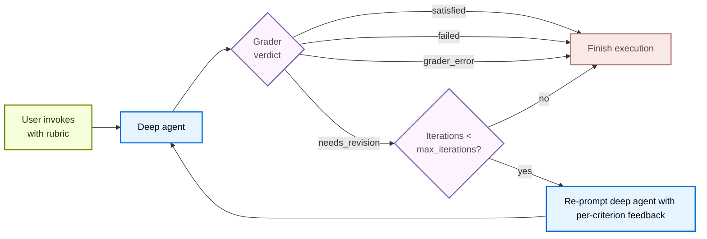

<Note>
`RubricMiddleware` is in [**beta**](/oss/javascript/versioning). The API may change in the future.
</Note>

Some agent tasks have a clear definition of "done" that the model alone cannot reliably hit on the first try: a haiku in the right syllable pattern, a refactor with all tests passing, a report that hits every required section. `RubricMiddleware` lets you declare *what done looks like* as a rubric and have the agent **self-evaluate and iterate** until the rubric is satisfied (or a configured maximum iteration cap is hit).

When the deep agent finishes reasoning and has an output, a separate **grader sub-agent** reviews the transcript against the rubric. If the grader returns `needs_revision`, its feedback is injected back into the conversation and the agent runs again. The loop terminates on `satisfied`, `max_iterations_reached`, `failed`, or `grader_error`.



## Rubric verdicts

Every grader pass produces one of five verdicts:

| Status | Meaning | Loops back? |
| --- | --- | --- |
| `satisfied` | Every criterion in the rubric passes. | No |
| `needs_revision` | At least one criterion fails; grader feedback is injected and the agent runs again. | Yes |
| `max_iterations_reached` | Grader still wants revisions, but `max_iterations` has been hit. | No |
| `failed` | The grader judged the rubric malformed or impossible to evaluate against the transcript. | No |
| `grader_error` | The grader sub-agent itself raised an exception (provider timeout, missing credentials, malformed structured response, etc.). | No |

## Configure the middleware

| Argument | Required | Default | Description |
| --- | --- | --- | --- |
| `model` | Yes | `None` | Chat model used by the grader sub-agent. Accepts a `"provider:model-id"` string or a `BaseChatModel` instance. |
| `system_prompt` | No | Built-in grader prompt | Custom grading instructions. Falls back to a default system prompt that teaches the grader the verdict format and what tools it has at its disposal. |
| `tools` | No | `None` | Tools the grader may call to gather evidence (run tests, count tokens, read files) before producing a verdict. With none, the grader reasons from the transcript alone. |
| `max_iterations` | No | `3` | Hard cap on grader iterations per rubric attempt. Maximum input value is 20. When the cap is reached without a `satisfied` verdict, the agent terminates with status `max_iterations_reached`. |
| `on_evaluation` | No | `None` | Optional callback invoked with each `RubricEvaluation` after grading. Useful for evals, observability, or persisting iteration history. |

## Observe iteration progress

Run the agent with `agent.stream(..., stream_mode="custom")` instead of `agent.invoke(...)` to receive each grader event as it fires.

| Event | When fired | Payload fields |
| --- | --- | --- |
| `rubric_evaluation_start` | Before the grader runs. | `type` — event name<br/>`grading_run_id` — shared across all events within one rubric attempt<br/>`iteration` — zero-based index of the current grading run |
| `rubric_evaluation_end` | After the grader returns or after a grader exception. | `type` — event name<br/>`grading_run_id` — shared across all events within one rubric attempt<br/>`iteration` — zero-based index of the current grader pass<br/>`result` — terminal verdict for this pass<br/>`explanation` — summary from the grader<br/>`criteria` — per-criterion verdicts |

The same `RubricEvaluation` payload is also delivered synchronously to the `on_evaluation` callback after each grader pass, and the full history is reachable through `agent.get_state(config).values` on a checkpointed thread.

## Persist rubrics across invocations

A single `agent.invoke()` call runs the rubric loop to completion and returns with a terminal verdict: `satisfied`, `failed`, or `max_iterations_reached`.

Rubrics carry over to follow-up invocations only if a checkpointer is attached and the same `thread_id` is passed alongside the invocation. In these cases, the same `rubric` persists across future `invoke` calls until the user passes a new one in.

Interrupts (`KeyboardInterrupt`, `asyncio.CancelledError`) propagate out of `agent.invoke()` uncaught. On a checkpointed thread, the next invocation with the same rubric resumes the in-flight grading run.

## Example: grade a lipogram with a custom tool and prompt

The following example builds a deep agent that writes a short paragraph about the ocean without using the letter "e". The rubric asks for zero instances of "e", at least two vivid sensory details, and a 3-4 sentence length.

```python expandable wrap
from deepagents import RubricMiddleware, create_deep_agent
from langchain.messages import HumanMessage
from langchain.tools import tool
from langgraph.checkpoint.memory import InMemorySaver


@tool
def check_lipogram(text: str, forbidden: str = "e") -> dict:
    """Check whether `text` contains the forbidden letter (case-insensitive)."""
    forbidden_lower = forbidden.lower()
    violating_words = sorted({w for w in text.split() if forbidden_lower in w.lower()})
    hit_count = sum(1 for c in text.lower() if c == forbidden_lower)
    return {
        "forbidden": forbidden,
        "hit_count": hit_count,
        "violating_words": violating_words,
        "ok": hit_count == 0,
    }


LIPOGRAM_GRADER_PROMPT = "You are an editor grading short paragraphs against a rubric."

agent = create_deep_agent(
    model="anthropic:claude-haiku-4-5",
    middleware=[
        RubricMiddleware(
            model="anthropic:claude-haiku-4-5",
            system_prompt=LIPOGRAM_GRADER_PROMPT,
            tools=[check_lipogram],
            max_iterations=5,
            on_evaluation=lambda ev: print(ev["result"], ev["explanation"]),
        ),
    ],
    checkpointer=InMemorySaver(),
)

config = {"configurable": {"thread_id": "lipogram-session"}}
result = agent.invoke(
    {
        "messages": [
            HumanMessage(
                "Write a short paragraph (3-4 sentences) about the ocean without using the letter 'e'."
            )
        ],
        "rubric": (
            "- The paragraph contains zero instances of the letter 'e'\n"
            "- The paragraph is about the ocean and includes at least two vivid sensory details"
            " (sight, sound, smell, touch, or taste).\n"
            "- The paragraph is 3-4 sentences long."
        ),
    },
    config=config,
)

print(result["messages"][-1].content)   # the final paragraph
```

The `rubric` field on input state is the trigger. Each grader iteration is delivered to `on_evaluation` as a `RubricEvaluation` dictionary containing the verdict, explanation, and per-criterion gaps.

When no `rubric` is supplied on input state, the middleware does not run.

---

<div className="source-links">
<Callout icon="terminal-2">
    [Connect these docs](/use-these-docs) to Claude, VSCode, and more via MCP for real-time answers.
</Callout>
<Callout icon="edit">
    [Edit this page on GitHub](https://github.com/langchain-ai/docs/edit/main/src/oss/deepagents/rubric.mdx) or [file an issue](https://github.com/langchain-ai/docs/issues/new/choose).
</Callout>
</div>
