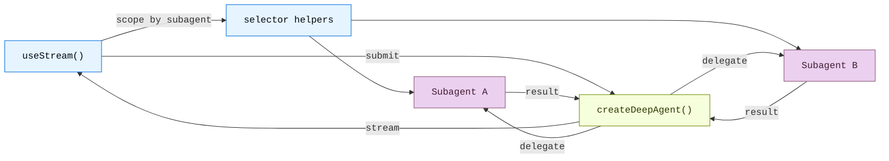

Build frontends that visualize deep agent workflows in real time. These patterns
show how to render subagent progress, task planning, streaming content, and
IDE-like sandbox experiences from agents created with `createDeepAgent`.

Deep agents are most useful when the UI makes delegation visible. Instead of
showing a single opaque assistant bubble, the LangChain SDKs expose the
coordinator, subagent discovery, custom state, and sandbox-backed artifacts so
users can inspect how a long-running task is being decomposed and completed.

<Note>
These patterns use the v1 frontend SDK packages. If you are using earlier versions, see the migration guides for [React](https://github.com/langchain-ai/langgraphjs/blob/main/libs/sdk-react/docs/v1-migration.md), [Vue](https://github.com/langchain-ai/langgraphjs/blob/main/libs/sdk-vue/docs/v1-migration.md), [Svelte](https://github.com/langchain-ai/langgraphjs/blob/main/libs/sdk-svelte/docs/v1-migration.md), and [Angular](https://github.com/langchain-ai/langgraphjs/blob/main/libs/sdk-angular/docs/v1-migration.md).
</Note>

## Architecture

Deep Agents use a coordinator-worker architecture. The main agent plans tasks and delegates to specialized subagents, each running in isolation. On the frontend, the v1 stream handle surfaces coordinator messages on the root stream and exposes subagent discovery snapshots for scoped subagent views.



```python
from deepagents import create_deep_agent

agent = create_deep_agent(
    model="google_genai:gemini-3.5-flash",
    tools=[get_weather],
    system_prompt="You are a helpful assistant",
    subagents=[
        {
            "name": "researcher",
            "description": "Research assistant",
        }
    ],
)
```


On the frontend, connect with [`useStream`](https://reference.langchain.com/javascript/langchain-react/index/useStream) the same way as with `createAgent`. Pass a [type parameter](/oss/python/langchain/frontend/overview) for type-safe stream state. Deep agent patterns use `stream.subagents`, selector helpers such as `useMessages(stream, subagent)`, and custom state values like `stream.values.todos` to render subagent-specific UIs.

```ts
import { useStream } from "@langchain/react";

function App() {
  const stream = useStream<typeof agent>({
    apiUrl: "http://localhost:2024",
    assistantId: "agent",
  });

  // Deep agent state beyond messages
  const todos = stream.values?.todos;
  const subagents = [...stream.subagents.values()];
}
```

## What the SDK exposes

Deep agent UIs usually need more than the final answer. The frontend SDK gives
you structured projections for the parts of the run users care about:

| Projection | Use it for |
| --- | --- |
| `stream.messages` | The coordinator conversation and final synthesis. |
| `stream.subagents` | Live discovery of specialist workers, including status and task metadata. |
| `stream.values` | Shared state such as todos, plans, report sections, sandbox metadata, or any custom key your agent writes. |
| Tool-call state | Rendering filesystem, search, browser, or domain tools as cards with progress and results. |
| Interrupts | Pausing delegated work for user approval or missing input without losing the run state. |

This lets you build interfaces that feel closer to an IDE, task board, or
workflow monitor than a plain chat transcript.

## Patterns

<CardGroup cols={3}>
  <Card title="Subagent streaming" icon="arrows-split" href="/oss/python/deepagents/frontend/subagent-streaming">
    Display specialist subagents with streaming content, progress tracking, and collapsible cards.
  </Card>
  <Card title="Todo list" icon="list-check" href="/oss/python/deepagents/frontend/todo-list">
    Track agent progress with a real-time todo list synced from agent state.
  </Card>
  <Card title="Sandbox" icon="code" href="/oss/python/deepagents/frontend/sandbox">
    Build an IDE-like UI with a file browser, code viewer, and diff panel backed by a sandbox.
  </Card>
</CardGroup>

## Related patterns

The [LangChain frontend patterns](/oss/python/langchain/frontend/overview), including
markdown messages, tool calling, and human-in-the-loop, all work with deep
agents too. Deep Agents are built on the same LangGraph runtime, so
`useStream` provides the same core API.

For lower-level graph visualizations, see the
[LangGraph frontend patterns](/oss/python/langgraph/frontend/overview). They show how
to map graph nodes and state keys directly to UI components.

---

<div className="source-links">
<Callout icon="terminal-2">
    [Connect these docs](/use-these-docs) to Claude, VSCode, and more via MCP for real-time answers.
</Callout>
<Callout icon="edit">
    [Edit this page on GitHub](https://github.com/langchain-ai/docs/edit/main/src/oss/deepagents/frontend/overview.mdx) or [file an issue](https://github.com/langchain-ai/docs/issues/new/choose).
</Callout>
</div>
