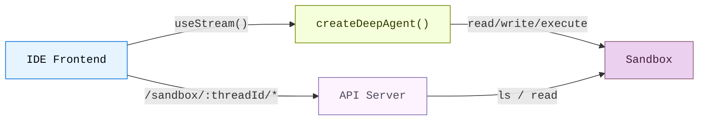
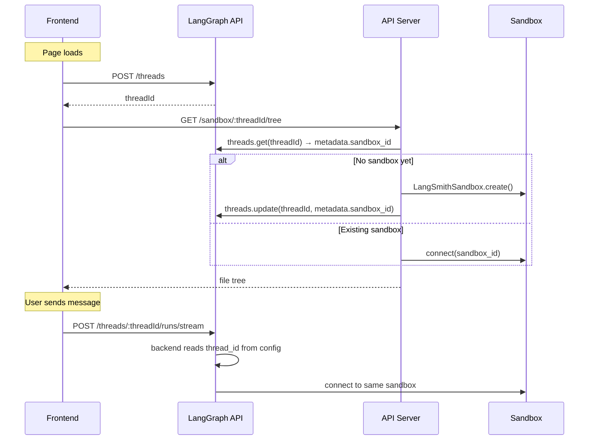

Coding agents need more than a chat window. They need a file browser, a code
viewer, and a diff panel, an IDE experience. This pattern connects a deep
agent to a [sandbox](/oss/python/deepagents/sandboxes) so it can read,
write, and execute code in an isolated environment, then exposes the sandbox
filesystem through a custom API server so the frontend can display files in
real time as the agent works.

This page covers the **three-panel UI** (file tree, code viewer, and chat) and
the **custom API routes** that expose the sandbox filesystem to it. For sandbox
providers, lifecycle scoping, seeding files, secrets, deployment, and production
`useStream` configuration, see [Going to production](/oss/python/deepagents/going-to-production).

import { PatternEmbed } from "/snippets/pattern-embed.jsx";

<PatternEmbed pattern="deep-agent-ide" minHeight={700} />

## Architecture

This setup has three parts:

1. **Deep agent with a sandbox backend:** The agent gets filesystem tools
   (`read_file`, `write_file`, `edit_file`, `execute`) automatically from the
   sandbox

2. **Custom API server** — A FastAPI app exposed via `langgraph.json`'s `http.app`
   field, providing file browsing endpoints the frontend can call


3. **Three-panel frontend:** A file tree, code/diff viewer, and chat panel
   that syncs files in real time as the agent makes changes



## Sandbox lifecycle

Choose how long a sandbox lives and who shares it before wiring the frontend.
See [Sandbox lifecycle](/oss/python/deepagents/going-to-production#lifecycle) for thread-scoped
vs assistant-scoped sandboxes, async [graph factory](/langsmith/graph-rebuild)
setup, TTL behavior, and SDK invocation examples.

This guide uses **thread-scoped sandboxes** by default. The frontend and
custom API server both resolve the sandbox from the LangGraph
[thread](/langsmith/use-threads) ID. That keeps conversations isolated and
lets page reloads reconnect to the same environment when you [persist the thread ID](#thread-creation).



For [multi-tenant](/oss/python/deepagents/going-to-production#multi-tenancy) apps,
scope sandboxes by user or assistant in your backend factory instead. For
demos without LangGraph threads, pass a client-generated session ID in the
API URL. The session ID does not persist across browser sessions.

## Connect the agent and API server

Configure the deep agent with a [sandbox backend](/oss/python/deepagents/sandboxes)
as described in [Execution environment](/oss/python/deepagents/going-to-production#execution-environment).
The agent gets filesystem tools and an `execute` tool automatically; no extra
tool configuration is needed.

Building this UI adds one requirement on top of the production setup: a
**custom API server** which runs outside the agent graph, so both the agent
backend and your file-browsing routes must resolve the **same sandbox** for
each thread. Store the sandbox ID on thread metadata and share a single
lookup function between them.

### Resolve the sandbox from thread metadata


```python
from deepagents import create_deep_agent
from deepagents.sandbox import LangSmithSandbox
from langgraph.config import get_config


def get_or_create_sandbox_for_thread(thread_id: str) -> LangSmithSandbox:
    # Look up sandbox_id from thread metadata, create if missing, seed files
    ...


sandbox = LangSmithSandbox(
    resolve=lambda: get_or_create_sandbox_for_thread(
        get_config()["configurable"]["thread_id"]
    ),
)

agent = create_deep_agent(
    model="google_genai:gemini-3.5-flash",
    backend=sandbox,
)
```


<Note>
  Similar to the example in [Going to production](/oss/python/deepagents/going-to-production#lifecycle), the
  agent is an async graph factory invoked on each run. Store the sandbox ID on
  thread metadata so custom `http.app` routes can call the same
  `getOrCreateSandboxForThread` helper. Going to production uses provider label
  lookup instead when the LangGraph SDK is the only entry point.
</Note>

### Seed project files

Before the agent runs, upload starter files with `uploadFiles` /
`upload_files`. See [File transfers](/oss/python/deepagents/going-to-production#file-transfers)
for seeding patterns, provider examples, and syncing
[memories](/oss/python/deepagents/memory) or [skills](/oss/python/deepagents/skills) into
the sandbox. For LangSmith sandboxes, pass `templateName` from a
[sandbox snapshot](/langsmith/sandbox-snapshots) when creating the container.

<Tip>
  Run `sandbox.execute("cd /app && npm install")` after uploading
  `package.json` so dependencies are ready before the first agent turn.
</Tip>

## Adding the file browsing API


The agent can read and write files, but the frontend also needs direct access to
browse the sandbox filesystem. Add a custom [FastAPI](https://fastapi.tiangolo.com) API server
and expose it through the `http.app` field in `langgraph.json`.


### Create the API server

The sandbox API endpoints use the thread ID as a URL path parameter. This
ensures the frontend always accesses the correct sandbox for the current
conversation, using the same `get_or_create_sandbox_for_thread` function as the
agent's backend:


```python
# src/api/server.py
from fastapi import FastAPI, Query, Path
from utils import get_or_create_sandbox_for_thread

app = FastAPI()

@app.get("/sandbox/{thread_id}/tree")
async def list_tree(
    thread_id: str = Path(...),
    filePath: str = Query("/app"),
):
    sandbox = await get_or_create_sandbox_for_thread(thread_id)
    result = await sandbox.aexecute(
        f"find {filePath} -printf '%y\\t%s\\t%p\\n' 2>/dev/null | sort"
    )
    entries = []
    for line in result.output.strip().split("\n"):
        if not line:
            continue
        type_char, size_str, full_path = line.split("\t")
        entries.append({
            "name": full_path.split("/")[-1],
            "type": "directory" if type_char == "d" else "file",
            "path": full_path,
            "size": int(size_str),
        })
    return {"path": filePath, "entries": entries, "sandboxId": sandbox.id}

@app.get("/sandbox/{thread_id}/file")
async def read_file(
    thread_id: str = Path(...),
    filePath: str = Query(...),
):
    sandbox = await get_or_create_sandbox_for_thread(thread_id)
    results = await sandbox.adownload_files([filePath])
    return {"path": filePath, "content": results[0].content.decode()}
```


<Note>
  Both the agent's backend and the API server call the same
  `get_or_create_sandbox_for_thread` function. This ensures they always resolve


  to the same sandbox for a given thread. The sandbox ID in thread metadata
  is the single source of truth — no in-memory caches needed.
</Note>

### Configure `langgraph.json`

Register both the agent graph and the API server. The `http.app` field tells
the LangGraph platform to serve your custom routes alongside the default ones.
See [application structure](/oss/python/langgraph/application-structure) and
[LangSmith Deployments](/oss/python/deepagents/going-to-production#langsmith-deployments)
for the full set of `langgraph.json` options.


```json
{
  "graphs": {
    "deep_agent_ide": "./src/agents/my_agent.py:agent"
  },
  "env": ".env",
  "http": {
    "app": "./src/api/server.py:app"
  }
}
```


Your custom routes are available at the same host as the LangGraph API. For
local development with `langgraph dev`, that's `http://localhost:2024`.

<Note>
  Custom routes defined in `http.app` take priority over default LangGraph routes. This means you
  can shadow built-in endpoints if needed, but be careful not to accidentally override routes like
  `/threads` or `/runs`.
</Note>

## Building the frontend

The frontend has three panels: a file tree sidebar, a code/diff viewer, and a
chat panel. It uses [`useStream`](https://reference.langchain.com/javascript/langchain-react/index/useStream) for the agent conversation and the custom API
endpoints for file browsing.

For production deployment, point `apiUrl` at your
[LangSmith Deployment](/langsmith/deployment), enable
`reconnectOnMount` and `fetchStateHistory`, and pass a stable
`thread_id` on each run. See
[Frontend](/oss/python/deepagents/going-to-production#frontend) in
[Going to production](/oss/python/deepagents/going-to-production) for those settings
and for [invoking the agent](/oss/python/deepagents/going-to-production#invoking-the-agent)
with `thread_id` and runtime `context`.

### Thread creation

Create a LangGraph thread when the page loads and persist its ID in
`sessionStorage` so page reloads reconnect to the same sandbox:

```tsx
const THREAD_KEY = "sandbox-thread-id";

function IDEPreview() {
  const [threadId, setThreadId] = useState<string | null>(
    () => sessionStorage.getItem(THREAD_KEY),
  );

  const updateThreadId = useCallback((id: string | null) => {
    setThreadId(id);
    if (id) sessionStorage.setItem(THREAD_KEY, id);
    else sessionStorage.removeItem(THREAD_KEY);
  }, []);

  const stream = useStream<typeof myAgent>({
    apiUrl: AGENT_URL,
    assistantId: "deep_agent_ide",
    threadId,
    onThreadId: updateThreadId,
  });

  // Create thread on first mount
  useEffect(() => {
    if (threadId) return;
    stream.client.threads.create().then((t) => updateThreadId(t.thread_id));
  }, [stream.client, threadId, updateThreadId]);

  // Pass threadId to sandbox file hooks
  const { tree, files } = useSandboxFiles(threadId);
  // ...
}
```

The "new thread" button clears the stored ID so the next mount creates a
fresh thread (and sandbox):

```tsx
function handleNewThread() {
  updateThreadId(null);
}
```

### File state management

Track two snapshots of the sandbox filesystem: the original state (before the
agent runs) and the current state (updated in real time). The thread ID is
included in the API URL so requests always hit the correct sandbox:

```ts
const AGENT_URL = "http://localhost:2024";

async function fetchTree(threadId: string): Promise<FileEntry[]> {
  const res = await fetch(
    `${AGENT_URL}/sandbox/${encodeURIComponent(threadId)}/tree?filePath=/app`,
  );
  const data = await res.json();
  return data.entries.filter((e: FileEntry) => !e.path.includes("node_modules"));
}

async function fetchFile(threadId: string, path: string): Promise<string | null> {
  const res = await fetch(
    `${AGENT_URL}/sandbox/${encodeURIComponent(threadId)}/file?filePath=${encodeURIComponent(path)}`,
  );
  const data = await res.json();
  return data.content ?? null;
}
```

### Real-time file sync

The key to the IDE experience is updating files **as the agent works**, not
after it finishes. Watch the stream's messages for `ToolMessage` instances
from file-mutating tools. When a `write_file` or `edit_file` tool call
completes, refresh that specific file. When `execute` completes, refresh
everything (since a shell command could modify any file):

<CodeGroup>
```tsx React
import { useStream } from "@langchain/react";
import { ToolMessage, AIMessage } from "langchain";

const FILE_MUTATING_TOOLS = new Set(["write_file", "edit_file", "execute"]);

export function IDEPreview() {
  const stream = useStream<typeof myAgent>({
    apiUrl: AGENT_URL,
    assistantId: "deep_agent_ide",
  });

  const processedIds = useRef(new Set<string>());

  useEffect(() => {
    // Build a map of file-mutating tool calls from AI messages
    const toolCallMap = new Map();
    for (const msg of stream.messages) {
      if (!AIMessage.isInstance(msg)) continue;
      for (const tc of msg.tool_calls ?? []) {
        if (tc.id && FILE_MUTATING_TOOLS.has(tc.name)) {
          toolCallMap.set(tc.id, { name: tc.name, args: tc.args });
        }
      }
    }

    // When a ToolMessage appears for a file-mutating tool, refresh
    for (const msg of stream.messages) {
      if (!ToolMessage.isInstance(msg)) continue;
      const id = msg.id ?? msg.tool_call_id;
      if (!id || processedIds.current.has(id)) continue;

      const call = toolCallMap.get(msg.tool_call_id);
      if (!call) continue;
      processedIds.current.add(id);

      if (call.name === "write_file" || call.name === "edit_file") {
        refreshSingleFile(call.args.path ?? call.args.file_path);
      } else if (call.name === "execute") {
        refreshTreeAndFiles();
      }
    }
  }, [stream.messages]);
}
```

```vue Vue
<script setup lang="ts">
import { useStream } from "@langchain/vue";
import { ToolMessage, AIMessage } from "langchain";
import { watch } from "vue";

const FILE_MUTATING_TOOLS = new Set(["write_file", "edit_file", "execute"]);
const processedIds = new Set<string>();

const stream = useStream<typeof myAgent>({
  apiUrl: AGENT_URL,
  assistantId: "deep_agent_ide",
});

watch(
  () => stream.messages.value,
  (messages) => {
    const toolCallMap = new Map();
    for (const msg of messages) {
      if (AIMessage.isInstance(msg)) {
        for (const tc of msg.tool_calls ?? []) {
          if (tc.id && FILE_MUTATING_TOOLS.has(tc.name)) {
            toolCallMap.set(tc.id, { name: tc.name, args: tc.args });
          }
        }
      }
    }

    for (const msg of messages) {
      if (!ToolMessage.isInstance(msg)) continue;
      const id = msg.id ?? msg.tool_call_id;
      if (!id || processedIds.has(id)) continue;

      const call = toolCallMap.get(msg.tool_call_id);
      if (!call) continue;
      processedIds.add(id);

      if (call.name === "write_file" || call.name === "edit_file") {
        refreshSingleFile(call.args.path ?? call.args.file_path);
      } else if (call.name === "execute") {
        refreshTreeAndFiles();
      }
    }
  },
  { deep: true },
);
</script>
```

```svelte Svelte
<script lang="ts">
  import { useStream } from "@langchain/svelte";
  import { ToolMessage, AIMessage } from "langchain";

  const FILE_MUTATING_TOOLS = new Set(["write_file", "edit_file", "execute"]);
  const processedIds = new Set<string>();

  const stream = useStream<typeof myAgent>({
    apiUrl: AGENT_URL,
    assistantId: "deep_agent_ide",
  });

  $effect(() => {
    const msgs = stream.messages;
    const toolCallMap = new Map();
    for (const msg of msgs) {
      if (AIMessage.isInstance(msg)) {
        for (const tc of msg.tool_calls ?? []) {
          if (tc.id && FILE_MUTATING_TOOLS.has(tc.name)) {
            toolCallMap.set(tc.id, { name: tc.name, args: tc.args });
          }
        }
      }
    }

    for (const msg of msgs) {
      if (!ToolMessage.isInstance(msg)) continue;
      const id = msg.id ?? msg.tool_call_id;
      if (!id || processedIds.has(id)) continue;

      const call = toolCallMap.get(msg.tool_call_id);
      if (!call) continue;
      processedIds.add(id);

      if (call.name === "write_file" || call.name === "edit_file") {
        refreshSingleFile(call.args.path ?? call.args.file_path);
      } else if (call.name === "execute") {
        refreshTreeAndFiles();
      }
    }
  });
</script>
```

```ts Angular
import { Component, effect } from "@angular/core";
import { injectStream } from "@langchain/angular";
import { ToolMessage, AIMessage } from "langchain";

const FILE_MUTATING_TOOLS = new Set(["write_file", "edit_file", "execute"]);

@Component({
  selector: "app-ide-preview",
  template: `<!-- ... -->`,
})
export class IdePreviewComponent {
  stream = injectStream<typeof myAgent>({
    apiUrl: AGENT_URL,
    assistantId: "deep_agent_ide",
  });

  private processedIds = new Set<string>();

  constructor() {
    effect(() => {
      const messages = this.stream.messages();
      const toolCallMap = new Map();
      for (const msg of messages) {
        if (AIMessage.isInstance(msg)) {
          for (const tc of (msg as AIMessage).tool_calls ?? []) {
            if (tc.id && FILE_MUTATING_TOOLS.has(tc.name)) {
              toolCallMap.set(tc.id, { name: tc.name, args: tc.args });
            }
          }
        }
      }

      for (const msg of messages) {
        if (!ToolMessage.isInstance(msg)) continue;
        const id = (msg as ToolMessage).id ?? (msg as ToolMessage).tool_call_id;
        if (!id || this.processedIds.has(id)) continue;

        const call = toolCallMap.get((msg as ToolMessage).tool_call_id);
        if (!call) continue;
        this.processedIds.add(id);

        if (call.name === "write_file" || call.name === "edit_file") {
          this.refreshSingleFile(call.args.path ?? call.args.file_path);
        } else if (call.name === "execute") {
          this.refreshTreeAndFiles();
        }
      }
    });
  }
}
```

</CodeGroup>

### Detecting changed files

Before each agent run, snapshot the current file contents. After files refresh,
compare against the snapshot to identify which files changed:

```ts
function detectChanges(current: FileSnapshot, original: FileSnapshot): Set<string> {
  const changed = new Set<string>();
  for (const [path, content] of Object.entries(current)) {
    if (original[path] !== content) changed.add(path);
  }
  for (const path of Object.keys(original)) {
    if (!(path in current)) changed.add(path);
  }
  return changed;
}
```

When a user selects a changed file, default to the diff view so they
immediately see what the agent modified.

### Displaying diffs

Use a framework-appropriate diff library to render unified diffs:

| Framework | Library                                                                    | Component                                                       |
| --------- | -------------------------------------------------------------------------- | --------------------------------------------------------------- |
| React     | [`@pierre/diffs`](https://diffs.com)                                       | `<FileDiff>` with `parseDiffFromFile`                           |
| Vue       | [`@git-diff-view/vue`](https://github.com/MrWangJustToDo/git-diff-view)    | `<DiffView>` with `generateDiffFile` from `@git-diff-view/file` |
| Svelte    | [`@git-diff-view/svelte`](https://github.com/MrWangJustToDo/git-diff-view) | `<DiffView>` with `generateDiffFile` from `@git-diff-view/file` |
| Angular   | [`ngx-diff`](https://github.com/rars/ngx-diff)                             | `<ngx-unified-diff>` with `[before]` and `[after]`              |

Example with `@pierre/diffs` (React):

```tsx
import { FileDiff } from "@pierre/diffs/react";
import { parseDiffFromFile } from "@pierre/diffs";

function DiffPanel({ original, current, fileName }) {
  const diff = parseDiffFromFile(
    { name: fileName, contents: original },
    { name: fileName, contents: current },
  );

  return (
    <FileDiff
      fileDiff={diff}
      options={{ theme: "github-dark", diffStyle: "unified", diffIndicators: "bars" }}
    />
  );
}
```

### Changed files summary

Show a summary of all modified files with line-level addition/deletion counts.
This gives users a quick overview of the agent's impact — similar to a `git
status`:

```tsx
function ChangedFilesSummary({ changedFiles, files, originalFiles, onSelect }) {
  const stats = [...changedFiles].map((path) => {
    const oldLines = (originalFiles[path] ?? "").split("\n");
    const newLines = (files[path] ?? "").split("\n");
    // Compute additions/deletions by comparing lines
    return { path, additions, deletions };
  });

  return (
    <div>
      <h3>{stats.length} Files Changed</h3>
      {stats.map((file) => (
        <button key={file.path} onClick={() => onSelect(file.path)}>
          {file.path}
          <span className="text-green-400">+{file.additions}</span>
          <span className="text-red-400">-{file.deletions}</span>
        </button>
      ))}
    </div>
  );
}
```

## Use cases

A sandbox is the right choice when:

- **Coding agents** that create, modify, and run code need a visual interface
  beyond chat
- **Code review workflows** where the agent suggests changes and the user
  reviews diffs before accepting
- **Tutorial or learning apps** where an AI assistant helps users build a
  project step by step, showing changes in context
- **Prototyping tools** where users describe features in natural language and
  watch the agent implement them in real time

## Best practices

Frontend-specific:

- **Persist `threadId` in `sessionStorage`** so page reloads reconnect to the
  same thread and sandbox instead of creating new ones.
- **Sync files on every relevant tool call**, not just when the run finishes. Watch for `write_file`, `edit_file`, and `execute`
  tool messages and refresh immediately.
- **Default to diff view for changed files**. When a user clicks a file that
  was modified by the agent, show the diff first — that's what they care about.
- **Show compact tool results for read-only operations**. Instead of dumping
  the full output of `read_file` in the chat, show a one-liner like
  `Read router.js L1-42`. Reserve the full output display for mutating tools.
- **Filter `node_modules` from the file tree**. Nobody wants to browse
  thousands of dependency files. Filter them out when fetching the tree.

For backends and sandboxes:

- **Use thread-scoped sandboxes** for production apps. See
  [Sandbox lifecycle](/oss/python/deepagents/going-to-production#lifecycle).
- **Share sandbox resolution** between the agent backend and the API server via
  thread metadata so both resolve the same environment with no in-memory caches.
- **Seed the sandbox with a real project**. See
  [File transfers](/oss/python/deepagents/going-to-production#file-transfers).
- **Keep secrets out of the sandbox**. Use the
  [sandbox auth proxy](/oss/python/deepagents/going-to-production#managing-secrets)
  instead of environment variables or file uploads for API keys.
- **Add guardrails before launch**. Configure
  [rate limits](/oss/python/deepagents/going-to-production#rate-limiting),
  [error handling](/oss/python/deepagents/going-to-production#handling-errors), and
  [data privacy](/oss/python/deepagents/going-to-production#data-privacy) middleware
  for autonomous coding agents.

## Related

<CardGroup cols={2}>
  <Card title="Going to production" icon="rocket" href="/oss/python/deepagents/going-to-production">
    Deploy the agent with persistent sandboxes, auth, guardrails, and production `useStream` settings.
  </Card>
  <Card title="Sandboxes" icon="box" href="/oss/python/deepagents/sandboxes">
    Sandbox providers, security model, and file transfer APIs.
  </Card>
  <Card title="Frontend overview" icon="layout" href="/oss/python/deepagents/frontend/overview">
    Other deep agent UI patterns: subagent streaming, todo lists, and custom state.
  </Card>
  <Card title="Application structure" icon="file-code" href="/oss/python/langgraph/application-structure">
    Full `langgraph.json` reference, including custom `http.app` routes.
  </Card>
</CardGroup>

---

<div className="source-links">
<Callout icon="terminal-2">
    [Connect these docs](/use-these-docs) to Claude, VSCode, and more via MCP for real-time answers.
</Callout>
<Callout icon="edit">
    [Edit this page on GitHub](https://github.com/langchain-ai/docs/edit/main/src/oss/deepagents/frontend/sandbox.mdx) or [file an issue](https://github.com/langchain-ai/docs/issues/new/choose).
</Callout>
</div>
