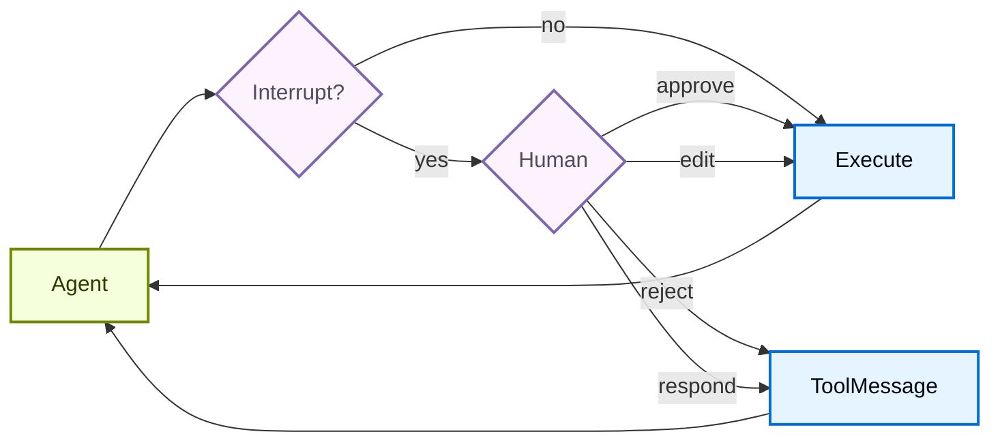

import HitlBasicConfigPy from '/snippets/code-samples/hitl-basic-config-py.mdx';
import HitlBasicConfigJs from '/snippets/code-samples/hitl-basic-config-js.mdx';

Some tool operations may be sensitive and require human approval before execution. Deep Agents support human-in-the-loop workflows through LangGraph's interrupt capabilities. You can configure which tools require approval using the `interrupt_on` parameter.



## Basic configuration

The `interrupt_on` parameter accepts a dictionary mapping tool names to interrupt configurations. Each tool can be configured with:

- **`True`**: Enable interrupts with default behavior (approve, edit, reject, respond allowed)
- **`False`**: Disable interrupts for this tool
- **`{"allowed_decisions": [...]}`**: Custom configuration with specific allowed decisions

<HitlBasicConfigPy />


## Decision types

The `allowed_decisions` list controls what actions a human can take when reviewing a tool call:

- **`"approve"`**: Execute the tool with the original arguments as proposed by the agent
- **`"edit"`**: Modify the tool arguments before execution
- **`"reject"`**: Skip executing this tool call entirely and return rejection feedback to the agent
- **`"respond"`**: Return the human's message directly as the tool result, skipping execution, for "ask user" style tools

Use `reject` when the human denies a proposed action. Use `respond` only when the human is acting as the tool, such as answering an `ask_user` prompt. Do not use `respond` to deny side-effecting tools, because its message may be treated by the model as a successful tool result.

You can customize which decisions are available for each tool:

```python
interrupt_on = {
    # Sensitive operations: allow all options
    "delete_file": {"allowed_decisions": ["approve", "edit", "reject"]},

    # Moderate risk: approval or rejection only
    "write_file": {"allowed_decisions": ["approve", "reject"]},

    # Must approve (no rejection allowed)
    "critical_operation": {"allowed_decisions": ["approve"]},
}
```


## Handle interrupts

When an interrupt is triggered, the agent pauses execution and returns control. Check for interrupts in the result and handle them accordingly. If the user rejects an action, include a clear `message` that tells the agent the tool was not executed and what to do next.

```python
from langchain_core.utils.uuid import uuid7
from langgraph.types import Command

# Create config with thread_id for state persistence
config = {"configurable": {"thread_id": str(uuid7())}}

# Invoke the agent
result = agent.invoke(
    {"messages": [{"role": "user", "content": "Delete the file temp.txt"}]},
    config=config,
    version="v2",  # [!code highlight]
)

# Check if execution was interrupted
if result.interrupts:  # [!code highlight]
    # Extract interrupt information
    interrupt_value = result.interrupts[0].value  # [!code highlight]
    action_requests = interrupt_value["action_requests"]
    review_configs = interrupt_value["review_configs"]

    # Create a lookup map from tool name to review config
    config_map = {cfg["action_name"]: cfg for cfg in review_configs}

    # Display the pending actions to the user
    for action in action_requests:
        review_config = config_map[action["name"]]
        print(f"Tool: {action['name']}")
        print(f"Arguments: {action['args']}")
        print(f"Allowed decisions: {review_config['allowed_decisions']}")

    # Get user decisions (one per action_request, in order)
    decisions = [
        {
            "type": "reject",
            "message": "User rejected deleting temp.txt. Do not retry deletion.",
        }
    ]

    # Resume execution with decisions
    result = agent.invoke(
        Command(resume={"decisions": decisions}),
        config=config,  # Must use the same config!
        version="v2",
    )

# Process final result
print(result.value["messages"][-1].content)  # [!code highlight]
```


## Multiple tool calls

When the agent calls multiple tools that require approval, all interrupts are batched together in a single interrupt. You must provide decisions for each one in order.

```python
config = {"configurable": {"thread_id": str(uuid7())}}

result = agent.invoke(
    {"messages": [{
        "role": "user",
        "content": "Delete temp.txt and send an email to admin@example.com"
    }]},
    config=config,
    version="v2",  # [!code highlight]
)

if result.interrupts:  # [!code highlight]
    interrupt_value = result.interrupts[0].value  # [!code highlight]
    action_requests = interrupt_value["action_requests"]

    # Two tools need approval
    assert len(action_requests) == 2

    # Provide decisions in the same order as action_requests
    decisions = [
        {"type": "approve"},  # First tool: delete_file
        {
            "type": "reject",
            "message": "User rejected this action. Do not retry this tool call.",
        }  # Second tool: send_email
    ]

    result = agent.invoke(
        Command(resume={"decisions": decisions}),
        config=config,
        version="v2",
    )
```


## Rejection messages

When a reviewer returns a `reject` decision, Deep Agents skip the tool call and send rejection feedback back to the agent. If you omit `message`, the default feedback tells the model that the tool was not executed and not to retry the same tool call unless the user asks.

For sensitive or side-effecting tools, pass a domain-specific `message` with the decision. Be explicit about whether the agent should abandon the action, ask a follow-up question, or try a safer alternative.

```python
decisions = [
    {
        "type": "reject",
        "message": "User rejected deleting this file. Do not retry deletion. Ask which file to archive instead.",
    }
]
```


## Edit tool arguments

When `"edit"` is in the allowed decisions, you can modify the tool arguments before execution:

```python
if result.interrupts:  # [!code highlight]
    interrupt_value = result.interrupts[0].value  # [!code highlight]
    action_request = interrupt_value["action_requests"][0]

    # Original args from the agent
    print(action_request["args"])  # {"to": "everyone@company.com", ...}

    # User decides to edit the recipient
    decisions = [{
        "type": "edit",
        "edited_action": {
            "name": action_request["name"],  # Must include the tool name
            "args": {"to": "team@company.com", "subject": "...", "body": "..."}
        }
    }]

    result = agent.invoke(
        Command(resume={"decisions": decisions}),
        config=config,
        version="v2",
    )
```


## Subagent interrupts

When using subagents, you can use interrupts [on tool calls](#interrupts-on-tool-calls) and [within tool calls](#interrupts-within-tool-calls).

### Interrupts on tool calls

Each subagent can have its own `interrupt_on` configuration that overrides the main agent's settings:

```python
agent = create_deep_agent(
    model="google_genai:gemini-3.5-flash",
    tools=[delete_file, read_file],
    interrupt_on={
        "delete_file": True,
        "read_file": False,
    },
    subagents=[{
        "name": "file-manager",
        "description": "Manages file operations",
        "system_prompt": "You are a file management assistant.",
        "tools": [delete_file, read_file],
        "interrupt_on": {
            # Override: require approval for reads in this subagent
            "delete_file": True,
            "read_file": True,  # Different from main agent!
        }
    }],
    checkpointer=checkpointer
)
```


When a subagent triggers an interrupt, the handling is the same—check for `interrupts` on the result and resume with `Command`.

### Interrupts within tool calls

Subagent tools can call `interrupt()` directly to pause execution and await approval:

```python
from langchain.agents import create_agent
from langchain_anthropic import ChatAnthropic
from langchain.messages import HumanMessage
from langchain.tools import tool
from langgraph.checkpoint.memory import InMemorySaver
from langgraph.types import Command, interrupt

from deepagents.graph import create_deep_agent
from deepagents.middleware.subagents import CompiledSubAgent


@tool(description="Request human approval before proceeding with an action.")
def request_approval(action_description: str) -> str:
    """Request human approval using the interrupt() primitive."""
    # interrupt() pauses execution and returns the value passed to Command(resume=...)
    approval = interrupt({
        "type": "approval_request",
        "action": action_description,
        "message": f"Please approve or reject: {action_description}",
    })

    if approval.get("approved"):
        return f"Action '{action_description}' was APPROVED. Proceeding..."
    else:
        return f"Action '{action_description}' was REJECTED. Reason: {approval.get('reason', 'No reason provided')}"


def main():
    checkpointer = InMemorySaver()
    model = ChatAnthropic(
        model_name="claude-sonnet-4-6",
        max_tokens=4096,
    )

    compiled_subagent = create_agent(
        model=model,
        tools=[request_approval],
        name="approval-agent",
    )

    parent_agent = create_deep_agent(
        model="google_genai:gemini-3.5-flash",
        checkpointer=checkpointer,
        subagents=[
            CompiledSubAgent(
                name="approval-agent",
                description="An agent that can request approvals",
                runnable=compiled_subagent,
            )
        ],
    )

    thread_id = "test_interrupt_directly"
    config = {"configurable": {"thread_id": thread_id}}

    print("Invoking agent - sub-agent will use request_approval tool...")

    result = parent_agent.invoke(
        {
            "messages": [
                HumanMessage(
                    content="Use the task tool to launch the approval-agent sub-agent. "
                    "Tell it to use the request_approval tool to request approval for 'deploying to production'."
                )
            ]
        },
        config=config,
        version="v2",  # [!code highlight]
    )

    # Check for interrupt
    if result.interrupts:  # [!code highlight]
        interrupt_value = result.interrupts[0].value  # [!code highlight]
        print(f"\nInterrupt received!")
        print(f"  Type: {interrupt_value.get('type')}")
        print(f"  Action: {interrupt_value.get('action')}")
        print(f"  Message: {interrupt_value.get('message')}")

        print("\nResuming with Command(resume={'approved': True})...")
        result2 = parent_agent.invoke(
            Command(resume={"approved": True}),
            config=config,
            version="v2",  # [!code highlight]
        )

        if not result2.interrupts:  # [!code highlight]
            print("\nExecution completed!")
            # Find the tool response
            tool_msgs = [m for m in result2.value.get("messages", []) if m.type == "tool"]  # [!code highlight]
            if tool_msgs:
                print(f"  Tool result: {tool_msgs[-1].content}")
        else:
            print("\nAnother interrupt occurred")
    else:
        print("\n  No interrupt - the model may not have called request_approval")


if __name__ == "__main__":
    main()
```

When run, this produces the following output:

```python
Invoking agent - sub-agent will use request_approval tool...

Interrupt received!
  Type: approval_request
  Action: deploying to production
  Message: Please approve or reject: deploying to production

Resuming with Command(resume={'approved': True})...

Execution completed!
  Tool result: Great! The approval request has been processed. The action **"deploying to production"** was **APPROVED**. You can now proceed with the production deployment.
```


## Filesystem permission interrupts

<Note>
Filesystem permission interrupts require `deepagents>=0.6.8`.
</Note>

Beyond `interrupt_on`, you can pause the built-in filesystem tools by marking a [permission rule](/oss/python/deepagents/permissions) with `mode="interrupt"`. When the agent calls `write_file` or `edit_file` on a path that matches an interrupt-mode rule, `create_deep_agent` raises the same human-in-the-loop interrupt as a configured tool, using the filesystem tool's name as the action name.

```python
from deepagents import FilesystemPermission, create_deep_agent
from langgraph.checkpoint.memory import MemorySaver


agent = create_deep_agent(
    model=model,
    permissions=[
        FilesystemPermission(
            operations=["write"],
            paths=["/secrets/**"],
            mode="interrupt",
        ),
    ],
    checkpointer=MemorySaver(),  # Required to pause and resume
)
```

Handle and resume the interrupt the same way as a tool-call interrupt: run until it pauses, inspect the request, then resume with a decision.

```python
from langgraph.types import Command

config = {"configurable": {"thread_id": "fs-thread-1"}}

result = agent.invoke(
    {"messages": [{"role": "user", "content": "Save the API key to /secrets/key.txt"}]},
    config=config,
    version="v2",
)

if result.interrupts:
    action = result.interrupts[0].value["action_requests"][0]
    print(f"Approve {action['name']} on {action['args']}?")

    # Resume with the human decision (approve, edit, or reject).
    result = agent.invoke(
        Command(resume={"decisions": [{"type": "approve"}]}),
        config=config,  # Same thread ID
        version="v2",
    )
```

Filesystem-permission interrupts merge with any `interrupt_on` you pass, so a single review step can cover both custom tools and protected filesystem paths.


## Best practices

### Always use a checkpointer

Human-in-the-loop requires a checkpointer to persist agent state between the interrupt and resume:

```python
from langgraph.checkpoint.memory import MemorySaver

checkpointer = MemorySaver()
agent = create_deep_agent(
    model="google_genai:gemini-3.5-flash",
    tools=[...],
    interrupt_on={...},
    checkpointer=checkpointer  # Required for HITL
)
```


### Use the same thread ID

When resuming, you must use the same config with the same `thread_id`:

```python
# First call
config = {"configurable": {"thread_id": "my-thread"}}
result = agent.invoke(input, config=config, version="v2")

# Resume (use same config)
result = agent.invoke(Command(resume={...}), config=config, version="v2")
```


### Match decision order to actions

The decisions list must match the order of `action_requests`:

```python
if result.interrupts:  # [!code highlight]
    interrupt_value = result.interrupts[0].value  # [!code highlight]
    action_requests = interrupt_value["action_requests"]

    # Create one decision per action, in order
    decisions = []
    for action in action_requests:
        decision = get_user_decision(action)  # Your logic
        decisions.append(decision)

    result = agent.invoke(
        Command(resume={"decisions": decisions}),
        config=config,
        version="v2",
    )
```


### Tailor configurations by risk

Configure different tools based on their risk level:

```python
interrupt_on = {
    # High risk: full control (approve, edit, reject)
    "delete_file": {"allowed_decisions": ["approve", "edit", "reject"]},
    "send_email": {"allowed_decisions": ["approve", "edit", "reject"]},

    # Medium risk: no editing allowed
    "write_file": {"allowed_decisions": ["approve", "reject"]},

    # Low risk: no interrupts
    "read_file": False,
    "list_files": False,
}
```

---

<div className="source-links">
<Callout icon="terminal-2">
    [Connect these docs](/use-these-docs) to Claude, VSCode, and more via MCP for real-time answers.
</Callout>
<Callout icon="edit">
    [Edit this page on GitHub](https://github.com/langchain-ai/docs/edit/main/src/oss/deepagents/human-in-the-loop.mdx) or [file an issue](https://github.com/langchain-ai/docs/issues/new/choose).
</Callout>
</div>
