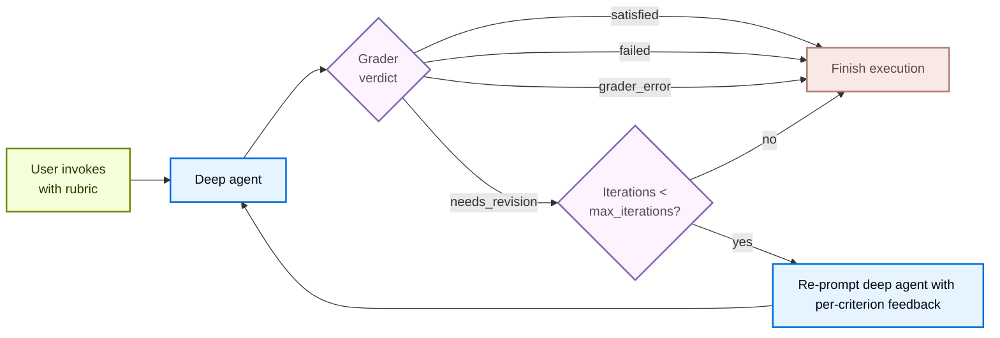

import RubricConfigurePy from '/snippets/code-samples/rubric-configure-py.mdx';
import RubricInvokePy from '/snippets/code-samples/rubric-invoke-py.mdx';
import RubricOnEvaluationPy from '/snippets/code-samples/rubric-on-evaluation-py.mdx';
import RubricStreamPy from '/snippets/code-samples/rubric-stream-py.mdx';
import RubricCodeGenerationMiddlewarePy from '/snippets/code-samples/rubric-code-generation-middleware-py.mdx';
import RubricCodeGenerationAgentPy from '/snippets/code-samples/rubric-code-generation-agent-py.mdx';
import RubricCodeGenerationInvokePy from '/snippets/code-samples/rubric-code-generation-invoke-py.mdx';

<Note>
`RubricMiddleware` requires `deepagents>=0.6.5`. It is in [**beta**](/oss/python/versioning); the API may change in the future.
</Note>

Some agent tasks have a clear definition of "done" that the working model alone cannot reliably hit on the first try: a haiku in the right syllable pattern, a refactor with all tests passing, a report that hits every required section. `RubricMiddleware` lets you declare *what done looks like* as a rubric and have the agent **self-evaluate and iterate**  until the rubric is satisfied (or a configured maximum iteration cap is hit).

**LLM-as-a-judge** is a pattern where one language model evaluates another model's output against defined criteria. In [LangSmith evaluations](/langsmith/evaluation-concepts#llm-as-judge), LLM-as-a-judge evaluators score application outputs offline in batch. `RubricMiddleware` applies the same pattern at runtime: after the deep agent produces output, a dedicated grader model reviews the transcript against your rubric and drives revision until every criterion passes (or a configured iteration cap is hit).

When the deep agent finishes reasoning, the LLM-as-a-judge grader sub-agent reviews the output and returns a verdict. If it returns `needs_revision`, per-criterion feedback is injected back into the conversation and the agent runs again. The loop terminates on `satisfied`, `max_iterations_reached`, `failed`, or `grader_error`.

## Configure the middleware

Add `RubricMiddleware` to the `middleware` list when you call `create_deep_agent`:

<RubricConfigurePy />

| Argument | Required | Default | Description |
| --- | --- | --- | --- |
| `model` | Yes | `None` | Chat model used by the LLM-as-a-judge grader sub-agent. Accepts a `"provider:model-id"` string or a `BaseChatModel` instance. Often a smaller or cheaper model than the deep agent's working model. |
| `system_prompt` | No | Built-in grader prompt | Custom grading instructions. Falls back to a default system prompt that teaches the grader the verdict format and what tools it has at its disposal. |
| `tools` | No | `None` | Tools the grader may call to gather evidence (run tests, count tokens, read files) before producing a verdict. With none, the grader reasons from the transcript alone. |
| `max_iterations` | No | `3` | Hard cap on grader iterations per rubric attempt. Maximum input value is 20. When the cap is reached without a `satisfied` verdict, the agent terminates with status `max_iterations_reached`. |
| `on_evaluation` | No | `None` | Optional callback invoked with each `RubricEvaluation` after every grading iteration, whether you use `invoke()`, `stream()` or `stream_events()`. Useful for logging, custom metrics, eval datasets, or UI updates. |

## Pass rubric on invocation

Pass a `rubric` string on invocation state to start the self-evaluation loop. Use `invoke()` for a single blocking call, or [`stream_events(..., version="v3")`](/oss/python/langchain/event-streaming) with [`CustomTransformer`](/oss/python/langchain/event-streaming#custom-updates) to receive grading events on `stream.custom` as they occur:

<Tabs>
    <Tab title="invoke()">
        <RubricInvokePy />
    </Tab>
    <Tab title="stream_events()">
        <RubricStreamPy />

        Rubric grading emits the following custom events on `stream.custom`:

        | Event | When fired | Payload fields |
        | --- | --- | --- |
        | `rubric_evaluation_start` | Before the grader runs. | <ul><li>`type`: event name</li><li>`grading_run_id`: shared across all events within one rubric attempt</li><li>`iteration`: zero-based index of the current grading run</li></ul> |
        | `rubric_evaluation_end` | After the grader returns or after a grader exception. | <ul><li>`type`: event name</li><li>`grading_run_id`: shared across all events within one rubric attempt</li><li>`iteration`: zero-based index of the current grader pass</li><li>`result`: terminal verdict for this pass</li><li>`explanation`: summary from the grader</li><li>`criteria`: per-criterion verdicts</li></ul> |
    </Tab>
</Tabs>

### Rubric verdicts

When the deep agent finishes reasoning and has an output, the LLM-as-a-judge grader sub-agent reviews the output against the rubric and produces one of the following verdicts:

| Status | Meaning | Loops back? |
| --- | --- | --- |
| `satisfied` | Every criterion in the rubric passes. | No |
| `needs_revision` | At least one criterion fails; grader feedback is injected and the agent runs again. | Yes |
| `max_iterations_reached` | Grader still wants revisions, but `max_iterations` has been hit. | No |
| `failed` | The grader judged the rubric malformed or impossible to evaluate against the transcript. | No |
| `grader_error` | The LLM-as-a-judge grader sub-agent itself raised an exception (provider timeout, missing credentials, malformed structured response, etc.). | No |

## Observe iteration progress

`on_evaluation` is a callback that fires after each grading iteration with the grader's verdict, whether you call `invoke()` or `stream_events()`. If you are not reading rubric events from `stream.custom` (with `CustomTransformer`) or [tracing the run with LangSmith](/langsmith/trace-with-langgraph), it is the main way to inspect what happened during grading.

<RubricOnEvaluationPy />

The middleware calls your function with a `RubricEvaluation` dictionary after each [grader pass](#grader-pass-events). The `RubricEvaluation` dictionary contains:

| Field | Type | Description |
| --- | --- | --- |
| `grading_run_id` | `str` | Identifier shared by every evaluation in one rubric attempt. A new run starts when the caller supplies a different `rubric`, or when the same `rubric` is invoked again after a terminal verdict. |
| `iteration` | `int` | Zero-based index of the current grader pass within that run. |
| `result` | `str` | The grader verdict for this pass: `satisfied`, `needs_revision`, `failed`, or `grader_error`. |
| `explanation` | `str` | Free-form summary from the grader. On infrastructure failures, this includes the exception type and message. |
| `criteria` | `list` | Per-criterion verdicts. Each entry is either `{name, passed: true}` or `{name, passed: false, gap}` where `gap` is actionable feedback for a failing criterion. |

### Grader pass events

| Event | Description |
| ----- | ------------- |
| **Successful grading** | Fires once per pass, including intermediate `needs_revision` verdicts and the final `satisfied` or `failed` verdict.    When the grader returns `needs_revision` but `max_iterations` has been reached, the callback still receives `result: "needs_revision"` (the grader's verdict). The run's terminal status is `max_iterations_reached` on private state `_rubric_status`, not on the evaluation record. Inspect `_rubric_status` after `invoke` completes, or read the last entry in `_rubric_evaluations` together with `_rubric_iterations`, to branch on cap exhaustion. |
| **Grader exceptions** | Fires with `result: "grader_error"`, an explanation derived from the exception, and an empty `criteria` list. |
| **Errors in your callback** | Exceptions are logged and suppressed. The grading loop continues. Do not use `on_evaluation` to enforce control flow (for example, raising to stop the agent). |

## Persist rubrics across invocations

A single `agent.invoke()` or `agent.stream_events()` call runs the rubric loop to completion and finishes with a terminal verdict: `satisfied`, `failed`, or `max_iterations_reached`.

To carry rubrics over to follow up invocations, attach a [checkpointer](/oss/python/langgraph/persistence#checkpoints) and pass the same `thread_id` alongside the invocation. In these cases, the same `rubric` persists across future `invoke()` or `stream_events()` calls until you pass a new one in.

Interrupts (`KeyboardInterrupt`, `asyncio.CancelledError`) propagate out of `agent.invoke()` and `agent.stream_events()` uncaught. On a checkpointed thread, the next call with the same rubric resumes the in-flight grading run.

## Example: generate vetted Python code

The following example builds a deep agent that writes a `find_duplicates` function. It defines `RubricMiddleware` once, attaches it to the agent, then passes a `rubric` string at invoke time.

Rather than asking the grader to reason abstractly about correctness, the example gives it a `run_test_suite` tool to verify behavior directly. The grader calls this tool for additional information before producing a verdict, and falls back to reasoning from the transcript when no tools are provided.

<Steps>
<Step title="Define RubricMiddleware">

This middleware adds an LLM-as-a-judge grader loop on top of the base agent. Configure the grader model, optional custom prompt, tools for evidence gathering, and a maximum iteration cap.

<RubricCodeGenerationMiddlewarePy />

</Step>
<Step title="Pass it to a deep agent">

The agent's `system_prompt` tells it how to do the work, while the rubric tells the grader how to judge the work.

<RubricCodeGenerationAgentPy />

</Step>
<Step title="Invoke with a human message and rubric">

At invocation time, provide the user request in `messages` and a newline-delimited checklist in `rubric` that the grader must mark satisfied. When no `rubric` is supplied on input state, the middleware does not run.

<RubricCodeGenerationInvokePy />

</Step>
</Steps>

After the agent produces output, the grader takes over and checks the output for each criterion: for example, that `test_unhashable` fails with a `TypeError` when the input contains unhashable types. If there are any issues the grader provides this feedback and the agent then revises its implementation and returns it to the grader.

---

<Callout icon="terminal-2">
    [Connect these docs](/use-these-docs) to Claude, VSCode, and more via MCP for real-time answers.
</Callout>
<Callout icon="edit">
    [Edit this page on GitHub](https://github.com/langchain-ai/docs/edit/main/src/oss/deepagents/rubric.mdx) or [file an issue](https://github.com/langchain-ai/docs/issues/new/choose).
</Callout>

