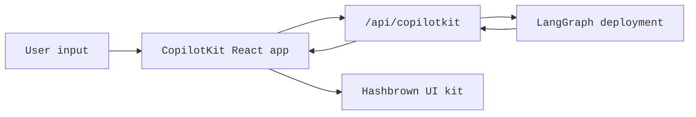

[CopilotKit](https://www.copilotkit.ai/) provides a full React chat runtime and pairs especially well with LangGraph when you want the agent to return **structured UI payloads** instead of only plain text. In this pattern, your LangGraph deployment serves both the graph API and a custom CopilotKit endpoint, while the frontend parses assistant messages into dynamic React components.

On the server, the [copilotkit](https://pypi.org/project/copilotkit/) package provides [`CopilotKitMiddleware`](https://docs.copilotkit.ai) so a LangGraph graph, a LangChain agent, or a [Deep Agent](/oss/python/deepagents/overview) can speak the [Agent UI (AG-UI)](https://docs.ag-ui.com/) wire protocol, stream tool and message events to a chat UI, and read or write the shared **CopilotKit** slice of state, with helpers to mount a CopilotKit-compatible HTTP endpoint in front of your graph.

This approach is useful when you want:

- a ready-made chat runtime instead of wiring `stream.messages` yourself
- a custom server endpoint that can add provider-specific behavior next to your deployed graph
- structured generative UI rendered from a constrained component registry

[CopilotKit for LangGraph](https://docs.copilotkit.ai/langgraph) also documents [generative UI](https://docs.copilotkit.ai/langgraph/generative-ui), [human in the loop](https://docs.copilotkit.ai/langgraph/human-in-the-loop) (HITL), and [shared state](https://docs.copilotkit.ai/langgraph/shared-state) on top of the same middleware and clients.

<Info>
  For CopilotKit-specific APIs, UI patterns, and runtime configuration, see the
  [CopilotKit docs](https://docs.copilotkit.ai/langgraph). For a Deep Agent walkthrough, see
  [Deep Agents and CopilotKit](https://docs.copilotkit.ai/langgraph/deep-agents) in the CopilotKit docs.
</Info>

import { ExampleEmbed } from "/snippets/example-embed.jsx"

<ExampleEmbed example="copilotkit" minHeight={700} />

## How it works

At a high level, CopilotKit sits between your React app and the LangGraph deployment. The frontend sends conversation state to a custom `/api/copilotkit` route mounted alongside the graph API, that route forwards the request to LangGraph, and the response comes back with both assistant messages and any structured UI payloads your component registry can render.

1. **Deploy the graph as usual** using LangSmith or using a LangGraph development server.
2. **Extend the deployment with an HTTP app** that mounts a CopilotKit route next to the graph API.
3. **Wrap the frontend in `CopilotKit`** and point it at that custom runtime URL.
4. **Register dynamic UI components** and parse assistant responses into those components at render time.



## What you get on the Python server

The [copilotkit](https://pypi.org/project/copilotkit/) and related packages bridge a LangGraph deployment and CopilotKit clients.

| Component | Role |
| --------- | ---- |
| `CopilotKitMiddleware` | Merges CopilotKit and AG-UI state and requests into your agent, including frontend [tool calls](/oss/python/langchain/agents#tools) and context. Add it to the `middleware` list for [create_agent](https://reference.langchain.com/python/langchain/agents/factory/create_agent) or [create_deep_agent](https://reference.langchain.com/python/deepagents/graph/create_deep_agent). |
| `CopilotKitState` (subclass) | [Custom state](/oss/python/langchain/short-term-memory): extend `CopilotKitState` so the CopilotKit key is part of graph state. |
| `LangGraphAGUIAgent` | Bundles a compiled graph with a name and description for the runtime. |
| `add_langgraph_fastapi_endpoint` (from [ag-ui-langgraph](https://pypi.org/project/ag-ui-langgraph/)) | Wires a **FastAPI** app so CopilotKit can run your graph on the same [LangGraph](/oss/python/langgraph/overview) process. Use it when you add a [custom `http` app in `langgraph.json`](#extend-the-langgraph-deployment-with-a-custom-endpoint) instead of a separate HTTP server. |

`CopilotKitMiddleware` is the same middleware for [create_deep_agent](https://reference.langchain.com/python/deepagents/graph/create_deep_agent) and for a graph from [create_agent](https://reference.langchain.com/python/langchain/agents/factory/create_agent) when you add it to the `middleware` list. For a `create_agent` graph with `CopilotKitState` and a FastAPI bridge, follow the [Python `main.py` example](#extend-the-langgraph-deployment-with-a-custom-endpoint) below. Structured generative UI (for example `useAgentContext` and an `output_schema` from the client) needs extra middleware that maps Copilot state to a [structured output](/oss/python/langchain/agents#structured-output) strategy, as in the expandable `src/middleware.py` example in the same section.

Mounting `app` on the `http` key in `langgraph.json` follows the usual [LangGraph or LangSmith deployment](/oss/python/langgraph/deploy) so one process serves the graph and the same FastAPI app to the CopilotKit client.


## Installation

For the backend endpoint:


```bash
uv add copilotkit ag-ui-langgraph fastapi uvicorn
```

The middleware package sits alongside the Deep Agents stack. Install it with your [chat model](/oss/python/integrations/chat) package (this example uses OpenAI):

<CodeGroup>
```python pip
pip install -U deepagents copilotkit langchain-openai
```

```python uv
uv add deepagents copilotkit langchain-openai
```
</CodeGroup>


For the frontend app:

```bash
bun add @copilotkit/react-core @copilotkit/react-ui @hashbrownai/core @hashbrownai/react
```

## Use CopilotKit with a Deep Agent

Add `CopilotKitMiddleware` to the `middleware` list you pass to [create_deep_agent](https://reference.langchain.com/python/deepagents/graph/create_deep_agent). The middleware lets CopilotKit route frontend tool calls and align chat state with your graph. Keep any other [middleware you configure](/oss/python/deepagents/customization#middleware) in the same list.

The compiled graph is then ready to plug into a CopilotKit- or AG-UI–aware process (for example, the [FastAPI pattern below](#extend-the-langgraph-deployment-with-a-custom-endpoint)) or a guide such as [Deep Agents and CopilotKit](https://docs.copilotkit.ai/langgraph/deep-agents) in the CopilotKit documentation.

```python
from deepagents import create_deep_agent
from copilotkit import CopilotKitMiddleware
from langgraph.checkpoint.memory import MemorySaver


def get_weather(location: str) -> str:
    """Return a simple weather string for a location."""
    return f"The weather in {location} is sunny."


agent = create_deep_agent(
    model="openai:gpt-5.4",
    tools=[get_weather],
    middleware=[CopilotKitMiddleware()],  # AG-UI, frontend tools, and context
    system_prompt="You are a helpful research assistant.",
    checkpointer=MemorySaver(),
)
```


## Extend the LangGraph deployment with a custom endpoint

The key idea is that the LangGraph deployment does not only serve graphs. It can also load an HTTP app, which lets you mount extra routes next to the deployment itself.

In `langgraph.json`, point `http.app` at your custom app entrypoint:


```json
{
  "dependencies": ["."],
  "graphs": {
    "copilotkit_shadify": "./main.py:agent"
  },
  "http": {
    "app": "./main.py:app"
  }
}
```


In Python, create a `FastAPI` app and expose the LangGraph agent through CopilotKit's AG-UI bridge:

```python main.py
from typing import Any, TypedDict

from ag_ui_langgraph import add_langgraph_fastapi_endpoint
from copilotkit import CopilotKitMiddleware, CopilotKitState, LangGraphAGUIAgent
from fastapi import FastAPI
from langchain.agents import create_agent

from src.middleware import apply_structured_output_schema, normalize_context


class AgentState(CopilotKitState):
    pass


class AgentContext(TypedDict, total=False):
    output_schema: dict[str, Any]


agent = create_agent(
    model="openai:gpt-5.4",
    middleware=[
        normalize_context,
        CopilotKitMiddleware(),
        apply_structured_output_schema,
    ],
    context_schema=AgentContext,
    state_schema=AgentState,
    system_prompt=(
        "You are a helpful UI assistant. Build visual responses using the "
        "available components."
    ),
)

app = FastAPI()

add_langgraph_fastapi_endpoint(
    app=app,
    agent=LangGraphAGUIAgent(
        name="copilotkit_shadify",
        description="A UI assistant that returns structured component payloads.",
        graph=agent,
    ),
    path="/",
)
```


This custom app is the important extension point: it mounts a CopilotKit-aware runtime without replacing the underlying LangGraph deployment.


In Python, the equivalent work happens in middleware: normalize the CopilotKit context and forward the `output_schema` from `useAgentContext(...)` into the model's structured output configuration.

```python expandable src/middleware.py
import json
from collections.abc import Mapping

from langchain.agents.middleware import before_agent, wrap_model_call
from langchain.agents.structured_output import ProviderStrategy


@wrap_model_call
async def apply_structured_output_schema(request, handler):
    schema = None
    runtime = getattr(request, "runtime", None)
    runtime_context = getattr(runtime, "context", None)

    if isinstance(runtime_context, Mapping):
        schema = runtime_context.get("output_schema")

    if schema is None and isinstance(getattr(request, "state", None), dict):
        copilot_context = request.state.get("copilotkit", {}).get("context")
        if isinstance(copilot_context, list):
            for item in copilot_context:
                if isinstance(item, dict) and item.get("description") == "output_schema":
                    schema = item.get("value")
                    break

    if isinstance(schema, str):
        try:
            schema = json.loads(schema)
        except json.JSONDecodeError:
            schema = None

    if isinstance(schema, dict):
        request = request.override(
            response_format=ProviderStrategy(schema=schema, strict=True),
        )

    return await handler(request)


@before_agent
def normalize_context(state, runtime):
    copilotkit_state = state.get("copilotkit", {})
    context = copilotkit_state.get("context")

    if isinstance(context, list):
        normalized = [
            item.model_dump() if hasattr(item, "model_dump") else item
            for item in context
        ]
        return {"copilotkit": {**copilotkit_state, "context": normalized}}

    return None
```


The result is a clean separation of concerns:

- LangGraph still owns graph execution and persistence
- CopilotKit owns the chat-facing runtime contract
- your custom endpoint glues them together inside one deployment

Point your CopilotKit `runtimeUrl` at the route the FastAPI (or other) app exposes, not only the raw graph REST surface, when you use the [CopilotKit](https://docs.copilotkit.ai) runtime adapter.

Follow the CopilotKit documentation for [LangGraphHttpAgent](https://docs.copilotkit.ai/langgraph) or `LangGraphAgent` in the Node **CopilotRuntime**; the **Python** graph and middleware still define tool behavior and agent logic.
:::

## Structure the frontend app

On the frontend, wrap your app in `CopilotKit` and point it at the custom runtime URL:

```tsx
import { CopilotKit } from "@copilotkit/react-core";
import { CopilotChat, useAgentContext } from "@copilotkit/react-core/v2";
import { s } from "@hashbrownai/core";

import { useChatKit } from "@/components/chat/chat-kit";
import { chatTheme } from "@/lib/chat-theme";

export function App() {
  return (
    <CopilotKit runtimeUrl={import.meta.env.VITE_RUNTIME_URL ?? "/api/copilotkit"}>
      <Page />
    </CopilotKit>
  );
}

function Page() {
  const chatKit = useChatKit();

  useAgentContext({
    description: "output_schema",
    value: s.toJsonSchema(chatKit.schema),
  });

  return <CopilotChat {...chatTheme} />;
}
```

There are two important pieces here:

- `runtimeUrl="/api/copilotkit"` sends the chat to your custom backend route rather than directly to the raw LangGraph API
- `useAgentContext(...)` sends the UI schema to the agent so the model knows what structured output format it should produce

## Register the dynamic components

The component registry lives in `useChatKit()`. This is where you define the set of components the agent is allowed to emit, such as cards, rows, columns, charts, code blocks, and buttons.

```tsx
import { s } from "@hashbrownai/core";
import { exposeComponent, exposeMarkdown, useUiKit } from "@hashbrownai/react";

import { Button } from "@/components/ui/button";
import { Card } from "@/components/ui/card";
import { CodeBlock } from "@/components/ui/code-block";
import { Row, Column } from "@/components/ui/layout";
import { SimpleChart } from "@/components/ui/simple-chart";

export function useChatKit() {
  return useUiKit({
    components: [
      exposeMarkdown(),
      exposeComponent(Card, {
        name: "card",
        description: "Card to wrap generative UI content.",
        children: "any",
      }),
      exposeComponent(Row, {
        name: "row",
        props: {
          gap: s.string("Tailwind gap size") as never,
        },
        children: "any",
      }),
      exposeComponent(Column, {
        name: "column",
        children: "any",
      }),
      exposeComponent(SimpleChart, {
        name: "chart",
        props: {
          labels: s.array("Category labels", s.string("A label")),
          values: s.array("Numeric values", s.number("A value")),
        },
        children: false,
      }),
      exposeComponent(CodeBlock, {
        name: "code_block",
        props: {
          code: s.streaming.string("The code to display"),
          language: s.string("Programming language") as never,
        },
        children: false,
      }),
      exposeComponent(Button, {
        name: "button",
        children: "text",
      }),
    ],
  });
}
```

This registry becomes the contract between the agent and the UI. The model is not generating arbitrary JSX. It is generating structured data that must validate against the components and props you exposed.

## Render assistant messages as dynamic UI

Once the assistant response arrives, the custom message renderer decides how to display it. In this example:

- assistant messages are parsed as structured JSON against the UI kit schema
- valid structured output is rendered as real React components
- user messages are rendered as ordinary chat bubbles

```tsx
import type { AssistantMessage } from "@ag-ui/core";
import type { RenderMessageProps } from "@copilotkit/react-ui";
import { useJsonParser } from "@hashbrownai/react";
import { memo } from "react";

import { useChatKit } from "@/components/chat/chat-kit";
import { Squircle } from "@/components/squircle";

const AssistantMessageRenderer = memo(function AssistantMessageRenderer({
  message,
}: {
  message: AssistantMessage;
}) {
  const kit = useChatKit();
  const { value } = useJsonParser(message.content ?? "", kit.schema);

  if (!value) return null;

  return (
    <div className="group/msg mt-2 flex w-full justify-start">
      <div className="magic-text-output w-full px-1 py-1">{kit.render(value)}</div>
    </div>
  );
});

export function CustomMessageRenderer({ message }: RenderMessageProps) {
  if (message.role === "assistant") {
    return <AssistantMessageRenderer message={message} />;
  }

  return (
    <div className="flex w-full justify-end">
      <Squircle className="w-full max-w-[64ch] px-4 py-3">
        <pre>{typeof message.content === "string" ? message.content : JSON.stringify(message.content, null, 2)}</pre>
      </Squircle>
    </div>
  );
}
```

This renderer pattern is what makes the integration feel native:

- CopilotKit handles chat state and transport
- the custom renderer decides how assistant payloads become UI
- [Hashbrown](https://hashbrown.dev/) turns validated structured data into concrete React elements

## Resources

- [Deep Agents and CopilotKit](https://docs.copilotkit.ai/langgraph/deep-agents) in the CopilotKit documentation — end-to-end Next.js, dev server, and **Deep Agent** path
- [CopilotKit: LangGraph features](https://docs.copilotkit.ai/langgraph) — generative UI, HITL, shared state
- [LangGraph deployment](/oss/python/langgraph/deploy) — production and dev server

## Best practices

- **Keep the custom endpoint thin:** use it to adapt CopilotKit to your graph deployment, not to duplicate business logic already inside the graph
- **Send the schema explicitly:** `useAgentContext` should describe the UI contract every time the page mounts
- **Register a constrained component set:** expose only the components and props you actually want the model to use
- **Treat rendering as a parsing step:** parse assistant content against your schema before rendering it
- **Keep user messages plain:** only assistant messages need the structured renderer; user messages can stay normal chat bubbles

---

<div className="source-links">
<Callout icon="terminal-2">
    [Connect these docs](/use-these-docs) to Claude, VSCode, and more via MCP for real-time answers.
</Callout>
<Callout icon="edit">
    [Edit this page on GitHub](https://github.com/langchain-ai/docs/edit/main/src/oss/langchain/frontend/integrations/copilotkit.mdx) or [file an issue](https://github.com/langchain-ai/docs/issues/new/choose).
</Callout>
</div>
