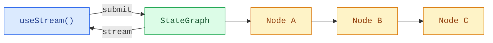

Build frontends that visualize LangGraph pipelines in real time. These patterns
show how to render multi-step graph execution with per-node status and streaming
content from custom `StateGraph` workflows.

LangGraph's frontend advantage is that the UI can follow the same structure as
the graph. Nodes, state keys, checkpoints, interrupts, subgraphs, and streamed
messages are all visible runtime concepts, so you can build interfaces that
explain what the system is doing instead of hiding execution behind one
assistant message.

<Note>
These patterns use the v1 frontend SDK packages. If you are using an earlier version, see the migration guides for [React](https://github.com/langchain-ai/langgraphjs/blob/main/libs/sdk-react/docs/v1-migration.md), [Vue](https://github.com/langchain-ai/langgraphjs/blob/main/libs/sdk-vue/docs/v1-migration.md), [Svelte](https://github.com/langchain-ai/langgraphjs/blob/main/libs/sdk-svelte/docs/v1-migration.md), and [Angular](https://github.com/langchain-ai/langgraphjs/blob/main/libs/sdk-angular/docs/v1-migration.md).
</Note>

## Architecture

LangGraph graphs are composed of named nodes connected by edges. Each node executes a step (classify, research, analyze, synthesize) and writes output to a specific state key. On the frontend, the SDK stream handle provides reactive access to node outputs, streaming tokens, and discovered subgraphs so you can map each node to a UI card.



```python
from langgraph.graph import StateGraph, MessagesState, START, END

class State(MessagesState):
    classification: str
    research: str
    analysis: str
    synthesis: str

graph = StateGraph(State)
graph.add_node("classify", classify_node)
graph.add_node("do_research", research_node)
graph.add_node("analyze", analyze_node)
graph.add_node("synthesize", synthesize_node)
graph.add_edge(START, "classify")
graph.add_edge("classify", "do_research")
graph.add_edge("do_research", "analyze")
graph.add_edge("analyze", "synthesize")
graph.add_edge("synthesize", END)

app = graph.compile()
```


On the frontend, [`useStream`](https://reference.langchain.com/javascript/langchain-react/index/useStream) exposes `stream.subgraphs` for graph-node discovery
and selector helpers such as `useMessages(stream, node)` for node-scoped
streaming content. `stream.values` still holds the full graph state when you
need fields such as the final `synthesis`. Angular uses the same stream API
shape through [`injectStream`](https://reference.langchain.com/javascript/langchain-angular/injectStream).

```ts
import { useStream } from "@langchain/react";

function Pipeline() {
  const stream = useStream<typeof graph>({
    apiUrl: "http://localhost:2024",
    assistantId: "pipeline",
  });

  const classification = stream.values?.classification;
  const research = stream.values?.research;
  const analysis = stream.values?.analysis;
  const graphNodes = [...stream.subgraphs.values()];
}
```

## What makes this different from a chat stream

Custom graphs often power product workflows: research pipelines, approval flows,
data pipelines, data enrichment, code review, planning, and multi-step analysis. The
frontend SDK lets you render these workflows using graph-native signals:

| Runtime concept | Frontend UX |
| --- | --- |
| **Named nodes** | One card, timeline step, or status badge per graph node. |
| **State keys** | Dedicated UI regions for typed outputs such as classification, sources, analysis, and final synthesis. |
| **Streaming metadata** | Route partial messages to the node that produced them. |
| **Checkpoints** | Inspect or resume from prior graph states for debugging and auditability. |
| **Interrupts** | Pause a node for human input, approval, or correction, then continue. |
| **Subgraphs** | Reveal nested execution only when the user needs more detail. |

Because the SDK exposes these concepts directly, you can scale from a simple
chat panel to a full workflow debugger without changing the backend protocol.

## Patterns

<CardGroup cols={2}>
  <Card title="Graph execution" icon="chart-dots" href="/oss/python/langgraph/frontend/graph-execution">
    Visualize multi-step graph pipelines with per-node status and streaming content.
  </Card>
</CardGroup>

## Related patterns

The [LangChain frontend patterns](/oss/python/langchain/frontend/overview)—markdown messages, tool calling, human-in-the-loop, resumable streams, and time travel—work with any LangGraph graph. The stream API provides the same core data model whether you use `createAgent`, `createDeepAgent`, or a custom `StateGraph`.

---

<div className="source-links">
<Callout icon="terminal-2">
    [Connect these docs](/use-these-docs) to Claude, VSCode, and more via MCP for real-time answers.
</Callout>
<Callout icon="edit">
    [Edit this page on GitHub](https://github.com/langchain-ai/docs/edit/main/src/oss/langgraph/frontend/overview.md) or [file an issue](https://github.com/langchain-ai/docs/issues/new/choose).
</Callout>
</div>
