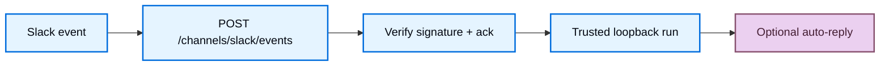

import ManagedDeepAgentsPrivateBetaNote from '/snippets/langsmith/managed-deep-agents-private-beta-note.mdx';
import ManagedDeepAgentsTestAndDeploy from '/snippets/langsmith/managed-deep-agents-test-and-deploy.mdx';

The Slack channel lets workspace members talk to your Managed Deep Agent from Slack. You declare triggers under `channels/`, point the Slack app Events Request URL at your deployment, and the runtime verifies signatures, runs the agent, and can auto-reply in the same thread or DM.

<Note>
<ManagedDeepAgentsPrivateBetaNote />
</Note>

For the channel model and current limits, see [Channels](/langsmith/managed-deep-agents-channels).

## Prerequisites

- A Managed Deep Agents project with a root [identity](/langsmith/managed-deep-agents-identity) declaration (`channels/` requires identity).
- A [Slack app](https://api.slack.com/apps) you can install into a workspace.
- Deploy or local Agent Server URL for Event Subscriptions (after first deploy, copy it from the LangSmith deployment dashboard).

## Add a Slack channel

Add `channels/slack.py` or `channels/slack.ts` next to your agent entry. The file name becomes the channel name (`slack` → `POST /channels/slack/events`). Export a named `channel` created with `define_slack_channel` / `defineSlackChannel`.

<CodeGroup>

```python channels/slack.py
from managed_deepagents.channels.slack import define_slack_channel

channel = define_slack_channel(
    on=["app_mention", "direct_message", "thread_reply"],
    auto_reply=True,
    mention_behavior="strip",
)
```

```ts channels/slack.ts
import { defineSlackChannel } from "managed-deepagents/channels/slack";

export const channel = defineSlackChannel({
  on: ["app_mention", "direct_message", "thread_reply"],
  autoReply: true,
  mentionBehavior: "strip",
});
```

</CodeGroup>

Pair this with an identity preset that matches your product:

<CodeGroup>

```python identity.py
from managed_deepagents import define_identity

# Shared Slack bot: conversations scoped by Slack source thread
identity = define_identity.preset("shared-bot")
```

```ts identity.ts
import { defineIdentity } from "managed-deepagents";

// Shared Slack bot: conversations scoped by Slack source thread
export const identity = defineIdentity.preset("shared-bot");
```

</CodeGroup>

For browser + Slack account linking (same actor across web and Slack), use `validated_token` ingress and [Connect-with-Slack](#optional-connect-with-slack) instead of a bare `shared-bot` install.

## How Slack Events work



1. Slack POSTs to `https://<agent-server>/channels/slack/events` (the file stem `slack` becomes the path segment).
2. The runtime verifies the Slack signing secret against the raw body and returns HTTP 200 within Slack’s ack window.
3. In the background it invokes the graph over trusted loopback, stamping actor and source-thread identity (`source.provider: "slack"`).
4. When `autoReply` is enabled, it posts the agent response back with the Slack Web API (and can set assistant loading status while the run is in progress).

LangGraph auth is bypassed only on `POST /channels/{name}/events` so Slack can deliver without an ingress secret; the loopback invoke still uses `MDA_INGRESS_SECRET`.

## Channel options

| Option (Python / TypeScript) | Default | Meaning |
| --- | --- | --- |
| `on` | _(required)_ | Triggers to handle: `app_mention`, `direct_message`, `thread_reply` |
| `auto_reply` / `autoReply` | `true` | Post the agent response back to Slack via the Web API |
| `mention_behavior` / `mentionBehavior` | `"strip"` | `"strip"` removes the bot `@mention` from the model input; `"preserve"` keeps it |
| `conversation.app_mention` / `conversation.appMention` | `"thread"` | How `@mentions` map to agent threads: `thread`, `conversation`, or `message` |
| `conversation.direct_message` / `conversation.directMessage` | `"conversation"` | How DMs map to agent threads |
| `filters` | shared conversations off | Optional include/exclude lists for conversations and actors (`slack:T…:U…`). Slack Connect shared conversations are not supported (`allow_shared_conversations: true` is rejected) |

### Triggers and Slack bot events

| Trigger | When it fires | Subscribe to bot events | Typical bot scopes |
| --- | --- | --- | --- |
| `app_mention` | Someone `@mentions` the bot in a channel | `app_mention` | `app_mentions:read`, `chat:write` |
| `direct_message` | Someone DMs the bot | `message.im` | `im:history`, `chat:write` |
| `thread_reply` | Someone replies in a thread the bot already joined (no new mention required) | `message.channels`, `message.groups` | `channels:history`, `groups:history`, `chat:write` |

`mda` derives required OAuth scopes from the `on` list at compile time. After you change scopes in the Slack app, **reinstall the app** to the workspace so the new scopes apply.

## Required secrets

Put these in the project `.env` (or LangSmith workspace secrets) before `mda deploy`. Deploy preflights the Slack pair when `channels/` is present.

| Variable | Required | Role |
| --- | --- | --- |
| `SLACK_SIGNING_SECRET` | Yes | Verifies Slack Events signatures (HMAC) |
| `SLACK_BOT_TOKEN` | Yes | Slack Web API for auto-reply and assistant status |
| `MDA_INGRESS_SECRET` | Yes when identity uses trusted loopback / `trusted_backend` | Trusted invoke from the Events path into the graph |
| `SLACK_CLIENT_ID` / `SLACK_CLIENT_SECRET` | Optional | Connect-with-Slack OIDC |
| `MDA_PUBLIC_APP_URL` | Optional (required for Connect-with-Slack) | Browser UI origin shown in connect prompts and post-OAuth return |
| `MDA_PUBLIC_API_URL` | Optional (recommended on Host) | Public Agent Server URL used as Slack OAuth `redirect_uri` |
| `MDA_GUEST_SIGNING_KEY` | Optional (required for Connect-with-Slack / guest) | Signs guest tokens and OAuth state |

Optional install pins for tests or multi-install hardening: `SLACK_API_APP_ID`, `SLACK_TEAM_ID`, `SLACK_BOT_USER_ID`.

## Configure the Slack app

Create or open a Slack app at [api.slack.com/apps](https://api.slack.com/apps), then wire Event Subscriptions and OAuth to your Agent Server.

### 1. Create the app and install it

1. Create an app **from scratch** in the workspace you will use for testing.
2. Under **OAuth & Permissions**, add the [bot token scopes](#triggers-and-slack-bot-events) that match your `on` triggers (at minimum `chat:write` plus the history/mention scopes above).
3. Install the app to the workspace and copy the **Bot User OAuth Token** into `SLACK_BOT_TOKEN`.
4. Under **Basic Information**, copy the **Signing Secret** into `SLACK_SIGNING_SECRET`.

<Frame caption="Slack app Basic Information → App Credentials">
  
</Frame>

Copy the **Signing Secret** into `SLACK_SIGNING_SECRET`. For [Connect-with-Slack](#optional-connect-with-slack), also copy **Client ID** into `SLACK_CLIENT_ID` and **Client Secret** into `SLACK_CLIENT_SECRET`. Prefer the Signing Secret over the deprecated Verification Token.

### 2. Point Event Subscriptions at your deployment

Deploy the agent first (or run `mda dev`) so the Events URL exists, then enable Event Subscriptions:

| Setting | Value |
| --- | --- |
| Enable Events | On |
| Request URL | `https://<agent-server>/channels/slack/events` |

Replace `<agent-server>` with the Agent Server URL from `mda deploy` / the LangSmith deployment dashboard (for local dev, use your publicly reachable tunnel or equivalent—Slack must reach the URL).

Slack sends a `url_verification` challenge; the managed runtime responds automatically when the signing secret matches.

### 3. Subscribe to bot events

Under **Subscribe to bot events**, add every event your triggers need:

- `app_mention`
- `message.im` (for `direct_message`)
- `message.channels` and `message.groups` (for `thread_reply`)

Invite the bot to each channel where you will `@mention` it. Add `message.groups` when the bot should continue threads in private channels (not shown in the example below).

<Frame caption="Event Subscriptions with a verified Request URL and bot event subscriptions">
  
</Frame>

### 4. Confirm bot token scopes

Under **OAuth & Permissions → Bot Token Scopes**, confirm scopes match the table above. If you add scopes after the first install, reinstall the app, then re-invite the bot to channels. Add `groups:history` when the bot should continue threads in private channels (not shown in the example below).

<Frame caption="OAuth & Permissions → Bot Token Scopes">
  
</Frame>

## Deploy and smoke-test

1. Put Slack secrets in `.env` and ensure [identity](/langsmith/managed-deep-agents-identity) is declared.
2. Run `mda deploy` (or `mda dev` with a reachable Events URL).
3. Set the Slack Request URL to `https://<agent-server>/channels/slack/events` and verify it.
4. In Slack, `@mention` the bot in a channel where it is invited (or DM it if `direct_message` is enabled).
5. Confirm the bot shows a loading status (when supported) and posts a reply when `autoReply` is `true`.

<ManagedDeepAgentsTestAndDeploy />

## Optional: Connect-with-Slack

Connect-with-Slack maps a Slack user (`slack:T…:U…`) to a web/guest actor so the same person keeps one thread history across browser and Slack when `scoping.threads` is `"actor"`.

When OIDC is configured (`SLACK_CLIENT_ID`, `SLACK_CLIENT_SECRET`, `MDA_PUBLIC_APP_URL`, and a signing key such as `MDA_GUEST_SIGNING_KEY`):

- **Linked users** — Events remap to the web actor and the agent runs.
- **Unlinked users** — The bot replies with a connect link; no agent run until they finish OAuth.

Shared-bot projects without OIDC keep Slack actors as-is (`slack:T…:U…`).

### Slack OAuth redirect URLs

| Slack setting | Value |
| --- | --- |
| Sign in with Slack redirect URL | `https://<agent-server>/identity/slack/callback` |
| Connect prompt / post-OAuth return | `MDA_PUBLIC_APP_URL` (your browser UI origin) |

On LangGraph Host, set `MDA_PUBLIC_API_URL` to the public Agent Server URL so Slack’s `redirect_uri` is not an internal loopback. `mda deploy` can inject `MDA_PUBLIC_API_URL` when the deployment already has a runtime URL; set it in `.env` after the first deploy if needed. Deploy also derives `CORS_ALLOW_ORIGINS` from `MDA_PUBLIC_APP_URL` (add more hosts with `MDA_CORS_ORIGINS` or an explicit `CORS_ALLOW_ORIGINS`).

Managed connect routes on the Agent Server:

| Path | Purpose |
| --- | --- |
| `/identity/slack/connect` | Start Connect-with-Slack |
| `/identity/slack/callback` | OAuth callback |
| `/identity/slack/status` | Link status for the signed-in web user |
| `/identity/slack/link` | Link helpers used by the connect flow |

<Frame caption="OAuth & Permissions → Redirect URLs">
  
</Frame>

<Frame caption="Connect-with-Slack prompt for an unlinked user">
  
</Frame>

## Troubleshooting

| Symptom | Likely cause |
| --- | --- |
| Request URL verification fails | Wrong `SLACK_SIGNING_SECRET`, or Events URL path is not `/channels/slack/events` |
| Mentions work, plain thread replies do not | Missing `message.channels` / `message.groups` bot events or `channels:history` / `groups:history` scopes—add them, **reinstall**, reply inside the thread |
| Deploy fails citing Slack secrets | `channels/` present but `SLACK_SIGNING_SECRET` / `SLACK_BOT_TOKEN` missing from `.env` / workspace secrets |
| Connect OAuth redirects to `localhost` | Set `MDA_PUBLIC_API_URL` to the public Agent Server URL and redeploy |
| Double replies on Host | Event dedupe is process-local; Slack retries can double-invoke on multi-replica Host |

## Next steps

<CardGroup cols={2}>
  <Card title="Channels" icon="messages" href="/langsmith/managed-deep-agents-channels">
    See how channel discovery and Events ingress work.
  </Card>
  <Card title="Identity" icon="fingerprint" href="/langsmith/managed-deep-agents-identity">
    Choose shared-bot vs linked validated_token for Slack callers.
  </Card>
  <Card title="Deploy an agent" icon="upload" href="/langsmith/managed-deep-agents-deploy">
    Route secrets and deploy the channel-enabled agent.
  </Card>
  <Card title="CLI reference" icon="terminal" href="/langsmith/managed-deep-agents-cli">
    Look up `channels/` packaging and deploy preflight.
  </Card>
</CardGroup>
