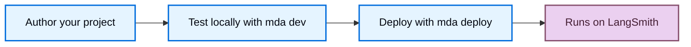

import ManagedDeepAgentsPrivateBetaNote from '/snippets/langsmith/managed-deep-agents-private-beta-note.mdx';
import ManagedDeepAgentsRuntimeOwnership from '/snippets/langsmith/managed-deep-agents-runtime-ownership.mdx';

Managed Deep Agents turns a local [project directory](/langsmith/managed-deep-agents-cli#project-file-reference) into a hosted LangGraph deployment. Knowing what the `mda` CLI compiles, what a deploy creates, and which parts the runtime owns helps you reason about behavior, secrets, and state.

<Note>
<ManagedDeepAgentsPrivateBetaNote />
</Note>

## Compilation

`mda dev` and `mda deploy` compile your project into a runnable LangGraph app in a `.mda/build` directory. Your agent entry and the modules it imports are copied without rewriting, so imports behave the same as in a normal Python or TypeScript project. The build leaves out secrets and generated files such as `.env` and `node_modules`. For the full ignored-path list, see the [CLI reference](/langsmith/managed-deep-agents-cli#project-file-reference).

## Deploy lifecycle

You author and test your project locally, then deploy it to LangSmith with one command.

`mda dev` runs the compiled app in LangSmith Studio so you can test it. `mda deploy` validates the project, syncs deploy-owned context to Context Hub, uploads the build, triggers a hosted build, and reconciles any cron schedules once the deployment is live. For secrets routing, deploy flags, and operational tips, see [Deploy an agent](/langsmith/managed-deep-agents-deploy). For the full step list and flags, see the [CLI reference](/langsmith/managed-deep-agents-cli#deploy-projects).

When you deploy a Managed Deep Agent, LangSmith creates or updates a hosted LangGraph deployment, creates a Context Hub agent repo for managed context, and reconciles any managed cron schedules declared under `schedules/`. Open the deployment page in LangSmith to inspect build status and revisions. Open traces to inspect user inputs, final responses, model calls, tool calls, sandbox activity, files, and runtime state created during runs.

## What the managed runtime owns

<ManagedDeepAgentsRuntimeOwnership />

## Context Hub

Each deployment has a [Context Hub](/langsmith/use-the-context-hub) repo that stores deploy-owned context and runtime-created memory:

- **`/instructions.md`**: the managed system prompt, synced from your project on deploy.
- **`/skills/**`**: deploy-owned skills, synced from your project on deploy.
- **`/memories/AGENTS.md`**: durable agent memory, written by the agent at runtime.

Edit instructions and skills in your project and redeploy. Memory is runtime-owned, so deploy preserves it instead of overwriting it.

## Threads and memory

The managed runtime owns the checkpointer and store, so each thread's state persists across runs without any setup. Durable memory persists in [Context Hub](#context-hub) and is available to the agent across threads.

Scheduled runs choose their thread behavior explicitly. An ephemeral thread is cleaned up after the run, while a persistent thread reuses a stable thread ID so state accumulates. For the thread modes and when to use each, see [Schedules](/langsmith/managed-deep-agents-schedules).

## Sandboxes

A [sandbox](/langsmith/sandboxes) gives the agent an isolated environment for code execution and filesystem work. Configure one by exporting `sandbox` from `sandbox/index.ts` or `sandbox/__init__.py`, and use `sandbox/setup.sh` to provision it the first time it is created. Each thread gets its own sandbox. For configuration options and examples, see [Configure a sandbox](/langsmith/managed-deep-agents-deploy#configure-a-sandbox).

## See also

- [Overview](/langsmith/managed-deep-agents-overview): when to use Managed Deep Agents and beta limits.
- [Deploy an agent](/langsmith/managed-deep-agents-deploy): the full deploy workflow, secrets, and troubleshooting.
- [CLI reference](/langsmith/managed-deep-agents-cli): every `mda` command, flag, and project file rule.
