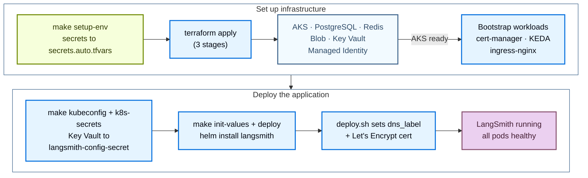

Deploy LangSmith to Azure with the public [Terraform modules](https://github.com/langchain-ai/terraform/tree/main/modules/azure). Managing the deployment as code lets you version, review, and reproduce your LangSmith environment across subscriptions instead of clicking through the Azure Portal.

The install runs in two stages:

1. **Infrastructure**: Terraform provisions AKS, Postgres, Redis, Blob Storage, Key Vault, cert-manager, KEDA, and ingress.
2. **Application**: Helm installs the LangSmith chart against the cluster.

After the base install, enable three optional add-ons (LangSmith Deployment, Agent Builder, and Insights and Polly) by setting flags and redeploying.



## Prerequisites

### Required tools

| Tool | Version | Purpose |
|---|---|---|
| Azure CLI (`az`) | 2.50 | Authenticate, query Azure resources, manage AKS credentials |
| Terraform | 1.5 | Run the infrastructure modules |
| `kubectl` | latest | Inspect the AKS cluster |
| Helm | 3.12 | Install and manage the LangSmith chart |

```bash
brew install azure-cli kubectl helm
brew tap hashicorp/tap && brew install hashicorp/tap/terraform

az --version
terraform version
kubectl version --client
helm version
```

### Required Azure RBAC

The identity running Terraform needs the following roles on the subscription:

| Role | Purpose |
|---|---|
| `Contributor` | Create and manage all Azure resources |
| `User Access Administrator` | Create role assignments for Key Vault, Blob, cert-manager managed identities |

`Owner` includes both. `Contributor` alone is insufficient because role assignments require User Access Administrator.

### Authenticate

```bash
az login
az account set --subscription <your-subscription-id>
az account show
```

You also need a LangSmith license key ([contact sales](https://www.langchain.com/contact-sales)) and either a `dns_label` (Azure subdomain, no DNS setup needed) or a custom `langsmith_domain`.

## Quickstart

<Tip>
For a condensed cheat sheet of `make` targets, required variables, and common constraints, see the [Azure quick reference](/langsmith/self-host-terraform-azure-quick-reference).
</Tip>

For the fastest path from zero to a running LangSmith instance:

```bash
# 1. Clone the public modules
git clone https://github.com/langchain-ai/terraform.git
cd terraform/modules/azure

# 2. Generate terraform.tfvars interactively
make quickstart

# 3. Bootstrap secrets (writes infra/secrets.auto.tfvars, chmod 600, gitignored)
make setup-env

# 4. Validate environment
make preflight

# 5. Provision infrastructure (~15 to 20 min)
make init
make apply

# 6. Get cluster credentials and push secrets into the cluster
make kubeconfig
make k8s-secrets

# 7. Deploy LangSmith via Helm (~10 min)
make init-values
make deploy
```

Or run steps 5 through 7 in one shot:

```bash
make deploy-all   # apply → kubeconfig → k8s-secrets → init-values → deploy
```

The following sections cover each phase in detail.

## Provision infrastructure

Terraform provisions the following Azure resources:

| Resource | Type | Purpose |
|---|---|---|
| Resource Group | `azurerm_resource_group` | Container for all resources |
| Virtual Network | `azurerm_virtual_network` | Isolated network (10.0.0.0/17) |
| AKS Cluster | `azurerm_kubernetes_cluster` | Kubernetes, all workloads run here |
| Ingress Controller | Helm | External load balancer + TLS termination (nginx by default) |
| PostgreSQL Flexible Server | `azurerm_postgresql_flexible_server` | Org config, run metadata (external tier) |
| Azure Managed Redis | `azapi_resource` (Microsoft.Cache/redisEnterprise) | Trace ingestion queue, pub/sub (external tier) |
| Blob Storage | `azurerm_storage_account` | Raw trace objects, always required |
| Managed Identity | `azurerm_user_assigned_identity` | Workload Identity for pod-to-Blob auth |
| Azure Key Vault | `azurerm_key_vault` | Stores all LangSmith secrets |
| cert-manager | Helm | Automated TLS certificate management |
| KEDA | Helm | Event-driven autoscaling for workers |

### Clone and configure

```bash
git clone https://github.com/langchain-ai/terraform.git
cd terraform/modules/azure
```

All subsequent commands run from `modules/azure/`. Run `make help` for the full target list.

Generate `terraform.tfvars` with the interactive wizard:

```bash
make quickstart
```

The wizard runs a 10-section questionnaire covering profile, subscription, naming, networking, AKS sizing, ingress controller, DNS/TLS, backend services, Key Vault, sizing profile, and security add-ons. Each section includes explanatory context, cost estimates, and trade-offs. Re-running is safe; existing values are preselected at each prompt. Press Enter to keep them.

Prefer manual editing:

```bash
cp infra/terraform.tfvars.example infra/terraform.tfvars
vi infra/terraform.tfvars
```

Minimum required values:

```hcl
# Identity
subscription_id = "<your-azure-subscription-id>"

# Location
location = "eastus"

# Naming + tagging
identifier  = "-prod"      # suffix on all resource names
environment = "prod"

# Deployment tier, production recommended
postgres_source   = "external"   # Azure DB for PostgreSQL
redis_source      = "external"   # Azure Managed Redis
clickhouse_source = "in-cluster" # use "external" + LangChain Managed for production

# DNS + TLS (HTTPS via Let's Encrypt on a free Azure subdomain)
dns_label              = "langsmith-prod"   # → langsmith-prod.eastus.cloudapp.azure.com
tls_certificate_source = "letsencrypt"
letsencrypt_email      = "ops@example.com"

# Sizing
sizing_profile = "production"   # minimum | dev | production | production-large
```

<Warning>
In-cluster ClickHouse runs as a single pod with no replication or backups, dev/POC only. For production, use [LangChain Managed ClickHouse](/langsmith/langsmith-managed-clickhouse).
</Warning>

<Info>
Blob Storage is always required, regardless of tier. Trace payloads must go to Azure Blob, never to ClickHouse.
</Info>

For all variables, see the [Azure variables reference](/langsmith/self-host-terraform-azure-variables).

### Bootstrap secrets

```bash
make setup-env
```

`setup-env.sh` writes `infra/secrets.auto.tfvars` (gitignored, `chmod 600`). Terraform picks this file up automatically; no shell exports needed.

- **First run:** prompts for PostgreSQL password, LangSmith license key, admin password, and admin email. Generates `api_key_salt`, `jwt_secret`, and four Fernet encryption keys locally.
- **Subsequent runs:** reads the six generated secrets (`api_key_salt`, `jwt_secret`, and the four Fernet keys) from Azure Key Vault. Re-prompts for the PostgreSQL password, license key, admin password, and admin email unless `LANGSMITH_PG_PASSWORD`, `LANGSMITH_LICENSE_KEY`, `LANGSMITH_ADMIN_PASSWORD`, and `LANGSMITH_ADMIN_EMAIL` are set in the environment.

<Warning>
Never commit `secrets.auto.tfvars`. It is gitignored. Regenerate on any machine by running `make setup-env`.
</Warning>

### Preflight

```bash
make preflight
```

Validates Azure CLI auth, the active subscription, 11 required resource providers, RBAC (Contributor + User Access Administrator), `terraform.tfvars` and `secrets.auto.tfvars` presence, and `terraform`/`kubectl`/`helm` on PATH.

### Apply

<Note>
Provisioning the Azure cloud foundation takes 15 to 20 minutes on a clean subscription. Do not interrupt the apply.
</Note>

```bash
make init
make apply   # ~15 to 20 min on first run
```

<Note>
Skip `make plan` on a fresh deploy. `kubernetes_manifest` resources require a live cluster API during plan, which does not exist yet. `make apply` handles resource ordering in three internal stages: Azure infrastructure including AKS → Kubernetes bootstrap (namespace, secrets, cert-manager, KEDA) → ClusterIssuer and remaining manifests.
</Note>

### Cluster credentials and Kubernetes Secrets

After `make apply` completes, get cluster credentials and push secrets into the cluster:

```bash
make kubeconfig    # fetches AKS credentials, merges into ~/.kube/config
make k8s-secrets   # Key Vault → langsmith-config-secret in the langsmith namespace
```

`make k8s-secrets` reads 8 secrets from Key Vault and creates or updates `langsmith-config-secret`. Safe to re-run; uses `--dry-run=client | kubectl apply` to update in place.

### Verify infrastructure

```bash
# All nodes Ready
kubectl get nodes

# Bootstrap components, all Running
kubectl get pods -n cert-manager     # 3 pods
kubectl get pods -n keda             # 3 pods
kubectl get pods -n ingress-nginx    # 2 pods (if using nginx)

# NGINX LoadBalancer, save the EXTERNAL-IP
kubectl get svc ingress-nginx-controller -n ingress-nginx

# Workload Identity ServiceAccount, should have client-id annotation
kubectl get sa langsmith-ksa -n langsmith \
  -o jsonpath='{.metadata.annotations}'

# Terraform outputs
terraform -chdir=infra output

# Key outputs consumed by Helm scripts
terraform -chdir=infra output -raw keyvault_name
terraform -chdir=infra output -raw storage_account_name
terraform -chdir=infra output -raw storage_container_name
terraform -chdir=infra output -raw storage_account_k8s_managed_identity_client_id
```

## Deploy LangSmith

Use one of the two supported deployment paths:

| Path | Command | When to use |
|---|---|---|
| Helm path _(default)_ | `make init-values && make deploy` | Interactive output, kubeconfig refresh, preflight checks. Best for first-time deploys and day-2 re-deploys. |
| Terraform path | `make init-app && make apply-app` | Helm release + Kubernetes Secrets + Workload Identity SA managed in Terraform state. Best for GitOps and CI/CD pipelines. |

### Helm path (recommended)

#### Generate Helm values

```bash
cd terraform/modules/azure
make init-values
```

`make init-values` reads `terraform output` and `terraform.tfvars` and generates `helm/values/values-overrides.yaml` with all fields populated:

- `config.hostname`, your FQDN (from `dns_label` or `langsmith_domain`).
- `config.initialOrgAdminEmail`, the first org admin account.
- `config.existingSecretName: langsmith-config-secret`, secrets reference.
- `config.blobStorage`, storage account name + container + Workload Identity client ID.
- Workload Identity annotations for 8 ServiceAccounts (backend, platform-backend, queue, ingest-queue, host-backend, listener, agent-builder-tool-server, agent-builder-trigger-server).
- Ingress + TLS block (cert-manager annotation, TLS secret name).
- Postgres and Redis external secret references (when `postgres_source = "external"` / `redis_source = "external"`).

Also copies the sizing overlay and any enabled add-on overlays from `helm/values/examples/` into `helm/values/`.

<Info>
The admin email is read from `langsmith_admin_email` in `terraform.tfvars` (set during `make setup-env`) and written into `values-overrides.yaml` automatically. No manual editing needed.
</Info>

#### Deploy

```bash
make deploy   # ~10 min
```

`make deploy` does the following:

1. Validates `values-overrides.yaml` exists.
2. Refreshes kubeconfig via `az aks get-credentials`.
3. Annotates the LoadBalancer service with `service.beta.kubernetes.io/azure-dns-label-name`, required for Azure to assign the DNS label to the public IP.
4. Creates the `letsencrypt-prod` cert-manager `ClusterIssuer` if `tls_certificate_source = "letsencrypt"` (idempotent).
5. Runs preflight checks (tools, cluster connectivity, Helm repo).
6. Verifies `langsmith-config-secret` exists; auto-creates from Key Vault if it is missing.
7. Builds and logs the values chain.
8. Auto-recovers any stuck `pending-upgrade` Helm release before proceeding.
9. Runs `helm upgrade --install langsmith langchain/langsmith --timeout 20m`.
10. Waits for core deployments to roll out.
11. Annotates the `langsmith-ksa` ServiceAccount with the Workload Identity client ID.
12. Prints the access URL and login credentials location.

<Info>
Why `--timeout 20m`? The `langsmith-backend-auth-bootstrap` Job runs DB migrations and org initialization as a post-install hook. This takes up to 5 minutes on first install. Without a long timeout, Helm may report failure even though the install eventually succeeds.
</Info>

<Tip>
**Watch pods in a second terminal:**

```bash
# macOS
brew install watch
watch kubectl get pods -n langsmith

# Without watch
while true; do clear; kubectl get pods -n langsmith; sleep 3; done
```
</Tip>

If you completed the Helm path, skip to [Verify the deployment](#verify-the-deployment). The following Terraform path is an alternative to the Helm path, not an additional step.

### Terraform path

Use this path when you want the Helm release, Kubernetes Secrets, and Workload Identity ServiceAccount managed in Terraform state.

```bash
# Copy and configure app vars
cp app/terraform.tfvars.example app/terraform.tfvars
vi app/terraform.tfvars   # set admin_email at minimum

# Pull infra outputs into app/infra.auto.tfvars.json + terraform init
make init-app

# Deploy Helm release + K8s Secrets + WI ServiceAccount via Terraform
make apply-app
```

Feature flags in `app/terraform.tfvars`:

```hcl
sizing                = "production"   # dev | production | production-large | none
enable_agent_deploys  = true           # LangSmith Deployment add-on
enable_agent_builder  = true           # Agent Builder add-on (requires agent_deploys)
enable_insights       = true           # Insights / ClickHouse add-on
enable_polly          = true           # Polly add-on (requires agent_deploys)
```

End-to-end via Terraform (infrastructure + application):

```bash
make deploy-all-tf   # apply → init-values → init-app → apply-app
```

### Verify the deployment

```bash
# All pods Running or Completed (~17 pods)
kubectl get pods -n langsmith

# Ingress host + TLS assigned
kubectl get ingress -n langsmith

# TLS certificate issued
kubectl get certificate -n langsmith   # READY: True

# Helm release status
helm list -n langsmith
```

Expected pod state (all Running after ~5 minutes):

```txt
langsmith-ace-backend-xxxxx              1/1   Running     0   5m
langsmith-backend-xxxxx                  1/1   Running     0   5m
langsmith-backend-auth-bootstrap-xxxxx   0/1   Completed   0   5m
langsmith-backend-ch-migrations-xxxxx    0/1   Completed   0   5m
langsmith-backend-migrations-xxxxx       0/1   Completed   0   5m
langsmith-clickhouse-0                   1/1   Running     0   5m
langsmith-frontend-xxxxx                 1/1   Running     0   5m
langsmith-ingest-queue-xxxxx             1/1   Running     0   5m
langsmith-platform-backend-xxxxx         1/1   Running     0   5m
langsmith-playground-xxxxx               1/1   Running     0   5m
langsmith-queue-xxxxx                    1/1   Running     0   5m
```

Open `https://<HOSTNAME>` and log in with the admin email and password from Key Vault:

```bash
az keyvault secret show \
  --vault-name $(terraform -chdir=infra output -raw keyvault_name) \
  --name langsmith-admin-password \
  --query value -o tsv
```

### Values chain

`make deploy` applies Helm values files in this order (last file wins on conflicts):

```txt
1. helm/values/values.yaml                              ← base values (chart defaults)
2. helm/values/values-overrides.yaml                    ← hostname, WI client-id, auth, postgres/redis
3. helm/values/langsmith-values-sizing-<profile>.yaml   ← resource requests + HPA settings
4. (add-on files when enable_* flags are set)
```

All files in `helm/values/` are gitignored (generated or contain live secrets). Source templates live in `helm/values/examples/` and are copied by `make init-values`.

### Day-2 operations

```bash
make status         # 10-section health check
make status-quick   # skip Key Vault + K8s secret queries (faster)
make deploy         # re-deploy after any Helm value changes
make init-values    # re-generate values after Terraform changes
make kubeconfig     # refresh cluster credentials
make k8s-secrets    # re-create langsmith-config-secret from Key Vault
```

## Enable add-ons

Each add-on is gated by a flag in `infra/terraform.tfvars`. Set the flag, re-run `make init-values` to regenerate values, then re-run `make deploy`.

### LangSmith Deployment

Enables [LangSmith Deployment](/langsmith/deploy-self-hosted-full-platform), which lets you deploy and manage agents as API servers directly from the [LangSmith UI](https://smith.langchain.com). This adds three new pods.

| Pod | Role | Workload Identity |
|---|---|---|
| `langsmith-host-backend` | LangSmith Deployment control plane API. Manages deployment lifecycle, stores state in shared PostgreSQL. | Yes |
| `langsmith-listener` | Watches host-backend, creates and updates `LangGraphPlatform` CRDs in Kubernetes. | Yes |
| `langsmith-operator` | Reconciles CRDs. Creates per-deployment Deployments, StatefulSets, and Services. | No |

#### Scale the node pool first

Before enabling, bump `default_node_pool_min_count` to at least 5. The operator spawns agent deployment pods on demand and needs node headroom:

```hcl
# infra/terraform.tfvars
default_node_pool_min_count = 5      # operator pods need headroom
enable_deployments          = true
```

<Warning>
Without sufficient node capacity, operator-spawned agent pods stay in `Pending` state indefinitely. Scale the node pool first, then enable.
</Warning>

#### Apply, regenerate values, deploy

```bash
cd terraform/modules/azure
make apply          # scale up node pool (~5 min)
make init-values    # picks up enable_deployments = true → generates add-on overlay
make deploy         # rolls out host-backend + listener + operator
```

`make init-values` appends the LangSmith Deployment add-on overlay (`langsmith-values-agent-deploys.yaml`) to the values chain. It automatically injects:

```yaml
config:
  deployment:
    enabled: true                          # REQUIRED, without this listener and operator are skipped silently
    url: "https://<your-hostname>"         # must match config.hostname (with protocol)
    tlsEnabled: true                       # set based on tls_certificate_source
```

<Warning>
**`config.deployment.url` must include `https://`.** Missing the protocol causes operator-deployed agents to stay stuck in `DEPLOYING` state indefinitely. The URL is injected automatically by `make init-values`. Do not set it manually in the overlay file; it is overwritten on the next run.
</Warning>

<Warning>
**`config.deployment.enabled: true` is required.** Setting only `config.deployment.url` without `enabled: true` causes the chart to silently skip creating `listener` and `operator`. No error, they never appear.
</Warning>

#### Verify

```bash
# All three pods Running
kubectl get pods -n langsmith | grep -E "host-backend|listener|operator"

# LangSmith Deployment CRDs registered
kubectl get crd | grep langchain

# List LangSmith Deployments (empty on first deploy, populated when you create a deployment)
kubectl get lgp -n langsmith
```

Expected: `langsmith-host-backend`, `langsmith-listener`, and `langsmith-operator` all Running. Total pod count: ~20 Running + 3 Completed jobs.

KEDA is already installed alongside infrastructure. With `enable_deployments = true`, the operator creates KEDA `ScaledObject` resources for each agent deployment's worker queue. Worker pods scale down to zero when idle and scale up based on Redis queue depth.

### Agent Builder

Provides visual AI-assisted creation and management of LangGraph agents from the LangSmith UI. No `terraform apply` needed; run `make init-values && make deploy`.

**Prerequisite:** LangSmith Deployment enabled (`enable_deployments = true`). Enabling Agent Builder without it causes a preflight error.

| Pod | Type | Role |
|---|---|---|
| `langsmith-agent-builder-tool-server` | Static | MCP tool execution server, code/file editing tools for the AI |
| `langsmith-agent-builder-trigger-server` | Static | Webhook receiver and scheduled trigger engine |
| `langsmith-agent-bootstrap` | Job (Completed) | Registers the bundled Agent Builder agent through the operator, runs once |
| `agent-builder-<hash>` + queue + redis + `lg-<hash>-0` | Dynamic (operator-managed) | Agent Builder deployment, created by the operator when the bootstrap Job runs |

Enable:

```hcl
# infra/terraform.tfvars
enable_deployments   = true    # required prerequisite
enable_agent_builder = true
```

```bash
cd terraform/modules/azure
make init-values    # appends langsmith-values-agent-builder.yaml to values chain
make deploy         # rolling update, ~10 min for bootstrap Job to complete
```

`make init-values` appends the Agent Builder add-on overlay (`langsmith-values-agent-builder.yaml`) to the values chain. The overlay enables the Agent Builder UI and supporting services, sets `backend.agentBootstrap.enabled: true` (the post-install job that registers Agent Builder as a LangSmith Deployment and creates the required ConfigMap), and sets conservative agent worker pod resources (1 to 2 CPU, 512 MiB to 1 GiB memory) instead of the chart's default 4 to 8 GiB memory.

Verify:

```bash
# Static pods Running, bootstrap Job Completed
kubectl get pods -n langsmith | grep -E "tool-server|trigger-server|Bootstrap"

# Operator-managed dynamic pods (4 pods, api-server, queue, redis, postgres StatefulSet)
kubectl get pods -n langsmith | grep agent-builder

# Operator-managed LangSmith Deployment for Agent Builder
kubectl get lgp -n langsmith
```

Expected: 3 static pods (tool-server, trigger-server, bootstrap Job) + 4 dynamic pods. Total: ~26 pods. After `make deploy`, an **Agent Builder** section appears in the LangSmith UI navigation.

<Warning>
**Roll the frontend after `agentBootstrap` completes.** The `agentBootstrap` Job creates the `langsmith-polly-config` ConfigMap that the frontend reads for the Polly UI. If the frontend was running when bootstrap completed, Polly shows "Unable to connect to LangGraph server". Fix:

```bash
kubectl rollout restart deployment langsmith-frontend -n langsmith
```
</Warning>

<Warning>
**Encryption key is read from `langsmith-config-secret`.** Do not set `config.agentBuilder.encryptionKey` inline in `values-overrides.yaml`. The chart reads it from `langsmith-config-secret` via `existingSecretName`. Setting it inline overrides the secret reference and creates a mismatch.
</Warning>

Both `langsmith-agent-builder-tool-server` and `langsmith-agent-builder-trigger-server` need Workload Identity to access Azure Blob Storage. Their federated credentials are pre-registered in `modules/k8s-cluster/main.tf`; no additional setup is needed.

### Insights and Polly

Two features, both of which require LangSmith Deployment. They are independent of each other; enable either one without the other.

- **Insights:** AI-powered trace analytics (Clio). Surfaces patterns and anomalies in LangSmith traces. Clio deploys as a dynamic LangGraph deployment through the operator on first UI invocation. Adds no new static pods.
- **Polly:** AI-powered evaluation and monitoring agent. Runs as a dynamic LangGraph deployment, operator-managed. The overlay enables Polly (top-level `polly.enabled: true`); the operator manages its resources.

No `terraform apply` needed; run `make init-values && make deploy`.

```hcl
# infra/terraform.tfvars
enable_deployments = true    # required prerequisite
enable_insights    = true    # Insights / Clio analytics
enable_polly       = true    # Polly AI evaluation agent
```

Enable one:

```hcl
enable_insights = true    # Insights only
# or
enable_polly    = true    # Polly only
```

```bash
cd terraform/modules/azure
make init-values    # appends insights + polly add-on overlays to the values chain
make deploy         # rolling update, ~5 min
```

`make init-values` appends the add-on overlays based on `clickhouse_source` in `terraform.tfvars`:

- `clickhouse_source = "in-cluster"`, generates a minimal overlay (top-level `insights.enabled: true` only). The Helm chart manages ClickHouse internally.
- `clickhouse_source = "external"`, generates a full overlay with `clickhouse.external.enabled: true` and a `langsmith-clickhouse` secret reference. Create this secret with the ClickHouse host and credentials before deploying.

<Warning>
**Do not manually copy the Insights example file for in-cluster ClickHouse.** The example `helm/values/examples/langsmith-values-insights.yaml` has `clickhouse.external.enabled: true` and `existingSecretName: langsmith-clickhouse`. Copying it manually when using in-cluster ClickHouse causes `CreateContainerConfigError` because the secret does not exist. Always use `make init-values` to generate the correct file.
</Warning>

Verify:

```bash
# ClickHouse already running from base install
# Insights and Polly deploy as dynamic pods when first invoked from the UI
kubectl get pods -n langsmith | grep -E "clickhouse|polly|clio"

# Watch for dynamic pods on first Insights use
kubectl get pods -n langsmith -w

# Confirm Insights is enabled in Helm values
helm get values langsmith -n langsmith | grep -A3 insights
# Expected: enabled: true
```

<Warning>
**Encryption keys must never change after first enable.** `insights_encryption_key` and `polly_encryption_key` must never change after first enable. Changing either permanently corrupts all existing encrypted data. There is no recovery path. These keys live in Key Vault and never rotate automatically.
</Warning>

<Warning>
**Roll the frontend after first Polly enable.** If the Polly UI shows "Unable to connect to LangGraph server" after enabling, the frontend started before the bootstrap ConfigMap was ready. Fix:

```bash
kubectl rollout restart deployment langsmith-frontend -n langsmith
```
</Warning>

### Add-on summary

| Phase | New pods | Total ~running |
|---|---|---|
| Base install | Core LangSmith (backend, frontend, queue, ingest-queue, clickhouse, etc.) | ~17 |
| LangSmith Deployment | `host-backend`, `listener`, `operator` | ~20 |
| Agent Builder | `tool-server`, `trigger-server`, `bootstrap` Job + 4 dynamic Agent Builder pods | ~26 |
| Insights and Polly | No new static pods (Clio + Polly appear dynamically on first use) | ~22 at rest |

## Ingress controllers

Set `ingress_controller` in `terraform.tfvars` before `make apply`. For the full TLS compatibility matrix, see `INGRESS_CONTROLLERS.md` in the [Azure module repo](https://github.com/langchain-ai/terraform/blob/main/modules/azure/INGRESS_CONTROLLERS.md).

| Value | What Terraform installs | Best for |
|---|---|---|
| `nginx` _(default)_ | `ingress-nginx` Helm chart with Azure LB | Standard deployments. Simplest setup. |
| `istio-addon` | AKS Service Mesh add-on (Azure-managed Istio) | Azure-managed Istio mesh, multi-dataplane, mTLS. |
| `istio` | `istio-base` + `istiod` + `istio-ingressgateway` | Self-managed Istio. Full mesh and sidecar injection. |
| `agic` | Azure Application Gateway v2 + AKS-managed `ingress_application_gateway` add-on | Enterprise Azure, native L7 WAF, HTTP-only or dns01 + custom domain. |
| `envoy-gateway` | `gateway-helm` OCI chart, Kubernetes Gateway API | Gateway API native, modern alternative to Ingress. |

<Warning>
`letsencrypt` (HTTP-01) only works with `nginx`, `istio` (self-managed), and `envoy-gateway`. `istio-addon` does not create an IngressClass, so the ACME solver cannot receive traffic. With `agic`, the Application Gateway rewrites the ACME challenge path, so the HTTP-01 solver fails. For both, use `dns01` with a custom domain, or `none` for HTTP-only.
</Warning>

## DNS and TLS

`dns_label` gives you a free Azure subdomain, `<label>.<region>.cloudapp.azure.com`, with no domain registration or DNS zone needed. `deploy.sh` annotates the correct LoadBalancer service automatically.

**Quickstart default (HTTP, zero setup):**

```hcl
dns_label              = "langsmith-prod"
tls_certificate_source = "none"
```

**Add HTTPS with Let's Encrypt (nginx, self-managed istio, or envoy-gateway):**

```hcl
dns_label              = "langsmith-prod"
tls_certificate_source = "letsencrypt"
letsencrypt_email      = "you@example.com"
```

**Custom domain + DNS-01 (all controllers, works behind firewalls):**

```hcl
langsmith_domain       = "langsmith.mycompany.com"
tls_certificate_source = "dns01"
letsencrypt_email      = "you@example.com"
create_dns_zone        = true
# After deploy: add ingress_ip = "<lb-ip>" and re-run make apply (creates A record)
```

**dns01 flow:**

1. `make apply` creates the Azure DNS zone and outputs 4 nameservers.
2. At your registrar, add NS records for the subdomain pointing to those 4 nameservers.
3. Verify: `dig NS langsmith.mycompany.com @8.8.8.8`.
4. `make deploy` issues the cert via DNS-01 automatically (Workload Identity writes the TXT record to Azure DNS).
5. Get the LB IP, add `ingress_ip = "<ip>"` to `terraform.tfvars`, then `make apply` (creates the A record).
6. `make status` shows exactly what NS and A records to add at each stage.

<Note>
**Why NS records, not CNAME:** cert-manager must write TXT records to the zone to prove ownership. That requires Azure DNS to be authoritative for the subdomain, and NS delegation grants that authority. A CNAME only aliases traffic and does not transfer DNS authority; the DNS-01 challenge fails.
</Note>

## Next steps

- Reference the [Azure variables](/langsmith/self-host-terraform-azure-variables) and the [quick reference](/langsmith/self-host-terraform-azure-quick-reference).
- Review the [Azure architecture](/langsmith/self-host-terraform-azure-architecture) for module structure, traffic flow, and Workload Identity.
- When something breaks, check the [Azure troubleshooting guide](/langsmith/self-host-terraform-azure-troubleshooting).
- Enable agent deployment in the UI with [LangSmith Deployment](/langsmith/deploy-self-hosted-full-platform).
