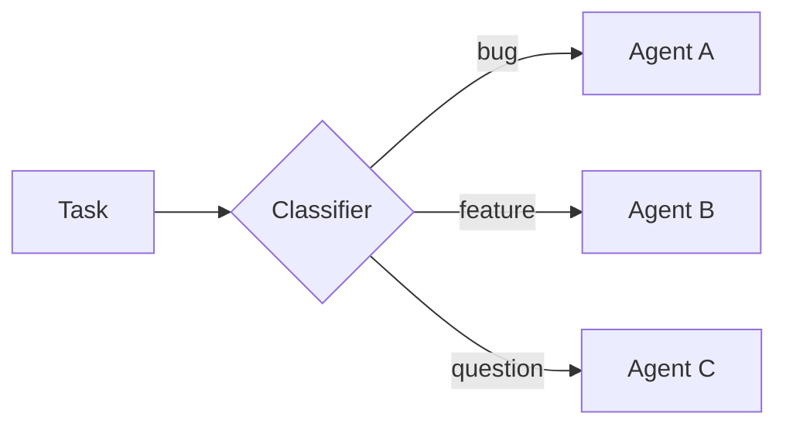
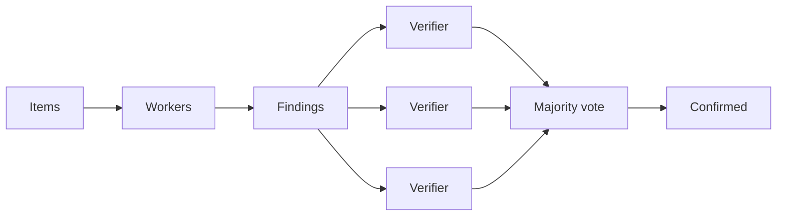
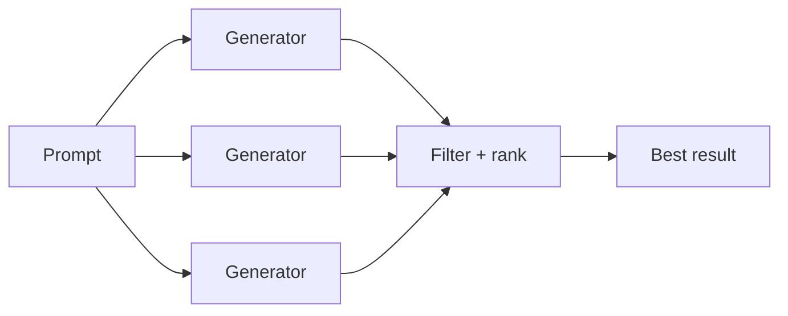
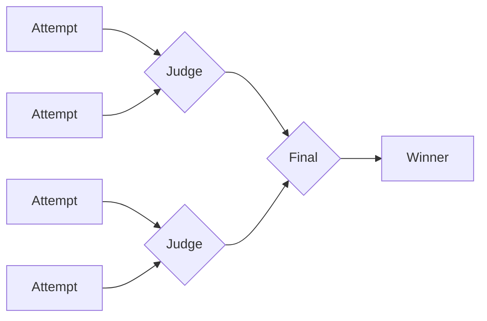
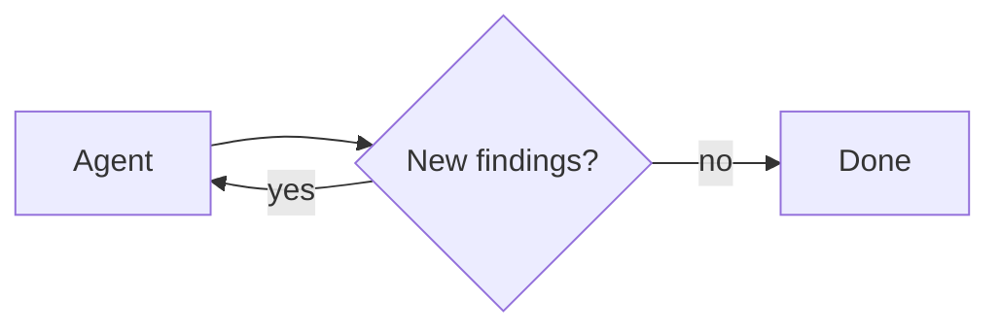

Dynamic subagents let an agent dispatch [subagents](/oss/deepagents/subagents) from interpreter code. Instead of asking the model to choose one subagent call at a time, the agent can use JavaScript loops, branches, and parallel batches to route work across configured subagents and synthesize the results.

Use this pattern when work spans many independent units, needs multiple perspectives, or benefits from recursive analysis. For general interpreter setup, see [Interpreters](/oss/deepagents/interpreters).

<Warning>
    Dynamic subagents use the interpreter runtime, which is in [**beta**](/oss/versioning). APIs and lifecycle behavior may change between releases.
</Warning>

:::python
<Note>
    Interpreters require `langchain-quickjs>=0.1.0` and Python `>=3.11`.
</Note>
:::

## Quickstart

Dynamic subagents require two things: subagents to dispatch work to, and a code interpreter, a secure, lightweight runtime where the model writes and executes orchestration code. Deep Agents includes an optional code interpreter based on QuickJS. Install the QuickJS middleware package, then pass interpreter middleware through the `middleware` argument on `create_deep_agent`.

:::python
<CodeGroup>
```bash pip
pip install -U "deepagents[quickjs]"
```

```bash uv
uv add "deepagents[quickjs]"
```
</CodeGroup>

```python
from deepagents import create_deep_agent
from langchain_quickjs import CodeInterpreterMiddleware

agent = create_deep_agent(
    model="openai:gpt-5.5",
    middleware=[CodeInterpreterMiddleware()],
)
```
:::

:::js
<CodeGroup>
```bash npm
npm install deepagents @langchain/quickjs
```

```bash pnpm
pnpm add deepagents @langchain/quickjs
```

```bash yarn
yarn add deepagents @langchain/quickjs
```
</CodeGroup>

```typescript
import { createDeepAgent } from "deepagents";
import { createCodeInterpreterMiddleware } from "@langchain/quickjs";

const agent = createDeepAgent({
  model: "openai:gpt-5.5",
  middleware: [createCodeInterpreterMiddleware()],
});
```
:::

Deep Agents ships with a general-purpose subagent built in, so basic fan-out works without extra configuration. For specialized work, configure custom subagents with their own names, descriptions, and system prompts; the names and descriptions are how the agent knows which role to reach for. See [Subagents](/oss/deepagents/subagents) for configuration.

To trigger dynamic subagents, prompt the agent with the word "workflow":

:::python
```python
result = await agent.ainvoke({
    "messages": [{"role": "user", "content": "Run a workflow that reviews every file in src/routes/ and summarizes the top risks."}]
})
```
:::

:::js
```typescript
const result = await agent.invoke({
  messages: [{ role: "user", content: "Run a workflow that reviews every file in src/routes/ and summarizes the top risks." }],
});
```
:::

<Tip>
    **The word "workflow" is a useful trigger.** The interpreter system prompt treats "workflow" as a signal to organize work through the interpreter, dispatching subagents with `task()` from code rather than grinding through items one model-chosen tool call at a time. Phrasing a request as a "workflow" is a deliberate lever you can pull to opt into dynamic orchestration. For a single, direct delegation, phrase the request plainly instead.
</Tip>

### Use with a coding agent

The fastest way to try dynamic subagents is with `dcode`, the LangChain terminal coding agent built on a Deep Agent. It ships with the code interpreter enabled, so dynamic subagents works out of the box with nothing to wire up.

Install `dcode`:

```bash
curl -LsSf https://langch.in/dcode | bash
```

Run it:

```bash
dcode
```

To trigger dynamic subagents, ask for a "workflow". Instead of grinding through the work itself or managing fan-out through its native `task` tool, the agent writes an orchestration script that calls the built-in `task()` global and runs it in the code interpreter. For example: "Run a workflow to review every file in src/ for SQL injection."

As subagents spawn, `dcode` shows them live in the dynamic subagents panel, grouped into phases by dispatch.

<Frame>
  
</Frame>

`dcode` is the fastest way to try this, but you can also use dynamic subagents in the coding agent of your choice over [ACP](/oss/deepagents/acp) (for example, Zed).

## How it works

When an agent has [subagents](/oss/deepagents/subagents) and interpreter middleware, the interpreter exposes a built-in `task()` global that dispatches subagents from code. A task spanning many independent units (reviewing every file in a directory, triaging a batch of tickets) becomes a loop that fans the work out, so it runs deterministically instead of one model-chosen tool call at a time.

Subagent orchestration also supports recursive language model (RLM) workflows, the approach described in the [Recursive Language Models paper](https://arxiv.org/abs/2512.24601): keep the working set in interpreter variables, select slices, call subagents with `task()`, and synthesize the results.

`task()` takes the following inputs:

- `description`: The prompt for the subagent
- `subagentType`: Which configured subagent to run
- `responseSchema` (optional): Structured output

A `task()` runs a full agentic loop and resolves to the subagent's result:

```javascript
const review = await task({
  description: "Review src/auth/login.ts for auth issues. Cite line numbers.",
  subagentType: "reviewer",
  responseSchema: {
    type: "object",
    properties: {
      issues: { type: "array", items: { type: "object", properties: {
        file: { type: "string" }, line: { type: "number" },
        severity: { type: "string" }, description: { type: "string" },
      }}},
    },
  },
});

// With responseSchema, the result is already a typed value, so no JSON.parse is needed.
const critical = review.issues.filter((issue) => issue.severity === "high");
```

When you pass `responseSchema`, the resolved value is already a typed JavaScript object; only call `JSON.parse` if a subagent intentionally returned a JSON string.

## Patterns

The agent picks a strategy from the shape of the task; these emerge from how it writes interpreter code, not from configuration, and the subagents you make available determine what it can do. Every pattern shares one model: hold work in JS variables, dispatch subagents with `task()`, and combine results in code. The diagrams below show the common shapes, each with a runnable example.

### Classify and act

Items are classified first, then each item is handled by a specialized subagent based on its classification. This lets you process mixed inputs where different items need different expertise.



**Use cases:** Triaging support tickets, error logs, user feedback, or any batch of items that need different handling depending on their type.

<Accordion title="Example: classify and act">

**What you configure**

:::python
```python
agent = create_deep_agent(
    model="openai:gpt-5.5",
    subagents=[
        {
            "name": "bug-fixer",
            "description": "Investigates bug reports and provides reproduction steps",
            "system_prompt": "You are a bug triage specialist. Investigate each bug report and provide clear reproduction steps.",
        },
        {
            "name": "feature-analyst",
            "description": "Evaluates feature requests for feasibility and effort",
            "system_prompt": "You are a product analyst. Evaluate each feature request for technical feasibility, estimated effort, and potential impact.",
        },
        {
            "name": "support-agent",
            "description": "Answers user questions based on documentation",
            "system_prompt": "You are a support specialist. Answer user questions clearly based on the available documentation.",
        },
    ],
    middleware=[CodeInterpreterMiddleware()],
)

result = await agent.ainvoke({
    "messages": [{"role": "user", "content": "Go through these 30 support tickets. Categorize each one, then for bugs give me reproduction steps, and for feature requests give me a feasibility assessment."}]
})
```
:::

:::js
```typescript
const agent = createDeepAgent({
  model: "openai:gpt-5.5",
  subagents: [
    {
      name: "bug-fixer",
      description: "Investigates bug reports and provides reproduction steps",
      systemPrompt: "You are a bug triage specialist. Investigate each bug report and provide clear reproduction steps.",
    },
    {
      name: "feature-analyst",
      description: "Evaluates feature requests for feasibility and effort",
      systemPrompt: "You are a product analyst. Evaluate each feature request for technical feasibility, estimated effort, and potential impact.",
    },
    {
      name: "support-agent",
      description: "Answers user questions based on documentation",
      systemPrompt: "You are a support specialist. Answer user questions clearly based on the available documentation.",
    },
  ],
  middleware: [createCodeInterpreterMiddleware()],
});

const result = await agent.invoke({
  messages: [{ role: "user", content: "Go through these 30 support tickets. Categorize each one, then for bugs give me reproduction steps, and for feature requests give me a feasibility assessment." }],
});
```
:::

**What the agent writes**

```javascript
// The agent has already classified each ticket; this routes every item to
// the right specialist and collects the handled results.
const SPECIALIST = { bug: "bug-fixer", feature: "feature-analyst", question: "support-agent" };

const handled = await Promise.all(
  tickets.map((ticket) =>
    task({
      description: `Handle this ${ticket.category}:\n${ticket.text}`,
      subagentType: SPECIALIST[ticket.category],
    }),
  ),
);
// ... group handled results by category into a single triage report
handled;
```
</Accordion>

### Fan-out and synthesize

The agent dispatches the same kind of work across many items in parallel, then combines the results.


**Use cases:** Code review across a directory, analyzing a batch of documents, processing log files, running the same check across many services.

<Accordion title="Example: fan-out and synthesize">

**What you configure**

:::python
```python
from deepagents import create_deep_agent
from langchain_quickjs import CodeInterpreterMiddleware

agent = create_deep_agent(
    model="openai:gpt-5.5",
    subagents=[{
        "name": "reviewer",
        "description": "Reviews code for security issues, citing lines and severity",
        "system_prompt": "You are a security-focused code reviewer. Read the file carefully and report any authentication or authorization issues with line numbers and severity.",
    }],
    middleware=[CodeInterpreterMiddleware()],
)

result = await agent.ainvoke({
    "messages": [{"role": "user", "content": "Review all the route handlers in src/routes/ for authentication issues. Summarize the top risks."}]
})
```
:::

:::js
```typescript
import { createDeepAgent } from "deepagents";
import { createCodeInterpreterMiddleware } from "@langchain/quickjs";

const agent = createDeepAgent({
  model: "openai:gpt-5.5",
  subagents: [{
    name: "reviewer",
    description: "Reviews code for security issues, citing lines and severity",
    systemPrompt: "You are a security-focused code reviewer. Read the file carefully and report any authentication or authorization issues with line numbers and severity.",
  }],
  middleware: [createCodeInterpreterMiddleware()],
});

const result = await agent.invoke({
  messages: [{ role: "user", content: "Review all the route handlers in src/routes/ for authentication issues. Summarize the top risks." }],
});
```
:::

**What the agent writes**

```javascript
// One reviewer per file, dispatched in parallel, then findings merged.
const files = (await tools.glob({ pattern: "src/routes/**/*.ts" }))
  .split("\n")
  .filter(Boolean);

const reviews = await Promise.all(
  files.map((file) =>
    task({
      description: `Review ${file} for authentication issues. Cite line numbers.`,
      subagentType: "reviewer",
      responseSchema: issuesSchema, // -> { issues: [{ file, line, severity }] }
    }),
  ),
);

const issues = reviews.flatMap((r) => r.issues);
// ... sort by severity, drop duplicates, summarize the top risks
issues;
```
</Accordion>

### Adversarial verification

A two-pass pattern. The first pass produces findings. The second pass sends each finding to independent verifiers, and only findings that survive agreement are kept. This reduces false positives when confidence matters more than speed.



**Use cases:** Security audits where false positives are costly, compliance checks, any review where you need high confidence in findings.

<Accordion title="Example: adversarial verification">

**What you configure**

:::python
```python
agent = create_deep_agent(
    model="openai:gpt-5.5",
    subagents=[
        {
            "name": "reviewer",
            "description": "Finds potential security vulnerabilities in code",
            "system_prompt": "You are a security auditor. Find potential vulnerabilities and report each with file, line, and description.",
        },
        {
            "name": "verifier",
            "description": "Independently verifies whether a reported vulnerability is real",
            "system_prompt": "You are a security verification specialist. Given a reported vulnerability, independently verify whether it is exploitable. Be skeptical. Only confirm real issues.",
        },
    ],
    middleware=[CodeInterpreterMiddleware()],
)

result = await agent.ainvoke({
    "messages": [{"role": "user", "content": "Do a thorough security audit of the payments module. I only want confirmed vulnerabilities, not maybes."}]
})
```
:::

:::js
```typescript
const agent = createDeepAgent({
  model: "openai:gpt-5.5",
  subagents: [
    {
      name: "reviewer",
      description: "Finds potential security vulnerabilities in code",
      systemPrompt: "You are a security auditor. Find potential vulnerabilities and report each with file, line, and description.",
    },
    {
      name: "verifier",
      description: "Independently verifies whether a reported vulnerability is real",
      systemPrompt: "You are a security verification specialist. Given a reported vulnerability, independently verify whether it is exploitable. Be skeptical. Only confirm real issues.",
    },
  ],
  middleware: [createCodeInterpreterMiddleware()],
});

const result = await agent.invoke({
  messages: [{ role: "user", content: "Do a thorough security audit of the payments module. I only want confirmed vulnerabilities, not maybes." }],
});
```
:::

**What the agent writes**

```javascript
// Pass 1: audit. Pass 2: verify each finding independently; keep only confirmed.
const { findings } = await task({
  description: "Audit the payments module for vulnerabilities.",
  subagentType: "auditor",
  responseSchema: findingsSchema, // -> { findings: [{ id, file, line, description }] }
});

const verdicts = await Promise.all(
  findings.map((f) =>
    task({
      description: `Verify ${f.file}:${f.line} (${f.description}). Confirm or refute.`,
      subagentType: "verifier",
      responseSchema: verdictSchema, // -> { confirmed: boolean }
    }),
  ),
);

const confirmed = findings.filter((_, i) => verdicts[i]?.confirmed);
// ... report only the confirmed vulnerabilities
confirmed;
```
</Accordion>

### Generate and filter

Multiple subagents generate independent solutions to the same problem. The agent compares, scores, and filters the results in code, keeping only the best.



**Use cases:** Architecture proposals, refactoring strategies, content variations, any task where exploring multiple options before committing produces a better outcome.

<Accordion title="Example: generate and filter">

**What you configure**

:::python
```python
agent = create_deep_agent(
    model="openai:gpt-5.5",
    subagents=[{
        "name": "architect",
        "description": "Proposes a database schema design with tradeoff analysis",
        "system_prompt": "You are a database architect. Propose a schema design for the given requirements. Include tradeoffs, migration considerations, and a clear rationale.",
    }],
    middleware=[CodeInterpreterMiddleware()],
)

result = await agent.ainvoke({
    "messages": [{"role": "user", "content": "Generate three different approaches to restructure the database schema for the orders system, then pick the best one."}]
})
```
:::

:::js
```typescript
const agent = createDeepAgent({
  model: "openai:gpt-5.5",
  subagents: [{
    name: "architect",
    description: "Proposes a database schema design with tradeoff analysis",
    systemPrompt: "You are a database architect. Propose a schema design for the given requirements. Include tradeoffs, migration considerations, and a clear rationale.",
  }],
  middleware: [createCodeInterpreterMiddleware()],
});

const result = await agent.invoke({
  messages: [{ role: "user", content: "Generate three different approaches to restructure the database schema for the orders system, then pick the best one." }],
});
```
:::

**What the agent writes**

```javascript
// Generate independent proposals in parallel, then score and keep the best.
const proposals = await Promise.all(
  [1, 2, 3].map((n) =>
    task({
      description: `Approach ${n}: redesign the orders schema, with tradeoffs.`,
      subagentType: "architect",
      responseSchema: designSchema, // -> { design, tradeoffs }
    }),
  ),
);

// ... score each proposal against the requirements
const best = proposals.sort((a, b) => score(b) - score(a))[0];
best;
```
</Accordion>

### Tournament

Variations are compared head-to-head by a judge subagent, with winners advancing through elimination rounds.



**Use cases:** Optimization under subjective criteria, style selection, choosing between competing implementations.

<Accordion title="Example: tournament">

**What you configure**

:::python
```python
agent = create_deep_agent(
    model="openai:gpt-5.5",
    subagents=[
        {
            "name": "writer",
            "description": "Rewrites a function with a focus on readability and clarity",
            "system_prompt": "You are an expert programmer focused on clean code. Rewrite the given function to maximize readability. Explain your choices.",
        },
        {
            "name": "judge",
            "description": "Compares two code implementations and picks the more readable one",
            "system_prompt": "You are a code quality judge. Compare two implementations and pick the more readable one. Justify your choice with specific criteria.",
        },
    ],
    middleware=[CodeInterpreterMiddleware()],
)

result = await agent.ainvoke({
    "messages": [{"role": "user", "content": "Rewrite the processOrder function in src/checkout.ts five different ways and find the most readable version."}]
})
```
:::

:::js
```typescript
const agent = createDeepAgent({
  model: "openai:gpt-5.5",
  subagents: [
    {
      name: "writer",
      description: "Rewrites a function with a focus on readability and clarity",
      systemPrompt: "You are an expert programmer focused on clean code. Rewrite the given function to maximize readability. Explain your choices.",
    },
    {
      name: "judge",
      description: "Compares two code implementations and picks the more readable one",
      systemPrompt: "You are a code quality judge. Compare two implementations and pick the more readable one. Justify your choice with specific criteria.",
    },
  ],
  middleware: [createCodeInterpreterMiddleware()],
});

const result = await agent.invoke({
  messages: [{ role: "user", content: "Rewrite the processOrder function in src/checkout.ts five different ways and find the most readable version." }],
});
```
:::

**What the agent writes**

```javascript
// Generate variants, then judge pairwise until a single winner remains.
let bracket = await Promise.all(
  [1, 2, 3, 4, 5].map((n) =>
    task({ description: `Rewrite processOrder for readability (variant ${n}).`, subagentType: "writer" }),
  ),
);

while (bracket.length > 1) {
  const winners = [];
  for (let i = 0; i < bracket.length; i += 2) {
    if (bracket[i + 1] === undefined) { winners.push(bracket[i]); break; }
    const { winner } = await task({
      description: `Pick the more readable:\n\nA:\n${bracket[i]}\n\nB:\n${bracket[i + 1]}`,
      subagentType: "judge",
      responseSchema: pickSchema, // -> { winner: "A" | "B" }
    });
    winners.push(winner === "A" ? bracket[i] : bracket[i + 1]);
  }
  bracket = winners;
}
bracket[0]; // the winning rewrite
```
</Accordion>

### Loop until done

The agent runs a discovery loop, deduplicating against what it has already found, until no new results appear. Useful when the scope of the work is not known upfront.



**Use cases:** Exhaustive search, dead code detection, dependency audits, any sweep where you want completeness rather than a fixed number of results.

<Accordion title="Example: loop until done">

**What you configure**

:::python
```python
agent = create_deep_agent(
    model="openai:gpt-5.5",
    subagents=[{
        "name": "analyzer",
        "description": "Analyzes code for unused exports, functions, and dead code paths",
        "system_prompt": "You are a code analyst specializing in dead code detection. Find unused exports, unreachable functions, and orphaned modules. Report each with file path and evidence.",
    }],
    middleware=[CodeInterpreterMiddleware()],
)

result = await agent.ainvoke({
    "messages": [{"role": "user", "content": "Find all the dead code in this repo. Be thorough. I want every unused export and unreachable function."}]
})
```
:::

:::js
```typescript
const agent = createDeepAgent({
  model: "openai:gpt-5.5",
  subagents: [{
    name: "analyzer",
    description: "Analyzes code for unused exports, functions, and dead code paths",
    systemPrompt: "You are a code analyst specializing in dead code detection. Find unused exports, unreachable functions, and orphaned modules. Report each with file path and evidence.",
  }],
  middleware: [createCodeInterpreterMiddleware()],
});

const result = await agent.invoke({
  messages: [{ role: "user", content: "Find all the dead code in this repo. Be thorough. I want every unused export and unreachable function." }],
});
```
:::

**What the agent writes**

```javascript
// Keep dispatching rounds, deduping against what's found, until a round adds nothing.
const seen = new Set();
const found = [];

while (true) {
  const { items } = await task({
    description: `Find dead code. Already found: ${[...seen].join(", ") || "(none)"}.`,
    subagentType: "analyzer",
    responseSchema: itemsSchema, // -> { items: [{ id, file }] }
  });
  const fresh = items.filter((i) => !seen.has(i.id));
  if (fresh.length === 0) break; // converged: nothing new
  for (const i of fresh) { seen.add(i.id); found.push(i); }
}
found;
```
</Accordion>

:::python
<Warning>
    `task()` dispatches from inside an already-running `eval` call. It does not go through the normal tool calling path, so `interrupt_on` approval workflows on the parent agent are not enforced per dispatch. Gate the `eval` tool itself if you need approval before subagent orchestration runs.
</Warning>
:::
:::js
<Warning>
    `task()` dispatches from inside an already-running `eval` call. It does not go through the normal tool calling path, so `interruptOn` approval workflows on the parent agent are not enforced per dispatch. Gate the `eval` tool itself if you need approval before subagent orchestration runs.
</Warning>
:::

## Disable dynamic subagents

Subagent dispatch is on by default whenever the agent has subagents. Disable it if you want subagents to be available only through the normal `task` tool path.

:::python
```python
from deepagents import create_deep_agent
from langchain_quickjs import CodeInterpreterMiddleware

agent = create_deep_agent(
    model="openai:gpt-5.5",
    subagents=[{"name": "reviewer", "description": "Reviews code", "system_prompt": "Review code."}],
    middleware=[CodeInterpreterMiddleware(subagents=False)],
)
```
:::

:::js
```typescript
import { createDeepAgent } from "deepagents";
import { createCodeInterpreterMiddleware } from "@langchain/quickjs";

const agent = createDeepAgent({
  model: "openai:gpt-5.5",
  subagents: [{ name: "reviewer", description: "Reviews code", systemPrompt: "Review code." }],
  middleware: [createCodeInterpreterMiddleware({ subagents: false })],
});
```
:::
