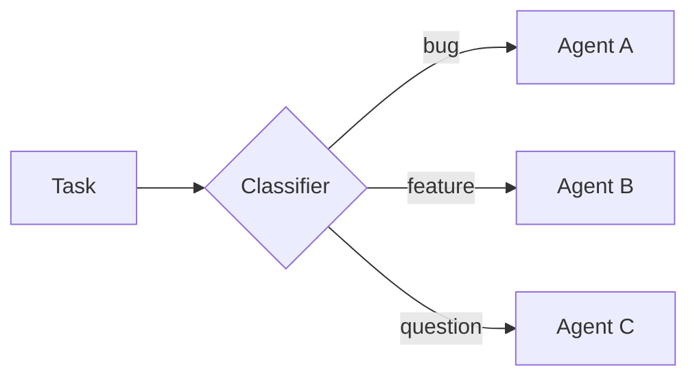
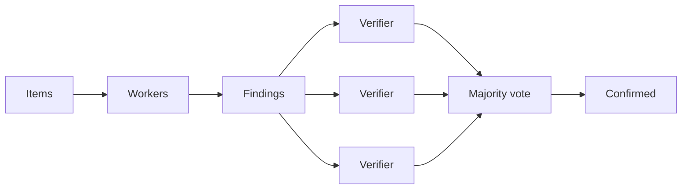
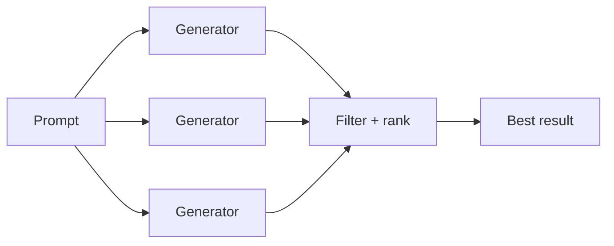
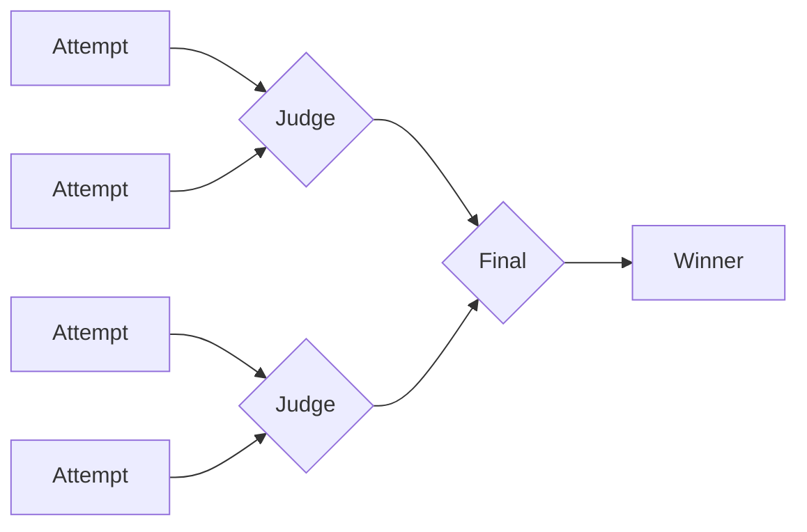
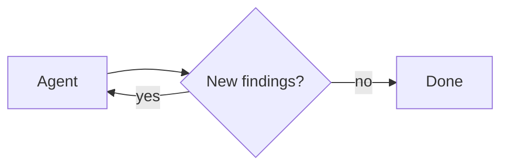

import DynamicSubagentsQuickstartPy from '/snippets/code-samples/dynamic-subagents-quickstart-py.mdx';
import DynamicSubagentsQuickstartJs from '/snippets/code-samples/dynamic-subagents-quickstart-js.mdx';
import DynamicSubagentsInvokePy from '/snippets/code-samples/dynamic-subagents-invoke-py.mdx';
import DynamicSubagentsInvokeJs from '/snippets/code-samples/dynamic-subagents-invoke-js.mdx';
import DynamicSubagentsTaskApiEvalJs from '/snippets/code-samples/dynamic-subagents-task-api-eval-js.mdx';
import DynamicSubagentsClassifyConfigurePy from '/snippets/code-samples/dynamic-subagents-classify-configure-py.mdx';
import DynamicSubagentsClassifyConfigureJs from '/snippets/code-samples/dynamic-subagents-classify-configure-js.mdx';
import DynamicSubagentsClassifyEvalJs from '/snippets/code-samples/dynamic-subagents-classify-eval-js.mdx';
import DynamicSubagentsFanoutConfigurePy from '/snippets/code-samples/dynamic-subagents-fanout-configure-py.mdx';
import DynamicSubagentsFanoutConfigureJs from '/snippets/code-samples/dynamic-subagents-fanout-configure-js.mdx';
import DynamicSubagentsFanoutEvalJs from '/snippets/code-samples/dynamic-subagents-fanout-eval-js.mdx';
import DynamicSubagentsAdversarialConfigurePy from '/snippets/code-samples/dynamic-subagents-adversarial-configure-py.mdx';
import DynamicSubagentsAdversarialConfigureJs from '/snippets/code-samples/dynamic-subagents-adversarial-configure-js.mdx';
import DynamicSubagentsAdversarialEvalJs from '/snippets/code-samples/dynamic-subagents-adversarial-eval-js.mdx';
import DynamicSubagentsGenerateConfigurePy from '/snippets/code-samples/dynamic-subagents-generate-configure-py.mdx';
import DynamicSubagentsGenerateConfigureJs from '/snippets/code-samples/dynamic-subagents-generate-configure-js.mdx';
import DynamicSubagentsGenerateEvalJs from '/snippets/code-samples/dynamic-subagents-generate-eval-js.mdx';
import DynamicSubagentsTournamentConfigurePy from '/snippets/code-samples/dynamic-subagents-tournament-configure-py.mdx';
import DynamicSubagentsTournamentConfigureJs from '/snippets/code-samples/dynamic-subagents-tournament-configure-js.mdx';
import DynamicSubagentsTournamentEvalJs from '/snippets/code-samples/dynamic-subagents-tournament-eval-js.mdx';
import DynamicSubagentsLoopConfigurePy from '/snippets/code-samples/dynamic-subagents-loop-configure-py.mdx';
import DynamicSubagentsLoopConfigureJs from '/snippets/code-samples/dynamic-subagents-loop-configure-js.mdx';
import DynamicSubagentsLoopEvalJs from '/snippets/code-samples/dynamic-subagents-loop-eval-js.mdx';
import DynamicSubagentsDisablePy from '/snippets/code-samples/dynamic-subagents-disable-py.mdx';
import DynamicSubagentsDisableJs from '/snippets/code-samples/dynamic-subagents-disable-js.mdx';

Dynamic subagents let an agent dispatch [subagents](/oss/deepagents/subagents) from interpreter code. Instead of asking the model to choose one subagent call at a time, the agent can use JavaScript loops, branches, and parallel batches to route work across configured subagents and synthesize the results.

Use this pattern when work spans many independent units, needs multiple perspectives, or benefits from recursive analysis. For general interpreter setup, see [Interpreters](/oss/deepagents/interpreters).

<Warning>
    Dynamic subagents use the interpreter runtime, which is in [**beta**](/oss/versioning). APIs and lifecycle behavior may change between releases.
</Warning>

:::python
<Note>
    Interpreters require `langchain-quickjs>=0.2.0` and Python `>=3.11`.
</Note>
:::

:::js
<Note>
    Interpreters require `@langchain/quickjs`.
</Note>
:::

## Quickstart

Dynamic subagents require [interpreter](/oss/deepagents/interpreters) middleware. Install and wire up the interpreter first. The built-in [general-purpose subagent](/oss/deepagents/subagents#default-subagent) handles basic fan-out without extra configuration.

:::python
<DynamicSubagentsQuickstartPy />
:::

:::js
<DynamicSubagentsQuickstartJs />
:::

For install steps and interpreter setup, see [Interpreters](/oss/deepagents/interpreters#quickstart).

For specialized work, configure custom [subagents](/oss/deepagents/subagents) with their own names, descriptions, and system prompts. The subagents' names and descriptions serve as information for the agent to evaluate which role to reach for.

To trigger dynamic subagents, prompt the agent with the word "workflow":

:::python
<DynamicSubagentsInvokePy />
:::

:::js
<DynamicSubagentsInvokeJs />
:::

<Tip>
    **The word "workflow" is a useful trigger.** The interpreter system prompt treats "workflow" as a signal to organize work through the interpreter, dispatching subagents with `task()` from code rather than grinding through items one model-chosen tool call at a time. Phrasing a request as a "workflow" is a deliberate lever you can pull to opt into dynamic orchestration. For a single, direct delegation, phrase the request plainly instead.
</Tip>

### Use with a coding agent

The fastest way to try dynamic subagents is with `dcode`, the LangChain terminal coding agent built on a Deep Agent. It ships with the code interpreter enabled, so dynamic subagents work out of the box with nothing to wire up.

Install `dcode`:

```bash
curl -LsSf https://langch.in/dcode | bash
```

Run it:

```bash
dcode
```

To trigger dynamic subagents, ask for a "workflow". Instead of grinding through the work itself or managing fan-out through its native `task` tool, the agent writes an orchestration script that calls the built-in `task()` global and runs it in the code interpreter. For example: "Run a workflow to review every file in src/ for SQL injection."

As subagents spawn, `dcode` shows them live in the dynamic subagents panel, grouped into phases by dispatch.

<Frame>
  
</Frame>

`dcode` is the fastest way to try this, but you can also use dynamic subagents in the coding agent of your choice over [ACP](/oss/deepagents/acp) (for example, Zed).

## How it works

When an agent has [subagents](/oss/deepagents/subagents) and interpreter middleware, the interpreter exposes a built-in `task()` global that dispatches subagents from code. A task spanning many independent units (reviewing every file in a directory, triaging a batch of tickets) becomes a loop that fans the work out, so it runs deterministically instead of one model-chosen tool call at a time.

Subagent orchestration also supports recursive language model (RLM) workflows, the approach described in the [Recursive Language Models paper](https://arxiv.org/abs/2512.24601): keep the working set in interpreter variables, select slices, call subagents with `task()`, and synthesize the results.

Many orchestration workflows combine dynamic subagents with [programmatic tool calling (PTC)](/oss/deepagents/interpreters#programmatic-tool-calling-ptc): use `tools.*` from interpreter code to discover or filter inputs, then dispatch subagents with `task()`. PTC is off by default; enable it with an explicit allowlist on interpreter middleware.

`task()` is a capability bridge into subagent execution, similar to PTC for tools. For isolation defaults, approval boundaries, and middleware options, see [Security](/oss/deepagents/interpreters#security) and [Configuration](/oss/deepagents/interpreters#configuration).

:::python
<Note>
    Multi-turn orchestration can persist interpreter variables across agent turns when using `mode="thread"` (the default). See [Persistence](/oss/deepagents/interpreters#persistence) on the interpreters page.
</Note>
:::

`task()` takes the following inputs:

- `description`: The prompt for the subagent
- `subagentType`: Which configured subagent to run
- `responseSchema` (optional): Structured output

A `task()` runs a full agentic loop and resolves to the subagent's result:

<DynamicSubagentsTaskApiEvalJs />

When you pass `responseSchema`, the resolved value is already a typed JavaScript object; only call `JSON.parse` if a subagent intentionally returned a JSON string.

## Patterns

The agent picks a strategy from the shape of the task; these emerge from how it writes interpreter code, not from configuration, and the subagents you make available determine what it can do. Every pattern shares the same orchestration approach: hold work in JS variables, dispatch subagents with `task()`, and combine results in code. The diagrams below show the common shapes, each with a runnable example.

### Classify and act

Items are classified first, then each item is handled by a specialized subagent based on its classification. This lets you process mixed inputs where different items need different expertise.



**Use cases:** Triaging support tickets, error logs, user feedback, or any batch of items that need different handling depending on their type.

<Accordion title="Example: classify and act">

**What you configure**

:::python
<DynamicSubagentsClassifyConfigurePy />
:::

:::js
<DynamicSubagentsClassifyConfigureJs />
:::

**What the agent writes**

<DynamicSubagentsClassifyEvalJs />
</Accordion>

### Fan-out and synthesize

The agent dispatches the same kind of work across many items in parallel, then combines the results.


**Use cases:** Code review across a directory, analyzing a batch of documents, processing log files, running the same check across many services.

Discovering files from interpreter code requires [programmatic tool calling (PTC)](/oss/deepagents/interpreters#programmatic-tool-calling-ptc). Enable `glob` in the PTC allowlist on interpreter middleware.

<Accordion title="Example: fan-out and synthesize">

**What you configure**

:::python
<DynamicSubagentsFanoutConfigurePy />
:::

:::js
<DynamicSubagentsFanoutConfigureJs />
:::

**What the agent writes**

<DynamicSubagentsFanoutEvalJs />
</Accordion>

### Adversarial verification

A two-pass pattern. The first pass produces findings. The second pass sends each finding to independent verifiers, and only findings that survive agreement are kept. This reduces false positives when confidence matters more than speed.



**Use cases:** Security audits where false positives are costly, compliance checks, any review where you need high confidence in findings.

<Accordion title="Example: adversarial verification">

**What you configure**

:::python
<DynamicSubagentsAdversarialConfigurePy />
:::

:::js
<DynamicSubagentsAdversarialConfigureJs />
:::

**What the agent writes**

<DynamicSubagentsAdversarialEvalJs />
</Accordion>

### Generate and filter

Multiple subagents generate independent solutions to the same problem. The agent compares, scores, and filters the results in code, keeping only the best.



**Use cases:** Architecture proposals, refactoring strategies, content variations, any task where exploring multiple options before committing produces a better outcome.

<Accordion title="Example: generate and filter">

**What you configure**

:::python
<DynamicSubagentsGenerateConfigurePy />
:::

:::js
<DynamicSubagentsGenerateConfigureJs />
:::

**What the agent writes**

<DynamicSubagentsGenerateEvalJs />
</Accordion>

### Tournament

Variations are compared head-to-head by a judge subagent, with winners advancing through elimination rounds.



**Use cases:** Optimization under subjective criteria, style selection, choosing between competing implementations.

<Accordion title="Example: tournament">

**What you configure**

:::python
<DynamicSubagentsTournamentConfigurePy />
:::

:::js
<DynamicSubagentsTournamentConfigureJs />
:::

**What the agent writes**

<DynamicSubagentsTournamentEvalJs />
</Accordion>

### Loop until done

The agent runs a discovery loop, deduplicating against what it has already found, until no new results appear. Useful when the scope of the work is not known upfront.



**Use cases:** Exhaustive search, dead code detection, dependency audits, any sweep where you want completeness rather than a fixed number of results.

<Accordion title="Example: loop until done">

**What you configure**

:::python
<DynamicSubagentsLoopConfigurePy />
:::

:::js
<DynamicSubagentsLoopConfigureJs />
:::

**What the agent writes**

<DynamicSubagentsLoopEvalJs />
</Accordion>

:::python
<Warning>
    `task()` dispatches from inside an already-running `eval` call. It does not go through the normal tool calling path, so `interrupt_on` approval workflows on the parent agent are not enforced per dispatch. Gate the `eval` tool itself if you need approval before subagent orchestration runs.
</Warning>
:::
:::js
<Warning>
    `task()` dispatches from inside an already-running `eval` call. It does not go through the normal tool calling path, so `interruptOn` approval workflows on the parent agent are not enforced per dispatch. Gate the `eval` tool itself if you need approval before subagent orchestration runs.
</Warning>
:::

## Disable dynamic subagents

Subagent dispatch is on by default whenever the agent has subagents. Disable it if you want subagents to be available only through the normal `task` tool path. For other middleware options, see [Configuration](/oss/deepagents/interpreters#configuration) on the interpreters page.

:::python
<DynamicSubagentsDisablePy />
:::

:::js
<DynamicSubagentsDisableJs />
:::

## See also

- [Interpreters](/oss/deepagents/interpreters): QuickJS setup, programmatic tool calling, persistence, security, and middleware configuration
- [Subagents](/oss/deepagents/subagents): Configure subagent names, descriptions, and system prompts
- [Event streaming](/oss/deepagents/event-streaming): Stream updates from the coordinator and delegated subagents
