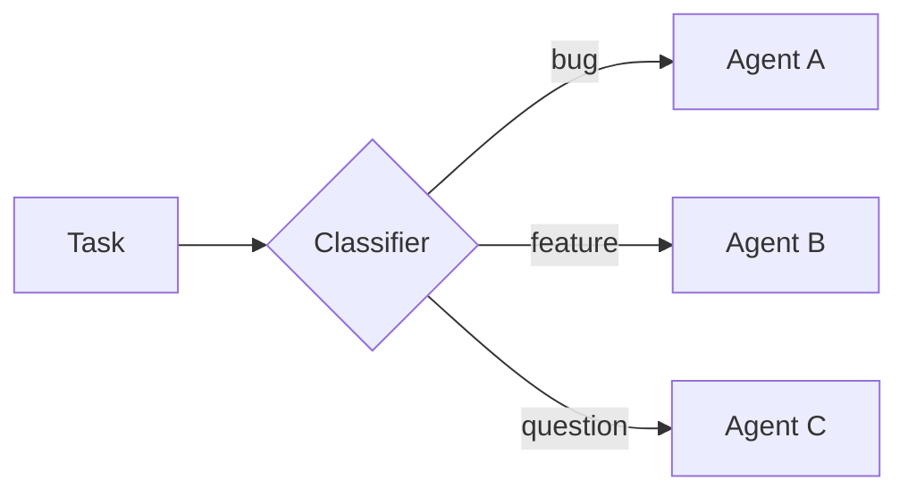
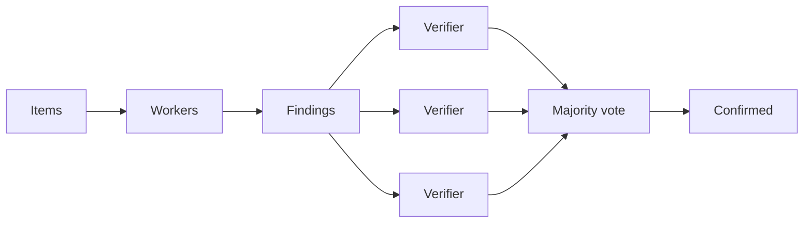
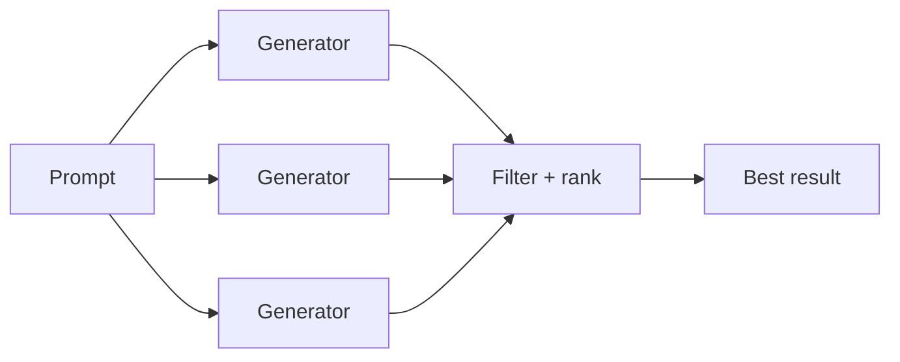
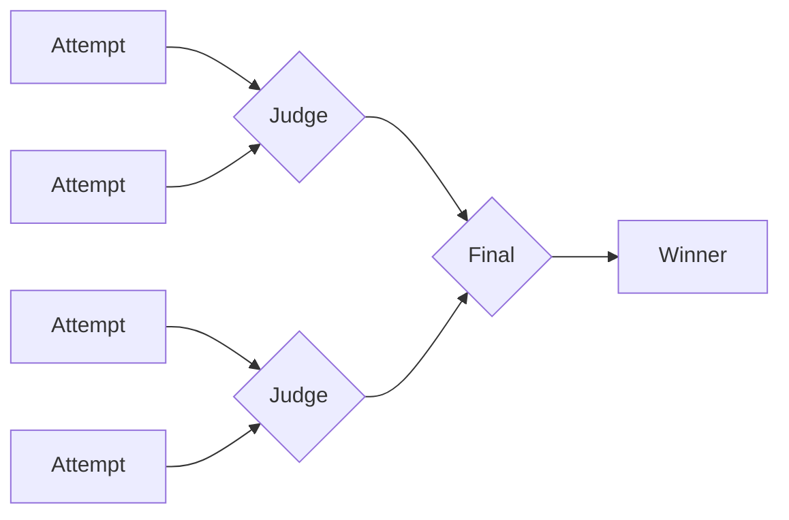
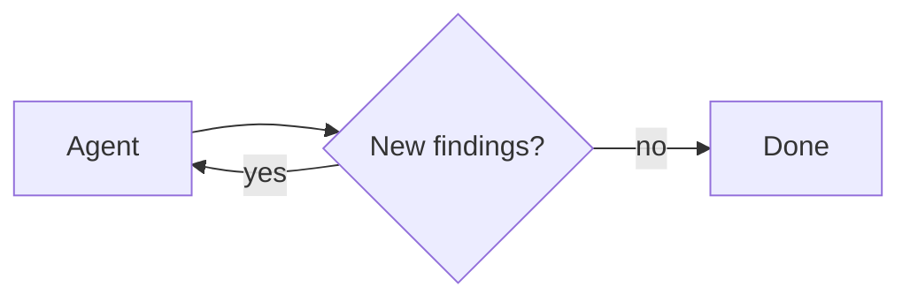

Interpreters give agents a programmable workspace where they can explore data, coordinate tool calls, and keep intermediate work out of the model context. The agent writes code to express its intent, then an **in-memory** runtime executes that code and returns the relevant results.

Where [sandboxes](/oss/deepagents/sandboxes) are a code-first way for acting on an environment (such as running commands, installing dependencies, and editing files), interpreters are a code-first way for acting inside the agent loop: composing tools, preserving state, and deciding what information should return to the model.

<Warning>
    Interpreters are in [**beta**](/oss/versioning). APIs and lifecycle behavior may change between releases.
</Warning>

:::python
<Note>
    Interpreters require `langchain-quickjs>=0.1.0` and Python `>=3.11`.
</Note>
:::

## Why use interpreters?

Most agent work alternates between model reasoning and tool calls. A model can fire several tool calls in one turn, but that batch is fixed the moment it is emitted. Nothing can loop, branch on a result, retry a failure, or feed one call's output into the next without another model turn, and every result returns to the model's context. The model also decides how many calls to issue, so asking it to dispatch work across hundreds of items is unreliable, and it tends to cover a sample rather than every one.

Interpreters give the agent a runtime for that work. A loop runs every iteration, tools are called from code, intermediate values stay in variables, and only a compact result returns to the model.

<CardGroup cols={2}>
  <Card title="Programmatic tool calling (PTC)" icon="tool" href="#programmatic-tool-calling-ptc">
    Call selected tools from interpreter code, including loops, retries, branching, and parallel batches.
  </Card>
  <Card title="Subagent orchestration" icon="arrows-split" href="#subagent-orchestration">
    Dispatch subagents from code for fan-out, verification, and recursive workflows over large inputs.
  </Card>
  <Card title="Stateful work" icon="database" href="#how-interpreters-work">
    Keep intermediate values in runtime state without overloading the model context.
  </Card>
  <Card title="Deterministic transforms" icon="code" href="#how-interpreters-work">
    Sort, group, parse, validate, score, aggregate, and explore structured data in code.
  </Card>
</CardGroup>

## Choose a pattern

Use interpreters for code inside the agent loop: composing tools, preserving state, and controlling what returns to the model. Use [sandboxes](/oss/deepagents/sandboxes) for code against an environment: shell commands, package installs, tests, filesystem edits, and OS-level execution.

| Need | Use |
| --- | --- |
| One or two simple external calls | Normal tool calling |
| A small program that loops, branches, retries, or aggregates results | Interpreter |
| Many selected tool calls that should run from code | Interpreter with [programmatic tool calling (PTC)](#programmatic-tool-calling-ptc) |
| Many independent units of work, multiple perspectives, or recursive analysis over large inputs | Interpreter with [subagent orchestration](#subagent-orchestration) |
| Shell commands, package installs, tests, or full OS filesystem access | [Sandboxes](/oss/deepagents/sandboxes) |

## Quickstart

Install the QuickJS middleware package, then pass interpreter middleware using the `middleware` argument on `create_deep_agent`.

:::python
<CodeGroup>
```bash pip
pip install -U "deepagents[quickjs]"
```

```bash uv
uv add "deepagents[quickjs]"
```
</CodeGroup>

```python
from deepagents import create_deep_agent
from langchain_quickjs import CodeInterpreterMiddleware

agent = create_deep_agent(
    model="openai:gpt-5.5",
    middleware=[CodeInterpreterMiddleware()],
)
```
:::

:::js
<CodeGroup>
```bash npm
npm install deepagents @langchain/quickjs
```

```bash pnpm
pnpm add deepagents @langchain/quickjs
```

```bash yarn
yarn add deepagents @langchain/quickjs
```
</CodeGroup>

```typescript
import { createDeepAgent } from "deepagents";
import { createCodeInterpreterMiddleware } from "@langchain/quickjs";

const agent = createDeepAgent({
  model: "openai:gpt-5.5",
  middleware: [createCodeInterpreterMiddleware()],
});
```
:::

## How interpreters work

The middleware adds an `eval` tool to the agent. When useful, the agent writes JavaScript and calls `eval`; you do not call the interpreter directly. The tool runs code in a persistent context, captures `console.log`, and returns the result of the last expression.

The agent can write code like this:

```javascript
const rows = [
  { team: "alpha", score: 8 },
  { team: "beta", score: 13 },
  { team: "alpha", score: 21 },
];

const totals = rows.reduce((acc, row) => {
  acc[row.team] = (acc[row.team] ?? 0) + row.score;
  console.log(`${row.team} score: ${acc[row.team]}`)
  return acc;
}, {});

totals;
```

:::python
By default, interpreter state also persists across turns in the same thread by snapshotting the working state after each agent run, and restoring it before the next run.
:::

Code runs against [**QuickJS**](https://github.com/quickjs-ng/quickjs), a lightweight JavaScript runtime. By default, interpreter code has no access to the host filesystem, network, shell, package manager, or clock. It can compute, hold state, and write to `console.log`, and nothing more.

Two explicit bridges extend that reach:

- **Tools**, through [programmatic tool calling (PTC)](#programmatic-tool-calling-ptc). Expose an allowlist of tools as async functions under the `tools` namespace. These can be the agent's own tools or standalone tools you define and pass in.
- **Subagents**, through [subagent orchestration](#subagent-orchestration). Dispatch configured subagents from code and orchestrate them in plain JavaScript.

Programmatic tool calling is off until you [enable it](#enable-ptc). Subagent dispatch is on by default whenever the agent has subagents, and you can turn it off. Nothing else crosses the QuickJS boundary unless you expose it.

## Programmatic tool calling (PTC)

Programmatic tool calling (PTC) exposes selected agent tools inside the interpreter under the global `tools` namespace. Instead of asking the model to issue one tool call, wait for the result, and then decide the next call, the agent can write code that calls tools in loops, branches, retries, or parallel batches.

This helps when intermediate results are only inputs to the next step: the interpreter filters or aggregates them before anything returns to the model, keeping multi-step workflows token-efficient. It is model-agnostic, implemented by middleware rather than a provider-specific tool-calling API.

The middleware exposes each allowlisted tool as an async function under `tools`. The agent calls it with `await`, processes the result in code, and the model sees only the final interpreter output, not every intermediate value. Tool names are converted to camel case while the input object still follows the tool's schema, so a tool named `web_search` becomes `tools.webSearch(...)`:

```typescript
const result: string = await tools.webSearch({
  query: "deepagents interpreters",
});
```

### Enable PTC

Enable PTC with an explicit allowlist:

:::python
```python
from deepagents import create_deep_agent
from langchain_quickjs import CodeInterpreterMiddleware

agent = create_deep_agent(
    model="openai:gpt-5.5",
    middleware=[CodeInterpreterMiddleware(ptc=["web_search"])],
)
```
:::

:::js
```typescript
import { createDeepAgent } from "deepagents";
import { createCodeInterpreterMiddleware } from "@langchain/quickjs";

const agent = createDeepAgent({
  model: "openai:gpt-5.5",
  middleware: [createCodeInterpreterMiddleware({ ptc: ["web_search"] })],
});
```
:::

After PTC is enabled, the agent can call the allowlisted tool from interpreter code. This example searches several topics in parallel and combines the results before returning to the model:

```javascript
const topics = ["retrieval", "memory", "evaluation"];

const results = await Promise.all(
  topics.map((topic) =>
    tools.webSearch({ query: `${topic} best practices 2025` }),
  ),
);

results.join("\n\n");
```

:::python
<Warning>
    PTC calls currently execute through the interpreter bridge and do not go through the normal tool calling path. As a result, `interrupt_on` approval workflows are not enforced per PTC-invoked tool call.
</Warning>
:::
:::js
<Warning>
    PTC calls currently execute through the interpreter bridge and do not go through the normal tool calling path. As a result, `interruptOn` approval workflows are not enforced per PTC-invoked tool call.
</Warning>
:::

## Subagent orchestration

When an agent has [subagents](/oss/deepagents/subagents) and interpreter middleware, the interpreter exposes a built-in `task()` global that dispatches subagents from code. A task spanning many independent units (reviewing every file in a directory, triaging a batch of tickets) becomes a loop that fans the work out, so it runs deterministically instead of one model-chosen tool call at a time.

Subagent orchestration also supports recursive language model (RLM) workflows, the approach described in the [Recursive Language Models paper](https://arxiv.org/abs/2512.24601): keep the working set in interpreter variables, select slices, call subagents with `task()`, and synthesize the results.

`task()` takes the following inputs:

- `description`: The prompt for the subagent
- `subagentType`: Which configured subagent to run
- `responseSchema` (optional): Structured output

A `task()` runs a full agentic loop and resolves to the subagent's result:

```javascript
const review = await task({
  description: "Review src/auth/login.ts for auth issues. Cite line numbers.",
  subagentType: "reviewer",
  responseSchema: {
    type: "object",
    properties: {
      issues: { type: "array", items: { type: "object", properties: {
        file: { type: "string" }, line: { type: "number" },
        severity: { type: "string" }, description: { type: "string" },
      }}},
    },
  },
});

// With responseSchema, the result is already a typed value, so no JSON.parse is needed.
const critical = review.issues.filter((issue) => issue.severity === "high");
```

When you pass `responseSchema`, the resolved value is already a typed JavaScript object; only call `JSON.parse` if a subagent intentionally returned a JSON string.

### Guide orchestration

The interpreter middleware ships orchestration guidance in the system prompt, so the agent already knows how to fan out in bounded batches, filter between passes, and synthesize results. You don't hand-write that logic or prompt for it turn by turn.

To shape *what* the agent orchestrates, work through the inputs it already responds to:

- **The subagents you configure.** Their `name` and `description` define the roles available. A `reviewer` paired with a `verifier` invites a two-pass check; a single `analyzer` invites a straight fan-out.
- **The task message.** Phrasing like "I only want confirmed issues, not maybes" or "be exhaustive" nudges the agent toward verification or an open-ended sweep.
- **The system prompt.** Use `systemPrompt` (or the agent's instructions) to add standing guidance when you want a consistent strategy across runs.

### Patterns

The agent picks a strategy from the shape of the task; these emerge from how it writes interpreter code, not from configuration, and the subagents you make available determine what it can do. Every pattern shares one model: hold work in JS variables, dispatch subagents with `task()`, and combine results in code. The diagrams below show the common shapes, each with a runnable example.

#### Classify and act

Items are classified first, then each item is handled by a specialized subagent based on its classification. This lets you process mixed inputs where different items need different expertise.



**Use cases:** Triaging support tickets, error logs, user feedback, or any batch of items that need different handling depending on their type.

<Accordion title="Example: classify and act">

**What you configure**

:::python
```python
agent = create_deep_agent(
    model="openai:gpt-5.5",
    subagents=[
        {
            "name": "bug-fixer",
            "description": "Investigates bug reports and provides reproduction steps",
            "system_prompt": "You are a bug triage specialist. Investigate each bug report and provide clear reproduction steps.",
        },
        {
            "name": "feature-analyst",
            "description": "Evaluates feature requests for feasibility and effort",
            "system_prompt": "You are a product analyst. Evaluate each feature request for technical feasibility, estimated effort, and potential impact.",
        },
        {
            "name": "support-agent",
            "description": "Answers user questions based on documentation",
            "system_prompt": "You are a support specialist. Answer user questions clearly based on the available documentation.",
        },
    ],
    middleware=[CodeInterpreterMiddleware()],
)

result = await agent.ainvoke({
    "messages": [{"role": "user", "content": "Go through these 30 support tickets. Categorize each one, then for bugs give me reproduction steps, and for feature requests give me a feasibility assessment."}]
})
```
:::

:::js
```typescript
const agent = createDeepAgent({
  model: "openai:gpt-5.5",
  subagents: [
    {
      name: "bug-fixer",
      description: "Investigates bug reports and provides reproduction steps",
      systemPrompt: "You are a bug triage specialist. Investigate each bug report and provide clear reproduction steps.",
    },
    {
      name: "feature-analyst",
      description: "Evaluates feature requests for feasibility and effort",
      systemPrompt: "You are a product analyst. Evaluate each feature request for technical feasibility, estimated effort, and potential impact.",
    },
    {
      name: "support-agent",
      description: "Answers user questions based on documentation",
      systemPrompt: "You are a support specialist. Answer user questions clearly based on the available documentation.",
    },
  ],
  middleware: [createCodeInterpreterMiddleware()],
});

const result = await agent.invoke({
  messages: [{ role: "user", content: "Go through these 30 support tickets. Categorize each one, then for bugs give me reproduction steps, and for feature requests give me a feasibility assessment." }],
});
```
:::

**What the agent writes**

```javascript
// The agent has already classified each ticket; this routes every item to
// the right specialist and collects the handled results.
const SPECIALIST = { bug: "bug-fixer", feature: "feature-analyst", question: "support-agent" };

const handled = await Promise.all(
  tickets.map((ticket) =>
    task({
      description: `Handle this ${ticket.category}:\n${ticket.text}`,
      subagentType: SPECIALIST[ticket.category],
    }),
  ),
);
// ... group handled results by category into a single triage report
handled;
```
</Accordion>

#### Fan-out and synthesize

The agent dispatches the same kind of work across many items in parallel, then combines the results.


**Use cases:** Code review across a directory, analyzing a batch of documents, processing log files, running the same check across many services.

<Accordion title="Example: fan-out and synthesize">

**What you configure**

:::python
```python
from deepagents import create_deep_agent
from langchain_quickjs import CodeInterpreterMiddleware

agent = create_deep_agent(
    model="openai:gpt-5.5",
    subagents=[{
        "name": "reviewer",
        "description": "Reviews code for security issues, citing lines and severity",
        "system_prompt": "You are a security-focused code reviewer. Read the file carefully and report any authentication or authorization issues with line numbers and severity.",
    }],
    middleware=[CodeInterpreterMiddleware()],
)

result = await agent.ainvoke({
    "messages": [{"role": "user", "content": "Review all the route handlers in src/routes/ for authentication issues. Summarize the top risks."}]
})
```
:::

:::js
```typescript
import { createDeepAgent } from "deepagents";
import { createCodeInterpreterMiddleware } from "@langchain/quickjs";

const agent = createDeepAgent({
  model: "openai:gpt-5.5",
  subagents: [{
    name: "reviewer",
    description: "Reviews code for security issues, citing lines and severity",
    systemPrompt: "You are a security-focused code reviewer. Read the file carefully and report any authentication or authorization issues with line numbers and severity.",
  }],
  middleware: [createCodeInterpreterMiddleware()],
});

const result = await agent.invoke({
  messages: [{ role: "user", content: "Review all the route handlers in src/routes/ for authentication issues. Summarize the top risks." }],
});
```
:::

**What the agent writes**

```javascript
// One reviewer per file, dispatched in parallel, then findings merged.
const files = (await tools.glob({ pattern: "src/routes/**/*.ts" }))
  .split("\n")
  .filter(Boolean);

const reviews = await Promise.all(
  files.map((file) =>
    task({
      description: `Review ${file} for authentication issues. Cite line numbers.`,
      subagentType: "reviewer",
      responseSchema: issuesSchema, // -> { issues: [{ file, line, severity }] }
    }),
  ),
);

const issues = reviews.flatMap((r) => r.issues);
// ... sort by severity, drop duplicates, summarize the top risks
issues;
```
</Accordion>

#### Adversarial verification

A two-pass pattern. The first pass produces findings. The second pass sends each finding to independent verifiers, and only findings that survive agreement are kept. This reduces false positives when confidence matters more than speed.



**Use cases:** Security audits where false positives are costly, compliance checks, any review where you need high confidence in findings.

<Accordion title="Example: adversarial verification">

**What you configure**

:::python
```python
agent = create_deep_agent(
    model="openai:gpt-5.5",
    subagents=[
        {
            "name": "reviewer",
            "description": "Finds potential security vulnerabilities in code",
            "system_prompt": "You are a security auditor. Find potential vulnerabilities and report each with file, line, and description.",
        },
        {
            "name": "verifier",
            "description": "Independently verifies whether a reported vulnerability is real",
            "system_prompt": "You are a security verification specialist. Given a reported vulnerability, independently verify whether it is exploitable. Be skeptical. Only confirm real issues.",
        },
    ],
    middleware=[CodeInterpreterMiddleware()],
)

result = await agent.ainvoke({
    "messages": [{"role": "user", "content": "Do a thorough security audit of the payments module. I only want confirmed vulnerabilities, not maybes."}]
})
```
:::

:::js
```typescript
const agent = createDeepAgent({
  model: "openai:gpt-5.5",
  subagents: [
    {
      name: "reviewer",
      description: "Finds potential security vulnerabilities in code",
      systemPrompt: "You are a security auditor. Find potential vulnerabilities and report each with file, line, and description.",
    },
    {
      name: "verifier",
      description: "Independently verifies whether a reported vulnerability is real",
      systemPrompt: "You are a security verification specialist. Given a reported vulnerability, independently verify whether it is exploitable. Be skeptical. Only confirm real issues.",
    },
  ],
  middleware: [createCodeInterpreterMiddleware()],
});

const result = await agent.invoke({
  messages: [{ role: "user", content: "Do a thorough security audit of the payments module. I only want confirmed vulnerabilities, not maybes." }],
});
```
:::

**What the agent writes**

```javascript
// Pass 1: audit. Pass 2: verify each finding independently; keep only confirmed.
const { findings } = await task({
  description: "Audit the payments module for vulnerabilities.",
  subagentType: "auditor",
  responseSchema: findingsSchema, // -> { findings: [{ id, file, line, description }] }
});

const verdicts = await Promise.all(
  findings.map((f) =>
    task({
      description: `Verify ${f.file}:${f.line} (${f.description}). Confirm or refute.`,
      subagentType: "verifier",
      responseSchema: verdictSchema, // -> { confirmed: boolean }
    }),
  ),
);

const confirmed = findings.filter((_, i) => verdicts[i]?.confirmed);
// ... report only the confirmed vulnerabilities
confirmed;
```
</Accordion>

#### Generate and filter

Multiple subagents generate independent solutions to the same problem. The agent compares, scores, and filters the results in code, keeping only the best.



**Use cases:** Architecture proposals, refactoring strategies, content variations, any task where exploring multiple options before committing produces a better outcome.

<Accordion title="Example: generate and filter">

**What you configure**

:::python
```python
agent = create_deep_agent(
    model="openai:gpt-5.5",
    subagents=[{
        "name": "architect",
        "description": "Proposes a database schema design with tradeoff analysis",
        "system_prompt": "You are a database architect. Propose a schema design for the given requirements. Include tradeoffs, migration considerations, and a clear rationale.",
    }],
    middleware=[CodeInterpreterMiddleware()],
)

result = await agent.ainvoke({
    "messages": [{"role": "user", "content": "Generate three different approaches to restructure the database schema for the orders system, then pick the best one."}]
})
```
:::

:::js
```typescript
const agent = createDeepAgent({
  model: "openai:gpt-5.5",
  subagents: [{
    name: "architect",
    description: "Proposes a database schema design with tradeoff analysis",
    systemPrompt: "You are a database architect. Propose a schema design for the given requirements. Include tradeoffs, migration considerations, and a clear rationale.",
  }],
  middleware: [createCodeInterpreterMiddleware()],
});

const result = await agent.invoke({
  messages: [{ role: "user", content: "Generate three different approaches to restructure the database schema for the orders system, then pick the best one." }],
});
```
:::

**What the agent writes**

```javascript
// Generate independent proposals in parallel, then score and keep the best.
const proposals = await Promise.all(
  [1, 2, 3].map((n) =>
    task({
      description: `Approach ${n}: redesign the orders schema, with tradeoffs.`,
      subagentType: "architect",
      responseSchema: designSchema, // -> { design, tradeoffs }
    }),
  ),
);

// ... score each proposal against the requirements
const best = proposals.sort((a, b) => score(b) - score(a))[0];
best;
```
</Accordion>

#### Tournament

Variations are compared head-to-head by a judge subagent, with winners advancing through elimination rounds.



**Use cases:** Optimization under subjective criteria, style selection, choosing between competing implementations.

<Accordion title="Example: tournament">

**What you configure**

:::python
```python
agent = create_deep_agent(
    model="openai:gpt-5.5",
    subagents=[
        {
            "name": "writer",
            "description": "Rewrites a function with a focus on readability and clarity",
            "system_prompt": "You are an expert programmer focused on clean code. Rewrite the given function to maximize readability. Explain your choices.",
        },
        {
            "name": "judge",
            "description": "Compares two code implementations and picks the more readable one",
            "system_prompt": "You are a code quality judge. Compare two implementations and pick the more readable one. Justify your choice with specific criteria.",
        },
    ],
    middleware=[CodeInterpreterMiddleware()],
)

result = await agent.ainvoke({
    "messages": [{"role": "user", "content": "Rewrite the processOrder function in src/checkout.ts five different ways and find the most readable version."}]
})
```
:::

:::js
```typescript
const agent = createDeepAgent({
  model: "openai:gpt-5.5",
  subagents: [
    {
      name: "writer",
      description: "Rewrites a function with a focus on readability and clarity",
      systemPrompt: "You are an expert programmer focused on clean code. Rewrite the given function to maximize readability. Explain your choices.",
    },
    {
      name: "judge",
      description: "Compares two code implementations and picks the more readable one",
      systemPrompt: "You are a code quality judge. Compare two implementations and pick the more readable one. Justify your choice with specific criteria.",
    },
  ],
  middleware: [createCodeInterpreterMiddleware()],
});

const result = await agent.invoke({
  messages: [{ role: "user", content: "Rewrite the processOrder function in src/checkout.ts five different ways and find the most readable version." }],
});
```
:::

**What the agent writes**

```javascript
// Generate variants, then judge pairwise until a single winner remains.
let bracket = await Promise.all(
  [1, 2, 3, 4, 5].map((n) =>
    task({ description: `Rewrite processOrder for readability (variant ${n}).`, subagentType: "writer" }),
  ),
);

while (bracket.length > 1) {
  const winners = [];
  for (let i = 0; i < bracket.length; i += 2) {
    if (bracket[i + 1] === undefined) { winners.push(bracket[i]); break; }
    const { winner } = await task({
      description: `Pick the more readable:\n\nA:\n${bracket[i]}\n\nB:\n${bracket[i + 1]}`,
      subagentType: "judge",
      responseSchema: pickSchema, // -> { winner: "A" | "B" }
    });
    winners.push(winner === "A" ? bracket[i] : bracket[i + 1]);
  }
  bracket = winners;
}
bracket[0]; // the winning rewrite
```
</Accordion>

#### Loop until done

The agent runs a discovery loop, deduplicating against what it has already found, until no new results appear. Useful when the scope of the work isn't known upfront.



**Use cases:** Exhaustive search, dead code detection, dependency audits, any sweep where you want completeness rather than a fixed number of results.

<Accordion title="Example: loop until done">

**What you configure**

:::python
```python
agent = create_deep_agent(
    model="openai:gpt-5.5",
    subagents=[{
        "name": "analyzer",
        "description": "Analyzes code for unused exports, functions, and dead code paths",
        "system_prompt": "You are a code analyst specializing in dead code detection. Find unused exports, unreachable functions, and orphaned modules. Report each with file path and evidence.",
    }],
    middleware=[CodeInterpreterMiddleware()],
)

result = await agent.ainvoke({
    "messages": [{"role": "user", "content": "Find all the dead code in this repo. Be thorough. I want every unused export and unreachable function."}]
})
```
:::

:::js
```typescript
const agent = createDeepAgent({
  model: "openai:gpt-5.5",
  subagents: [{
    name: "analyzer",
    description: "Analyzes code for unused exports, functions, and dead code paths",
    systemPrompt: "You are a code analyst specializing in dead code detection. Find unused exports, unreachable functions, and orphaned modules. Report each with file path and evidence.",
  }],
  middleware: [createCodeInterpreterMiddleware()],
});

const result = await agent.invoke({
  messages: [{ role: "user", content: "Find all the dead code in this repo. Be thorough. I want every unused export and unreachable function." }],
});
```
:::

**What the agent writes**

```javascript
// Keep dispatching rounds, deduping against what's found, until a round adds nothing.
const seen = new Set();
const found = [];

while (true) {
  const { items } = await task({
    description: `Find dead code. Already found: ${[...seen].join(", ") || "(none)"}.`,
    subagentType: "analyzer",
    responseSchema: itemsSchema, // -> { items: [{ id, file }] }
  });
  const fresh = items.filter((i) => !seen.has(i.id));
  if (fresh.length === 0) break; // converged: nothing new
  for (const i of fresh) { seen.add(i.id); found.push(i); }
}
found;
```
</Accordion>

:::python
<Warning>
    `task()` dispatches from inside an already-running `eval` call. It does not go through the normal tool calling path, so `interrupt_on` approval workflows on the parent agent are not enforced per dispatch. Gate the `eval` tool itself if you need approval before subagent orchestration runs.
</Warning>
:::
:::js
<Warning>
    `task()` dispatches from inside an already-running `eval` call. It does not go through the normal tool calling path, so `interruptOn` approval workflows on the parent agent are not enforced per dispatch. Gate the `eval` tool itself if you need approval before subagent orchestration runs.
</Warning>
:::

:::python
## Persistence

`CodeInterpreterMiddleware` snapshots interpreter state after each agent run and restores it before the next run by default. A snapshot is a serialized copy of the interpreter's in-memory JavaScript state, including globals, variables, functions, and imported modules that exist when the agent finishes running code.

Across conversation turns, the lifecycle is:

1. A turn starts, and `CodeInterpreterMiddleware` restores the latest interpreter snapshot for the thread.
2. The agent calls `eval`, and the code can read or mutate interpreter variables.
3. The agent run finishes, and the middleware snapshots the updated interpreter state into graph state.
4. The next turn starts from that restored interpreter state instead of an empty runtime.

Within a single agent run, repeated `eval` calls use the live interpreter context object. The middleware does not snapshot and restore between those calls; it snapshots the context when the run completes so it can be restored on a later turn or checkpoint replay.

<Note>
    Between conversation turns, snapshots only retain values that can be reasonably serialized. Use them for data, not for live runtime objects. Functions, classes, and other unserializable values are restored as unaccessible artifacts. If interpreter code accesses one after restore, the eval tool will throw an error like `Value for 'fn' was not restored because it is not serializable (type: function).`
</Note>

Snapshots preserve interpreter memory, not outside-world effects. If interpreter code calls a tool through PTC, restoring a prior interpreter snapshot does not undo side effects from that tool call. It only restores the interpreter variables that recorded or processed the result.

When the graph uses a checkpointer, this pairs with [LangGraph time travel](/oss/langgraph/use-time-travel). Restoring a graph checkpoint can restore the interpreter snapshot stored in graph state, so you can return to an earlier agent context and interpreter state while debugging or replaying.

```python
from deepagents import create_deep_agent
from langchain_quickjs import CodeInterpreterMiddleware
from langgraph.checkpoint.memory import MemorySaver

checkpointer = MemorySaver()

agent = create_deep_agent(
    model="openai:gpt-5.5",
    checkpointer=checkpointer,
    middleware=[
        CodeInterpreterMiddleware(
            snapshot_between_turns=True,  # Default
        )
    ],
)
```

You can disable cross-turn snapshots with `snapshot_between_turns=False`.
:::

## Security

Interpreters use QuickJS to run untrusted JavaScript with strict default isolation. Treat that as a scoped interpreter runtime, not a full production sandbox backend.

Every tool you expose through PTC is an outside capability that interpreter code can use. Treat the PTC allowlist as a permission boundary: expose only the tools the agent needs, and avoid bridging broad tools that can access sensitive systems, spend money, mutate data, or call unrestricted networks unless that behavior is intentional.

:::python
| Capability | Available by default | How to expose it |
| --- | --- | --- |
| JavaScript execution | Yes | Add interpreter middleware |
| Top-level `await` | Yes | Use promises in interpreter code |
| `console.log` capture | Yes | Disable with `capture_console=False` |
| Agent tools | No | Add a PTC allowlist |
| Filesystem access | No | Add the [built-in filesystem tools](/oss/deepagents/harness#virtual-filesystem-access) via the PTC allowlist |
| Network access | No | Expose a specific network tool through PTC |
| Wall-clock or datetime access | No | Expose an explicit time tool if needed |
| Shell commands, package installs, tests, OS-level execution | No | Use a [sandbox backend](/oss/deepagents/sandboxes) |
:::
:::js
| Capability | Available by default | How to expose it |
| --- | --- | --- |
| JavaScript execution | Yes | Add interpreter middleware |
| Top-level `await` | Yes | Use promises in interpreter code |
| `console.log` capture | Yes | Disable with `captureConsole: false` |
| Agent tools | No | Add a PTC allowlist |
| Filesystem access | No | Add the [built-in filesystem tools](/oss/deepagents/harness#virtual-filesystem-access) via the PTC allowlist |
| Network access | No | Expose a specific network tool through PTC |
| Wall-clock or datetime access | No | Expose an explicit time tool if needed |
| Shell commands, package installs, tests, OS-level execution | No | Use a [sandbox backend](/oss/deepagents/sandboxes) |
:::

:::python
<Note>
    **How code execution works**

    Interpreter code runs in an embedded QuickJS context, not a separate VM or process. In Python, this runtime is provided by [`quickjs-rs`](https://github.com/langchain-ai/quickjs-rs), which documents the same-process execution boundary in its [Security guide](https://github.com/langchain-ai/quickjs-rs#security).

    Treat interpreters as a capability-scoped execution layer, not a host-memory isolation boundary. For untrusted or semi-trusted code, run agents in isolated worker processes or containers and keep the PTC allowlist narrow.
</Note>
:::

## Configuration

:::python
`CodeInterpreterMiddleware` accepts the following options:

| Kwarg | Default | Purpose |
| --- | --- | --- |
| `memory_limit` | `64 * 1024 * 1024` <br/>(64 MB) | QuickJS heap memory limit in bytes. |
| `timeout` | `5.0` | Per-eval timeout in seconds. |
| `max_ptc_calls` | `256` | Maximum `tools.*` calls per eval. Use `None` only in trusted environments. |
| `tool_name` | `"eval"` | Name of the interpreter tool exposed to the model. |
| `max_result_chars` | `4000` | Maximum characters returned from result and stdout blocks. |
| `capture_console` | `True` | Whether `console.log`, `console.warn`, and `console.error` output is captured. |
| `subagents` | `True` | Expose the built-in `task()` global for [subagent orchestration](#subagent-orchestration). Set to `False` to require subagent dispatch through the normal `task` tool path. |
| `ptc` | `None` | PTC allowlist: list of tool names or `BaseTool` instances. |
| `snapshot_between_turns` | `True` | Whether interpreter state snapshots persist across agent turns. |
| `max_snapshot_bytes` | `None` | Maximum serialized snapshot size. Defaults to `memory_limit`. |
:::

:::js
`createCodeInterpreterMiddleware` accepts the following options:

| Option | Default | Purpose |
| --- | --- | --- |
| `ptc` | omitted | PTC allowlist: array of tool names or `StructuredToolInterface` instances. |
| `memoryLimitBytes` | `64 * 1024 * 1024` <br/>(64 MB) | QuickJS memory limit in bytes. |
| `maxStackSizeBytes` | `320 * 1024` | QuickJS stack size limit in bytes. |
| `executionTimeoutMs` | `5000` | Per-eval timeout in milliseconds. Negative values disable the timeout. |
| `systemPrompt` | `null` | Override the built-in interpreter system prompt. |
| `maxPtcCalls` | `256` | Maximum `tools.*` calls per eval. Use `null` only in trusted environments. |
| `maxResultChars` | `4000` | Maximum characters retained from console output, result, and error strings. |
| `toolName` | `"eval"` | Name of the interpreter tool exposed to the model. |
| `captureConsole` | `true` | Whether `console.log`, `console.warn`, and `console.error` output is captured. |
| `subagents` | `true` | Expose the built-in `task()` global for [subagent orchestration](#subagent-orchestration). Set to `false` to require subagent dispatch through the normal `task` tool path. |
:::
