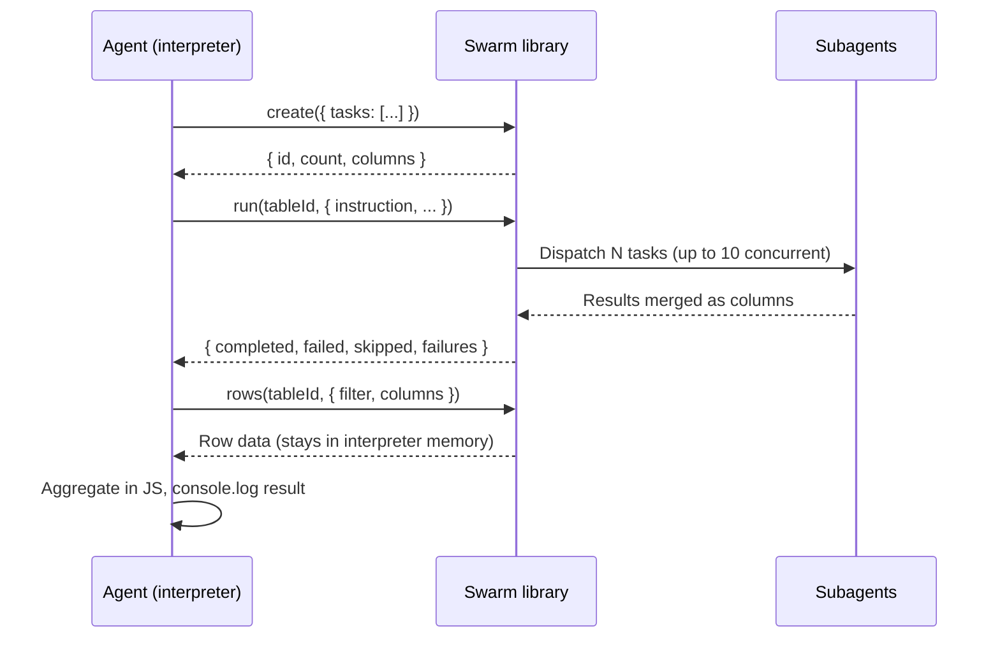

:::js

The `swarm` [interpreter library](/oss/deepagents/interpreters#interpreter-libraries) provides parallel task fan-out with a table-based data model. It gives agents a three-function API (`create`, `run`, `rows`) that handles concurrency, batching, error grouping, and result merging.

The core value:

- **Context isolation.** Source data and results stay in the interpreter. The agent sees lightweight handles and summaries, not the raw data. An agent processing 1,500 records consumes only a few hundred bytes of context through swarm.
- **Deterministic coverage.** The dispatch loop is infrastructure, not generated code. The agent can't quietly skip items or decide a sample is "sufficient."
- **Concurrency management.** Bounded worker pool (up to 10 concurrent dispatches) with auto-batching for larger tables.

### Configure swarm

The `swarm()` factory takes a default model and a list of named subagent configurations. Each subagent gets its own system prompt, tools, and optional model override.

```typescript
import { createDeepAgent } from "deepagents";
import { createCodeInterpreterMiddleware, swarm } from "@langchain/quickjs";

const swarmLib = swarm({
  defaultModel: "anthropic:claude-sonnet-4-6",
  subagents: [
    {
      name: "screener",
      description: "Screens items and returns CLEAN or FLAGGED with evidence.",
      systemPrompt: "You are a quality screener...",
      tools: [tavilySearch],
    },
    {
      name: "classifier",
      description: "Classifies flagged items by category and root cause.",
      systemPrompt: "You are a failure classifier...",
      model: "anthropic:claude-opus-4-6",
    },
  ],
});

const agent = createDeepAgent({
  model,
  middleware: [
    createCodeInterpreterMiddleware({
      libraries: [swarmLib],
    }),
  ],
});
```

When no model is specified on a subagent, it uses `defaultModel`.

### How it works

Swarm operates on a **table**: a JSONL-backed data structure where each row is an independent unit of work with an `id` and arbitrary columns. The agent creates a table, dispatches work across rows, and reads results back. The table is the single source of truth throughout the pipeline.



Data flows through the interpreter, not the agent's context window. The agent sees:

1. The `create()` handle: `{ id: "t_abc", count: 1585, columns: ["id", "text"] }`
2. The `run()` summary: `{ completed: 1585, failed: 0, skipped: 0, failures: [] }`
3. The aggregation output from `rows()` + JavaScript

Total context consumed: a few hundred bytes instead of the full dataset.

### API reference

#### `create(source)`

Builds a table from one of three source types and returns a lightweight handle. The actual row data is persisted to the backend and never returned to the caller.

```javascript
import { create } from "swarm";

// From glob pattern
const table = await create({ glob: "src/**/*.ts" });

// From explicit file paths
const table = await create({ filePaths: ["a.ts", "b.ts"] });

// From inline records (must include an `id` field)
const table = await create({
  tasks: items.map((name, i) => ({ id: `r${i}`, name })),
});
// → { id: "t_a1b2c3", count: 45, columns: ["id", "file"] }
```

Exactly one source type must be provided. Providing zero or more than one throws.

| Source | Row shape |
| --- | --- |
| `glob` | `{ id: <basename>, file: <path> }` |
| `filePaths` | `{ id: <basename>, file: <path> }` |
| `tasks` | As provided (must include `id`) |

#### `run(tableId, options)`

Dispatches an instruction template across rows via subagents. Results are merged back as new columns on the table.

```javascript
import { run } from "swarm";

const result = await run(table.id, {
  instruction: "Classify the sentiment of {text}",
  responseSchema: {
    type: "object",
    properties: {
      sentiment: { type: "string", enum: ["positive", "negative", "neutral"] },
      confidence: { type: "number" },
    },
    required: ["sentiment", "confidence"],
  },
});
// → { completed: 1480, failed: 5, skipped: 0, failures: [...] }
```

| Option | Default | Description |
| --- | --- | --- |
| `instruction` | required | Template with `{column}` placeholders interpolated per-row. |
| `context` | omitted | Prose prepended to every subagent prompt. Use for shared background that applies to all rows. |
| `filter` | omitted | [Filter clause](#filtering) to select a subset of rows. Unmatched rows are skipped. |
| `subagentType` | omitted | Named subagent to dispatch to. When set, runs a full agentic loop with tools. When omitted, makes a single model call (invoke mode). |
| `responseSchema` | required | JSON Schema (type: "object") for structured output. Properties become columns on the row. |
| `batchSize` | auto | Rows per subagent call. Auto-computed to cap total dispatches at 10. Can also be a function `(row, rowCount) => number` for dynamic sizing. |
| `concurrency` | `10` | Maximum concurrent dispatches. Clamped to [1, 10]. |

**Dispatch mode.** When `subagentType` is set, each dispatch runs a full agentic loop with tools and middleware (agent mode). When omitted, each dispatch is a direct model call with structured output and no tools (invoke mode). Use invoke mode for classification, extraction, and labeling. Use agent mode when the subagent needs tools like web search.

**Return value.** `run()` returns a summary. It never throws due to individual task failures.

```typescript
{
  completed: number;  // Rows where the subagent succeeded
  failed: number;     // Rows where the subagent failed or interpolation failed
  skipped: number;    // Rows excluded by the filter
  failures: Array<{   // Deduplicated failure groups
    error: string;
    count: number;
    ids: string[];
  }>;
}
```

Failures are grouped by error message. Instead of 42 individual errors, the agent sees 3-4 categories with counts and affected IDs.

#### `rows(tableId, options?)`

Retrieves rows for inspection and aggregation. The data enters the interpreter's memory, not the agent's context window. Only computed results (via `console.log`) flow back to the agent.

```javascript
import { rows } from "swarm";

const data = await rows(table.id, {
  filter: { column: "sentiment", equals: "negative" },
  columns: ["id", "text", "sentiment", "confidence"],
  limit: 10,
});

const avgConfidence = data.reduce((s, r) => s + r.confidence, 0) / data.length;
console.log(`Average confidence: ${avgConfidence}`);
```

| Option | Default | Description |
| --- | --- | --- |
| `filter` | omitted | Only return rows matching the [filter](#filtering). |
| `columns` | all | Project to specific columns. |
| `limit` | no limit | Maximum rows to return. |

There is no default limit. The agent performs aggregation in JavaScript inside the interpreter, and only the computed result flows back to the context.

### Filtering

Filters select rows in both `run()` (scope which rows are dispatched) and `rows()` (query results). They support leaf predicates and recursive combinators.

```javascript
// Leaf predicates
{ column: "status", equals: "pending" }
{ column: "status", notEquals: "done" }
{ column: "label", in: ["bug", "feature"] }
{ column: "result", exists: true }

// Combinators
{ and: [{ column: "status", equals: "flagged" }, { column: "severity", exists: true }] }
{ or: [{ column: "type", equals: "error" }, { column: "type", equals: "warning" }] }
```

Column paths support dot-notation for nested access (e.g., `{ column: "meta.score", exists: true }`).

**Retry pattern.** Use `exists: false` to select rows that failed or were never processed:

```javascript
// First pass
await run(table.id, { instruction: "Classify: {text}", responseSchema: labelSchema });
// → { completed: 1480, failed: 105 }

// Retry only rows without a result
await run(table.id, {
  instruction: "Classify: {text}",
  responseSchema: labelSchema,
  filter: { column: "sentiment", exists: false },
});
// → { completed: 98, failed: 7, skipped: 1480 }
```

### Structured output

When `responseSchema` is provided, each schema property is flattened as a top-level column on the row:

```javascript
// Before: { id: "r1", text: "Great product!" }
// After:  { id: "r1", text: "Great product!", sentiment: "positive", confidence: 0.95 }
```

Schema `enum` constraints prevent output drift across large task sets. Schema `description` fields are visible to the model and influence output quality.

Batching and structured output are independent. When `batchSize` is set without `responseSchema`, the batching layer auto-generates a minimal schema internally to match text results back to rows by ID. The caller gets a plain text column, same as unbatched.

### Batching and concurrency

Swarm manages concurrency at two levels.

**Worker pool.** Up to 10 concurrent subagent dispatches per `run()` call, configurable via the `concurrency` option (clamped to [1, 10]).

**Auto-batching.** When matched rows exceed the concurrency limit, multiple rows are grouped into each subagent call. This bounds total dispatches regardless of table size.

| Matched rows | Batch size | Total dispatches | Max concurrent |
| --- | --- | --- | --- |
| 1-10 | 1 (no batching) | = matched rows | = matched rows |
| 11-500 | ceil(N/10), capped at 50 | ceil(N/batchSize) | 10 |
| 501+ | 50 (capped) | ceil(N/50) | 10 |

For example, 1,585 rows produces 32 batches of 50, dispatched 10 at a time. All 1,585 items are processed with at most 10 concurrent subagent calls at any point.

### Patterns

#### Single-pass file review

```javascript
import { create, run, rows } from "swarm";

const table = await create({ glob: "src/**/*.ts" });

await run(table.id, {
  instruction: "Review {file} for security issues. List findings or write 'no issues'.",
  context: "TypeScript Express backend using Prisma ORM. Focus on injection, auth bypass, path traversal.",
  subagentType: "reviewer",
  responseSchema: {
    type: "object",
    properties: {
      issues: { type: "array", items: { type: "string" } },
    },
    required: ["issues"],
  },
});

const flagged = await rows(table.id, {
  filter: { column: "issues", exists: true },
  columns: ["file", "issues"],
});
console.log(JSON.stringify(flagged, null, 2));
```

#### Multi-pass analysis with filtering

Multiple `run()` calls against the same table. Each pass writes to different columns. Filters scope which rows are dispatched in subsequent passes.

```javascript
import { create, run, rows } from "swarm";

const table = await create({ tasks: interviews });

// Pass 1: classify sentiment (invoke mode — no tools needed)
await run(table.id, {
  instruction: "Classify sentiment of: {text}",
  responseSchema: {
    type: "object",
    properties: {
      sentiment: { type: "string", enum: ["positive", "negative", "neutral"] },
    },
    required: ["sentiment"],
  },
});

// Pass 2: deep analysis of negative items only (agent mode — needs tools)
await run(table.id, {
  instruction: "Explain why this text has negative sentiment:\n\n{text}",
  subagentType: "analyst",
  responseSchema: {
    type: "object",
    properties: { explanation: { type: "string" } },
    required: ["explanation"],
  },
  filter: { column: "sentiment", equals: "negative" },
});

// Aggregate in JS
const negatives = await rows(table.id, {
  filter: { column: "sentiment", equals: "negative" },
  columns: ["text", "explanation"],
});
console.log(JSON.stringify(negatives, null, 2));
```

#### Error handling and retry

The agent inspects deduplicated failure groups from `run()` and retries selectively:

```javascript
const result = await run(table.id, {
  instruction: "Classify: {text}",
  responseSchema: labelSchema,
});

console.log(`Completed: ${result.completed}, Failed: ${result.failed}`);

if (result.failed > 0) {
  // Log failure groups for triage
  console.log(JSON.stringify(result.failures, null, 2));

  // Retry rows that don't have a result
  const retry = await run(table.id, {
    instruction: "Classify: {text}",
    responseSchema: labelSchema,
    filter: { column: "sentiment", exists: false },
  });
  console.log(`Retry: ${retry.completed} recovered, ${retry.failed} still failing`);
}
```

#### Large-file classification with chunked reading

```javascript
import { create, run, rows } from "swarm";

// Read large file in chunks to avoid truncation
let records = [];
let offset = 0;
while (true) {
  const chunk = await tools.readFile({ file_path: "/data.txt", offset, limit: 500 });
  const lines = chunk.split("\n").filter((l) => l.trim());
  for (const l of lines) {
    records.push({ id: `r${records.length}`, text: l });
  }
  if (lines.length < 500) break;
  offset += 500;
}

const table = await create({ tasks: records });

await run(table.id, {
  instruction: "Classify: {text}",
  responseSchema: {
    type: "object",
    properties: {
      label: { type: "string", enum: ["positive", "negative", "neutral"] },
    },
    required: ["label"],
  },
});

const data = await rows(table.id, { columns: ["label"] });
const counts = {};
data.forEach((r) => {
  counts[r.label] = (counts[r.label] || 0) + 1;
});
console.log(counts);
```

:::
