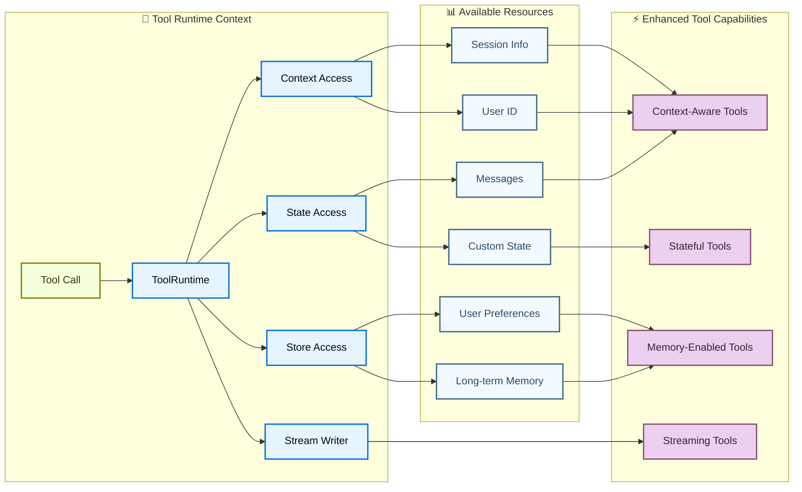

import ToolReturnValuesPy from '/snippets/code-samples/tool-return-values-py.mdx';
import ToolReturnValuesJs from '/snippets/code-samples/tool-return-values-js.mdx';
import ToolReturnObjectPy from '/snippets/code-samples/tool-return-object-py.mdx';
import ToolReturnObjectJs from '/snippets/code-samples/tool-return-object-js.mdx';
import ToolReturnCommandPy from '/snippets/code-samples/tool-return-command-py.mdx';
import ToolReturnCommandJs from '/snippets/code-samples/tool-return-command-js.mdx';
import ToolUpdateStatePy from '/snippets/code-samples/tool-update-state-py.mdx';
import ToolErrorHandlingPy from '/snippets/code-samples/tool-error-handling-py.mdx';
import ToolErrorHandlingJs from '/snippets/code-samples/tool-error-handling-js.mdx';
import ToolRuntimeContextThreadJs from '/snippets/code-samples/tool-runtime-context-thread-js.mdx';
import ToolRuntimeContextThreadPy from '/snippets/code-samples/tool-runtime-context-thread-py.mdx';

Tools extend what [agents](/oss/langchain/agents) can do—letting them fetch real-time data, execute code, query external databases, and take actions in the world.

Under the hood, tools are callable functions with well-defined inputs and outputs that get passed to a [chat model](/oss/langchain/models). The model decides when to invoke a tool based on the conversation context, and what input arguments to provide.

<Tip>
For details on how models handle tool calls, see [Tool calling](/oss/langchain/models#tool-calling). Trace tool calls and debug errors with [LangSmith](https://smith.langchain.com)—follow the [tracing quickstart](/langsmith/trace-with-langchain) to get set up.
</Tip>

## Create tools

### Basic tool definition

:::python
The simplest way to create a tool is with the @[`@tool`] decorator. By default, the function's docstring becomes the tool's description that helps the model understand when to use it:

```python
from langchain.tools import tool

@tool
def search_database(query: str, limit: int = 10) -> str:
    """Search the customer database for records matching the query.

    Args:
        query: Search terms to look for
        limit: Maximum number of results to return
    """
    return f"Found {limit} results for '{query}'"
```

Type hints are **required** as they define the tool's input schema. The docstring should be informative and concise to help the model understand the tool's purpose.
:::

:::js
The simplest way to create a tool is by importing the `tool` function from the `langchain` package. You can use [zod](https://zod.dev/) to define the tool's input schema:

```ts
import * as z from "zod"
import { tool } from "langchain"

const searchDatabase = tool(
  ({ query, limit }) => `Found ${limit} results for '${query}'`,
  {
    name: "search_database",
    description: "Search the customer database for records matching the query.",
    schema: z.object({
      query: z.string().describe("Search terms to look for"),
      limit: z.number().describe("Maximum number of results to return"),
    }),
  }
);
```

:::

<Note>
    **Server-side tool use:** Some chat models feature built-in tools (web search, code interpreters) that are executed server-side. See [Server-side tool use](#server-side-tool-use) for details.
</Note>

<Warning>
    Prefer `snake_case` for tool names (e.g., `web_search` instead of `Web Search`). Some model providers have issues with or reject names containing spaces or special characters with errors. Sticking to alphanumeric characters, underscores, and hyphens helps to improve compatibility across providers.
</Warning>

:::python

### Customize tool properties

#### Custom tool name

By default, the tool name comes from the function name. Override it when you need something more descriptive:

```python
@tool("web_search")  # Custom name
def search(query: str) -> str:
    """Search the web for information."""
    return f"Results for: {query}"

print(search.name)  # web_search
```

#### Custom tool description

Override the auto-generated tool description for clearer model guidance:

```python
@tool("calculator", description="Performs arithmetic calculations. Use this for any math problems.")
def calc(expression: str) -> str:
    """Evaluate mathematical expressions."""
    return str(eval(expression))
```

### Advanced schema definition

Define complex inputs with Pydantic models or JSON schemas:

<CodeGroup>
    ```python Pydantic model
    from pydantic import BaseModel, Field
    from typing import Literal

    class WeatherInput(BaseModel):
        """Input for weather queries."""
        location: str = Field(description="City name or coordinates")
        units: Literal["celsius", "fahrenheit"] = Field(
            default="celsius",
            description="Temperature unit preference"
        )
        include_forecast: bool = Field(
            default=False,
            description="Include 5-day forecast"
        )

    @tool(args_schema=WeatherInput)
    def get_weather(location: str, units: str = "celsius", include_forecast: bool = False) -> str:
        """Get current weather and optional forecast."""
        temp = 22 if units == "celsius" else 72
        result = f"Current weather in {location}: {temp} degrees {units[0].upper()}"
        if include_forecast:
            result += "\nNext 5 days: Sunny"
        return result
    ```

    ```python JSON Schema
    weather_schema = {
        "type": "object",
        "properties": {
            "location": {"type": "string"},
            "units": {"type": "string"},
            "include_forecast": {"type": "boolean"}
        },
        "required": ["location", "units", "include_forecast"]
    }

    @tool(args_schema=weather_schema)
    def get_weather(location: str, units: str = "celsius", include_forecast: bool = False) -> str:
        """Get current weather and optional forecast."""
        temp = 22 if units == "celsius" else 72
        result = f"Current weather in {location}: {temp} degrees {units[0].upper()}"
        if include_forecast:
            result += "\nNext 5 days: Sunny"
        return result
    ```
</CodeGroup>

### Reserved argument names

The following parameter names are reserved and cannot be used as tool arguments. Using these names will cause runtime errors.

| Parameter name | Purpose |
|----------------|---------|
| `config` | Reserved for passing `RunnableConfig` to tools internally |
| `runtime` | Reserved for `ToolRuntime` parameter (accessing state, context, store) |

To access runtime information, use the @[`ToolRuntime`] parameter instead of naming your own arguments `config` or `runtime`.
:::

## Access context

Tools are most powerful when they can access runtime information like conversation history, user data, and persistent memory. This section covers how to access and update this information from within your tools.

:::python
Tools can access runtime information through the @[`ToolRuntime`] parameter, which provides:

| Component | Description | Use case |
|-----------|-------------|----------|
| **State** | Short-term memory - mutable data that exists for the current conversation (messages, counters, custom fields) | Access conversation history, track tool call counts |
| **Context** | Immutable configuration passed at invocation time (user IDs, session info) | Personalize responses based on user identity |
| **Store** | Long-term memory - persistent data that survives across conversations | Save user preferences, maintain knowledge base |
| **Stream Writer** | Emit real-time updates during tool execution | Show progress for long-running operations |
| **Execution Info** | Identity and retry information for the current execution (thread ID, run ID, attempt number) | Access thread/run IDs, adjust behavior based on retry state |
| **Server Info** | Server-specific metadata when running on LangGraph Server (assistant ID, graph ID, authenticated user) | Access assistant ID, graph ID, or authenticated user info |
| **Config** | @[`RunnableConfig`] for the execution | Access callbacks, tags, and metadata |
| **Tool Call ID** | Unique identifier for the current tool invocation | Correlate tool calls for logs and model invocations |



### Short-term memory (State)

State represents short-term memory that exists for the duration of a conversation. It includes the message history and any custom fields you define in your [graph state](/oss/langgraph/graph-api#state).

<Info>
    Add `runtime: ToolRuntime` to your tool signature to access state. This parameter is automatically injected and hidden from the LLM - it won't appear in the tool's schema.
</Info>

#### Access state

Tools can access the current conversation state using `runtime.state`:

```python
from langchain.tools import tool, ToolRuntime
from langchain.messages import HumanMessage

@tool
def get_last_user_message(runtime: ToolRuntime) -> str:
    """Get the most recent message from the user."""
    messages = runtime.state["messages"]

    # Find the last human message
    for message in reversed(messages):
        if isinstance(message, HumanMessage):
            return message.content

    return "No user messages found"

# Access custom state fields
@tool
def get_user_preference(
    pref_name: str,
    runtime: ToolRuntime
) -> str:
    """Get a user preference value."""
    preferences = runtime.state.get("user_preferences", {})
    return preferences.get(pref_name, "Not set")
```

<Warning>
    The `runtime` parameter is hidden from the model. For the example above, the model only sees `pref_name` in the tool schema.
</Warning>

#### Update state

Use @[`Command`] to update the agent's state. This is useful for tools that need to update custom state fields.
Include a `ToolMessage` in the update so the model can see the result of the tool call:

<ToolUpdateStatePy />

<Tip>
    When tools update state variables, consider defining a [reducer](/oss/langgraph/graph-api#reducers) for those fields. Since LLMs can call multiple tools in parallel, a reducer determines how to resolve conflicts when the same state field is updated by concurrent tool calls.
</Tip>
:::

### Context

Context provides immutable configuration data that is passed at invocation time. Use it for user IDs, session details, or application-specific settings that shouldn't change during a conversation.

<Note>
While `thread_id` (passed via `config={"configurable": {"thread_id": ...}}`) scopes the *conversation*: message history and checkpoints, `context` carries *per-run* data your tools and middleware read at invocation time. In production you typically pass both together: a stable `thread_id` per conversation, and a `context` object on every invoke.
</Note>

:::python
Access context through `runtime.context`. Pass it alongside a `thread_id` so the conversation is persisted across turns:

<ToolRuntimeContextThreadPy />

:::

:::js
Tools can access an agent's runtime context through the `config` parameter. Pass `context` alongside a `thread_id` so the conversation is persisted across turns:

<ToolRuntimeContextThreadJs />

:::

### Long-term memory (Store)

The @[`BaseStore`] provides persistent storage that survives across conversations. Unlike state (short-term memory), data saved to the store remains available in future sessions.

:::python
Access the store through `runtime.store`. The store uses a namespace/key pattern to organize data:

<Tip>
    For production deployments, use a persistent store implementation like @[`PostgresStore`] instead of `InMemoryStore`. See the [memory documentation](/oss/langgraph/add-memory) for setup details.
</Tip>

```python expandable
from typing import Any
from langgraph.store.memory import InMemoryStore
from langchain.agents import create_agent
from langchain.tools import tool, ToolRuntime
from langchain_openai import ChatOpenAI

# Access memory
@tool
def get_user_info(user_id: str, runtime: ToolRuntime) -> str:
    """Look up user info."""
    store = runtime.store
    user_info = store.get(("users",), user_id)
    return str(user_info.value) if user_info else "Unknown user"

# Update memory
@tool
def save_user_info(user_id: str, user_info: dict[str, Any], runtime: ToolRuntime) -> str:
    """Save user info."""
    store = runtime.store
    store.put(("users",), user_id, user_info)
    return "Successfully saved user info."

model = ChatOpenAI(model="gpt-5.4")

store = InMemoryStore()
agent = create_agent(
    model,
    tools=[get_user_info, save_user_info],
    store=store
)

# First session: save user info
agent.invoke({
    "messages": [{"role": "user", "content": "Save the following user: userid: abc123, name: Foo, age: 25, email: foo@langchain.dev"}]
})

# Second session: get user info
agent.invoke({
    "messages": [{"role": "user", "content": "Get user info for user with id 'abc123'"}]
})
# Here is the user info for user with ID "abc123":
# - Name: Foo
# - Age: 25
# - Email: foo@langchain.dev
```

:::

:::js
Access the store through `config.store`. The store uses a namespace/key pattern to organize data:

```ts expandable
import * as z from "zod";
import { createAgent, tool } from "langchain";
import { InMemoryStore } from "@langchain/langgraph";
import { ChatOpenAI } from "@langchain/openai";

const store = new InMemoryStore();

// Access memory
const getUserInfo = tool(
  async ({ user_id }) => {
    const value = await store.get(["users"], user_id);
    console.log("get_user_info", user_id, value);
    return value;
  },
  {
    name: "get_user_info",
    description: "Look up user info.",
    schema: z.object({
      user_id: z.string(),
    }),
  }
);

// Update memory
const saveUserInfo = tool(
  async ({ user_id, name, age, email }) => {
    console.log("save_user_info", user_id, name, age, email);
    await store.put(["users"], user_id, { name, age, email });
    return "Successfully saved user info.";
  },
  {
    name: "save_user_info",
    description: "Save user info.",
    schema: z.object({
      user_id: z.string(),
      name: z.string(),
      age: z.number(),
      email: z.string(),
    }),
  }
);

const agent = createAgent({
  model: new ChatOpenAI({ model: "gpt-5.4" }),
  tools: [getUserInfo, saveUserInfo],
  store,
});

// First session: save user info
await agent.invoke({
  messages: [
    {
      role: "user",
      content: "Save the following user: userid: abc123, name: Foo, age: 25, email: foo@langchain.dev",
    },
  ],
});

// Second session: get user info
const result = await agent.invoke({
  messages: [
    { role: "user", content: "Get user info for user with id 'abc123'" },
  ],
});

console.log(result);
// Here is the user info for user with ID "abc123":
// - Name: Foo
// - Age: 25
// - Email: foo@langchain.dev
```

:::

### Stream writer

Stream real-time updates from tools during execution. This is useful for providing progress feedback to users during long-running operations.

:::python
Use `runtime.stream_writer` to emit custom updates:

```python
from langchain.tools import tool, ToolRuntime

@tool
def get_weather(city: str, runtime: ToolRuntime) -> str:
    """Get weather for a given city."""
    writer = runtime.stream_writer

    # Stream custom updates as the tool executes
    writer(f"Looking up data for city: {city}")
    writer(f"Acquired data for city: {city}")

    return f"It's always sunny in {city}!"
```

<Note>
If you use `runtime.stream_writer` inside your tool, the tool must be invoked within a LangGraph execution context. See [Streaming](/oss/langchain/streaming) for more details.
</Note>
:::

:::js
Use `config.writer` to emit custom updates:

```ts
import * as z from "zod";
import { tool, ToolRuntime } from "langchain";

const getWeather = tool(
  ({ city }, config: ToolRuntime) => {
    const writer = config.writer;

    // Stream custom updates as the tool executes
    if (writer) {
      writer(`Looking up data for city: ${city}`);
      writer(`Acquired data for city: ${city}`);
    }

    return `It's always sunny in ${city}!`;
  },
  {
    name: "get_weather",
    description: "Get weather for a given city.",
    schema: z.object({
      city: z.string(),
    }),
  }
);
```

:::

### Execution info

Access thread ID, run ID, and retry state from within a tool via `runtime.execution_info`:

:::python
```python
from langchain.tools import tool, ToolRuntime

@tool
def log_execution_context(runtime: ToolRuntime) -> str:
    """Log execution identity information."""
    info = runtime.execution_info
    print(f"Thread: {info.thread_id}, Run: {info.run_id}")  # [!code highlight]
    print(f"Attempt: {info.node_attempt}")
    return "done"
```
:::

:::js
```ts
import { tool } from "langchain";
import * as z from "zod";

const logExecutionContext = tool(
  async (_input, runtime) => {
    const info = runtime.executionInfo;
    console.log(`Thread: ${info.threadId}, Run: ${info.runId}`);  // [!code highlight]
    console.log(`Attempt: ${info.nodeAttempt}`);
    return "done";
  },
  {
    name: "log_execution_context",
    description: "Log execution identity information.",
    schema: z.object({}),
  }
);
```
:::

:::python
<Note>
Requires `deepagents>=0.5.0` (or `langgraph>=1.1.5`).
</Note>
:::

:::js
<Note>
Requires `deepagents>=1.9.0` (or `@langchain/langgraph>=1.2.8`).
</Note>
:::

### Server info

When your tool runs on LangGraph Server, access the assistant ID, graph ID, and authenticated user via `runtime.server_info`:

:::python
```python
from langchain.tools import tool, ToolRuntime

@tool
def get_assistant_scoped_data(runtime: ToolRuntime) -> str:
    """Fetch data scoped to the current assistant."""
    server = runtime.server_info
    if server is not None:
        print(f"Assistant: {server.assistant_id}, Graph: {server.graph_id}")  # [!code highlight]
        if server.user is not None:
            print(f"User: {server.user.identity}")  # [!code highlight]
    return "done"
```

`server_info` is `None` when the tool is not running on LangGraph Server (e.g., during local development or testing).
:::

:::js
```ts
import { tool } from "langchain";
import * as z from "zod";

const getAssistantScopedData = tool(
  async (_input, runtime) => {
    const server = runtime.serverInfo;
    if (server != null) {
      console.log(`Assistant: ${server.assistantId}, Graph: ${server.graphId}`);  // [!code highlight]
      if (server.user != null) {
        console.log(`User: ${server.user.identity}`);  // [!code highlight]
      }
    }
    return "done";
  },
  {
    name: "get_assistant_scoped_data",
    description: "Fetch data scoped to the current assistant.",
    schema: z.object({}),
  }
);
```

`serverInfo` is `null` when the tool is not running on LangGraph Server.
:::

:::python
<Note>
Requires `deepagents>=0.5.0` (or `langgraph>=1.1.5`).
</Note>
:::

:::js
<Note>
Requires `deepagents>=1.9.0` (or `@langchain/langgraph>=1.2.8`).
</Note>
:::

## Tool execution

In LangChain, tools are used by agents (for example via @[`create_agent`]) and tool error handling is configured through [middleware](/oss/langchain/middleware).

For LangGraph workflows, tool execution is handled by @[`ToolNode`]. See [ToolNode](/oss/langgraph/workflows-agents#toolnode).

### Tool return values

You can choose different return values for your tools:

- Return a `string` for human-readable results.
- Return an `object` for structured results the model should parse.
- Return a `Command` with optional message when you need to write to state.

#### Return a string

Return a string when the tool should provide plain text for the model to read and use in its next response.

:::python

<ToolReturnValuesPy />

:::

:::js

<ToolReturnValuesJs />

:::

Behavior:

- The return value is converted to a `ToolMessage`.
- The model sees that text and decides what to do next.
- No agent state fields are changed unless the model or another tool does so later.

Use this when the result is naturally human-readable text.

#### Return an object

Return an object (for example, a `dict`) when your tool produces structured data that the model should inspect.

:::python

<ToolReturnObjectPy />

:::

:::js

<ToolReturnObjectJs />

:::

Behavior:

- The object is serialized and sent back as tool output.
- The model can read specific fields and reason over them.
- Like string returns, this does not directly update graph state.

Use this when downstream reasoning benefits from explicit fields instead of free-form text.

#### Return a Command

Return a @[`Command`] when the tool needs to update graph state (for example, setting user preferences or app state).
You can return a `Command` with or without including a `ToolMessage`.
If the model needs to see that the tool succeeded (for example, to confirm a preference change), include a `ToolMessage` in the update, using `runtime.tool_call_id` for the `tool_call_id` parameter.

:::python

<ToolReturnCommandPy />

:::

:::js

<ToolReturnCommandJs />

:::

Behavior:

- The command updates state using `update`.
- Updated state is available to subsequent steps in the same run.
- Use reducers for fields that may be updated by parallel tool calls.

Use this when the tool is not just returning data, but also mutating agent state.

### Error handling

Handle tool errors using LangChain agent [middleware](/oss/langchain/middleware) to retry failed tool calls or return custom error messages:

:::python

<ToolErrorHandlingPy />

:::

:::js

<ToolErrorHandlingJs />

:::

### State injection

Tools can access the current graph state through @[`ToolRuntime`]:

:::python

```python
from langchain.tools import tool, ToolRuntime

@tool
def get_message_count(runtime: ToolRuntime) -> str:
    """Get the number of messages in the conversation."""
    messages = runtime.state["messages"]
    return f"There are {len(messages)} messages."
```

:::

For more details on accessing state, context, and long-term memory from tools, see [Access context](#access-context).


## Dynamic tool selection

With dynamic tools, the set of tools available to the agent is modified at runtime rather than defined all upfront. Not every tool is appropriate for every situation. Too many tools may overwhelm the model (overload context) and increase errors; too few limit capabilities. Dynamic tool selection enables adapting the available toolset based on authentication state, user permissions, feature flags, or conversation stage.

There are two approaches depending on whether tools are known ahead of time:

<Tabs>
  <Tab title="Filtering pre-registered tools">

    When all possible tools are known at agent creation time, you can pre-register them and dynamically filter which ones are exposed to the model based on state, permissions, or context.

    <Tabs>
      <Tab title="State">
        Enable advanced tools only after certain conversation milestones:

        :::python

        ```python
        from langchain.agents import create_agent
        from langchain.agents.middleware import wrap_model_call, ModelRequest, ModelResponse
        from typing import Callable

        @wrap_model_call
        def state_based_tools(
            request: ModelRequest,
            handler: Callable[[ModelRequest], ModelResponse]
        ) -> ModelResponse:
            """Filter tools based on conversation State."""
            # Read from State: check if user has authenticated
            state = request.state
            is_authenticated = state.get("authenticated", False)
            message_count = len(state["messages"])

            # Only enable sensitive tools after authentication
            if not is_authenticated:
                tools = [t for t in request.tools if t.name.startswith("public_")]
                request = request.override(tools=tools)
            elif message_count < 5:
                # Limit tools early in conversation
                tools = [t for t in request.tools if t.name != "advanced_search"]
                request = request.override(tools=tools)

            return handler(request)

        agent = create_agent(
            model="gpt-5.4",
            tools=[public_search, private_search, advanced_search],
            middleware=[state_based_tools]
        )
        ```

        :::

        :::js

        ```typescript
        import { createMiddleware, tool } from "langchain";
        import { createDeepAgent } from "deepagents";

        const stateBasedTools = createMiddleware({
            name: "StateBasedTools",
            wrapModelCall: (request, handler) => {
                // Read from State: check authentication and conversation length
                const state = request.state as typeof request.state & {
                    authenticated?: boolean;
                };
                const isAuthenticated = state.authenticated ?? false;
                const messageCount = state.messages.length;

                let filteredTools = request.tools;

                // Only enable sensitive tools after authentication
                if (!isAuthenticated) {
                    filteredTools = request.tools.filter(
                        (t: any) => typeof t.name === "string" && t.name.startsWith("public_"),
                    );
                } else if (messageCount < 5) {
                    filteredTools = request.tools.filter(
                        (t: any) => typeof t.name === "string" && t.name !== "advanced_search",
                    );
                }

                return handler({ ...request, tools: filteredTools });
            },
        });

        const agent = await createDeepAgent({
            model: "claude-sonnet-4-20250514",
            tools: tools,
            middleware: [stateBasedTools] as any,
        });
        ```

        :::
      </Tab>

      <Tab title="Store">
        Filter tools based on user preferences or feature flags in Store:

        :::python

        ```python
        from dataclasses import dataclass
        from langchain.agents import create_agent
        from langchain.agents.middleware import wrap_model_call, ModelRequest, ModelResponse
        from typing import Callable
        from langgraph.store.memory import InMemoryStore

        @dataclass
        class Context:
            user_id: str

        @wrap_model_call
        def store_based_tools(
            request: ModelRequest,
            handler: Callable[[ModelRequest], ModelResponse]
        ) -> ModelResponse:
            """Filter tools based on Store preferences."""
            user_id = request.runtime.context.user_id

            # Read from Store: get user's enabled features
            store = request.runtime.store
            feature_flags = store.get(("features",), user_id)

            if feature_flags:
                enabled_features = feature_flags.value.get("enabled_tools", [])
                # Only include tools that are enabled for this user
                tools = [t for t in request.tools if t.name in enabled_features]
                request = request.override(tools=tools)

            return handler(request)

        agent = create_agent(
            model="gpt-5.4",
            tools=[search_tool, analysis_tool, export_tool],
            middleware=[store_based_tools],
            context_schema=Context,
            store=InMemoryStore()
        )
        ```

        :::

        :::js

        ```typescript
        import { createMiddleware } from "langchain";
        import { createDeepAgent, StoreBackend } from "deepagents";
        import * as z from "zod";
        import { InMemoryStore } from "@langchain/langgraph";

        const contextSchema = z.object({
          userId: z.string(),
        });

        const storeBasedTools = createMiddleware({
          name: "StoreBasedTools",
          contextSchema,
          wrapModelCall: async (request, handler) => {
            const userId =
              (request.runtime?.context as { userId?: string } | undefined)?.userId ??
                "user-123";

            // Read from Store: get user's enabled features
            const runtimeStore = request.runtime?.store as InMemoryStore | undefined;
            const rawFlags = (await runtimeStore?.get(
              ["features"],
              userId as string,
            )) as unknown;
            const featureFlags = rawFlags as FeatureFlags | undefined;

            let filteredTools = request.tools;

            if (featureFlags) {
              const enabledFeatures = featureFlags.enabledTools || [];
              filteredTools = request.tools.filter((t) =>
                enabledFeatures.includes(t.name as string)
              );
            }

            return handler({ ...request, tools: filteredTools });
          },
        });

        const agent = await createDeepAgent({
          model: "claude-sonnet-4-20250514",
          backend: new StoreBackend(),
          store,
          checkpointer,
          tools,
          middleware: [storeBasedTools] as any,
        });
        ```

        :::
      </Tab>

      <Tab title="Runtime Context">
        Filter tools based on user permissions from Runtime Context:

        :::python

        ```python
        from dataclasses import dataclass
        from langchain.agents import create_agent
        from langchain.agents.middleware import wrap_model_call, ModelRequest, ModelResponse
        from typing import Callable

        @dataclass
        class Context:
            user_role: str

        @wrap_model_call
        def context_based_tools(
            request: ModelRequest,
            handler: Callable[[ModelRequest], ModelResponse]
        ) -> ModelResponse:
            """Filter tools based on Runtime Context permissions."""
            # Read from Runtime Context: get user role
            if request.runtime is None or request.runtime.context is None:
                # If no context provided, default to viewer (most restrictive)
                user_role = "viewer"
            else:
                user_role = request.runtime.context.user_role

            if user_role == "admin":
                # Admins get all tools
                pass
            elif user_role == "editor":
                # Editors can't delete
                tools = [t for t in request.tools if t.name != "delete_data"]
                request = request.override(tools=tools)
            else:
                # Viewers get read-only tools
                tools = [t for t in request.tools if t.name.startswith("read_")]
                request = request.override(tools=tools)

            return handler(request)

        agent = create_agent(
            model="gpt-5.4",
            tools=[read_data, write_data, delete_data],
            middleware=[context_based_tools],
            context_schema=Context
        )
        ```

        :::

        :::js

        ```typescript
        import * as z from "zod";
        import { createMiddleware } from "langchain";
        import { createDeepAgent } from "deepagents";

        const contextSchema = z.object({
          userRole: z.string(),
        });

        const contextBasedTools = createMiddleware({
          name: "ContextBasedTools",
          contextSchema,
          wrapModelCall: (request, handler) => {
            // Read from Runtime Context: get user role
            const userRole = request.runtime.context.userRole;

            let filteredTools = request.tools;

            if (userRole === "admin") {
              // Admins get all tools
            } else if (userRole === "editor") {
              filteredTools = request.tools.filter((t) => t.name !== "delete_data");
            } else {
              filteredTools = request.tools.filter(
                (t) => (t.name as string).startsWith("read_"),
              );
            }

            return handler({ ...request, tools: filteredTools });
          },
        });

        const agent = await createDeepAgent({
          model: "claude-sonnet-4-20250514",
          store,
          checkpointer,
          tools,
          middleware: [contextBasedTools] as any,
        });
        ```

        :::
      </Tab>
    </Tabs>

    This approach is best when:
    - All possible tools are known at compile/startup time
    - You want to filter based on permissions, feature flags, or conversation state
    - Tools are static but their availability is dynamic

    See [Dynamically selecting tools](/oss/langchain/middleware/custom#dynamically-selecting-tools) for more examples.

  </Tab>

  <Tab title="Runtime tool registration">

    When tools are discovered or created at runtime (e.g., loaded from an MCP server, generated based on user data, or fetched from a remote registry), you need to both register the tools and handle their execution dynamically.

    This requires two middleware hooks:
    1. `wrap_model_call` - Add the dynamic tools to the request
    2. `wrap_tool_call` - Handle execution of the dynamically added tools

    :::python

    ```python
    from langchain.tools import tool
    from langchain.agents import create_agent
    from langchain.agents.middleware import AgentMiddleware, ModelRequest, ToolCallRequest

    # A tool that will be added dynamically at runtime
    @tool
    def calculate_tip(bill_amount: float, tip_percentage: float = 20.0) -> str:
        """Calculate the tip amount for a bill."""
        tip = bill_amount * (tip_percentage / 100)
        return f"Tip: ${tip:.2f}, Total: ${bill_amount + tip:.2f}"

    class DynamicToolMiddleware(AgentMiddleware):
        """Middleware that registers and handles dynamic tools."""

        def wrap_model_call(self, request: ModelRequest, handler):
            # Add dynamic tool to the request
            # This could be loaded from an MCP server, database, etc.
            updated = request.override(tools=[*request.tools, calculate_tip])
            return handler(updated)

        def wrap_tool_call(self, request: ToolCallRequest, handler):
            # Handle execution of the dynamic tool
            if request.tool_call["name"] == "calculate_tip":
                return handler(request.override(tool=calculate_tip))
            return handler(request)

    agent = create_agent(
        model="gpt-4o",
        tools=[get_weather],  # Only static tools registered here
        middleware=[DynamicToolMiddleware()],
    )

    # The agent can now use both get_weather AND calculate_tip
    result = agent.invoke({
        "messages": [{"role": "user", "content": "Calculate a 20% tip on $85"}]
    })
    ```

    :::

    :::js

    ```typescript
    import { createAgent, createMiddleware, tool } from "langchain";
    import * as z from "zod";

    // A tool that will be added dynamically at runtime
    const calculateTip = tool(
      ({ billAmount, tipPercentage = 20 }) => {
        const tip = billAmount * (tipPercentage / 100);
        return `Tip: $${tip.toFixed(2)}, Total: $${(billAmount + tip).toFixed(2)}`;
      },
      {
        name: "calculate_tip",
        description: "Calculate the tip amount for a bill",
        schema: z.object({
          billAmount: z.number().describe("The bill amount"),
          tipPercentage: z.number().default(20).describe("Tip percentage"),
        }),
      }
    );

    const dynamicToolMiddleware = createMiddleware({
      name: "DynamicToolMiddleware",
      wrapModelCall: (request, handler) => {
        // Add dynamic tool to the request
        // This could be loaded from an MCP server, database, etc.
        return handler({
          ...request,
          tools: [...request.tools, calculateTip],
        });
      },
      wrapToolCall: (request, handler) => {
        // Handle execution of the dynamic tool
        if (request.toolCall.name === "calculate_tip") {
          return handler({ ...request, tool: calculateTip });
        }
        return handler(request);
      },
    });

    const agent = createAgent({
      model: "gpt-4o",
      tools: [getWeather], // Only static tools registered here
      middleware: [dynamicToolMiddleware],
    });

    // The agent can now use both getWeather AND calculateTip
    const result = await agent.invoke({
      messages: [{ role: "user", content: "Calculate a 20% tip on $85" }],
    });
    ```

    :::

    This approach is best when:
    - Tools are discovered at runtime (e.g., from an MCP server)
    - Tools are generated dynamically based on user data or configuration
    - You're integrating with external tool registries

    <Note>
    The `wrap_tool_call` hook is required for runtime-registered tools because the agent needs to know how to execute tools that weren't in the original tool list. Without it, the agent won't know how to invoke the dynamically added tool.
    </Note>

  </Tab>
</Tabs>

## Prebuilt tools

LangChain provides a large collection of prebuilt tools and toolkits for common tasks like web search, code interpretation, database access, and more. These ready-to-use tools can be directly integrated into your agents without writing custom code.

See the [tools and toolkits](/oss/integrations/tools) integration page for a complete list of available tools organized by category.

## Server-side tool use

Some chat models feature built-in tools that are executed server-side by the model provider. These include capabilities like web search and code interpreters that don't require you to define or host the tool logic.

Refer to the individual [chat model integration pages](/oss/integrations/providers) and the [tool calling documentation](/oss/langchain/models#server-side-tool-use) for details on enabling and using these built-in tools.
